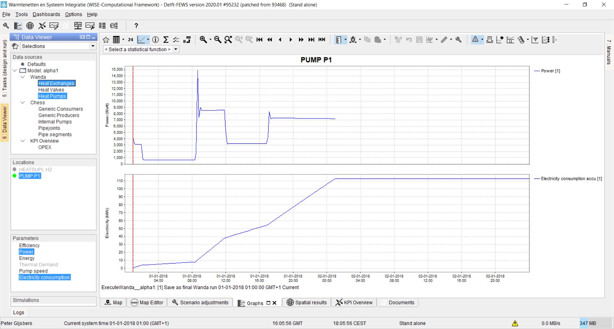
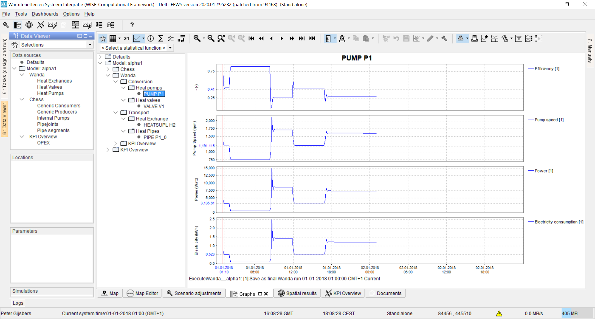
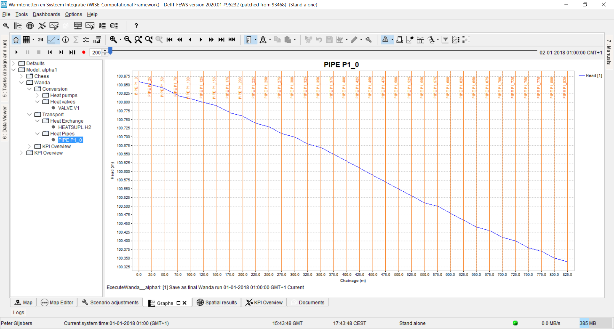
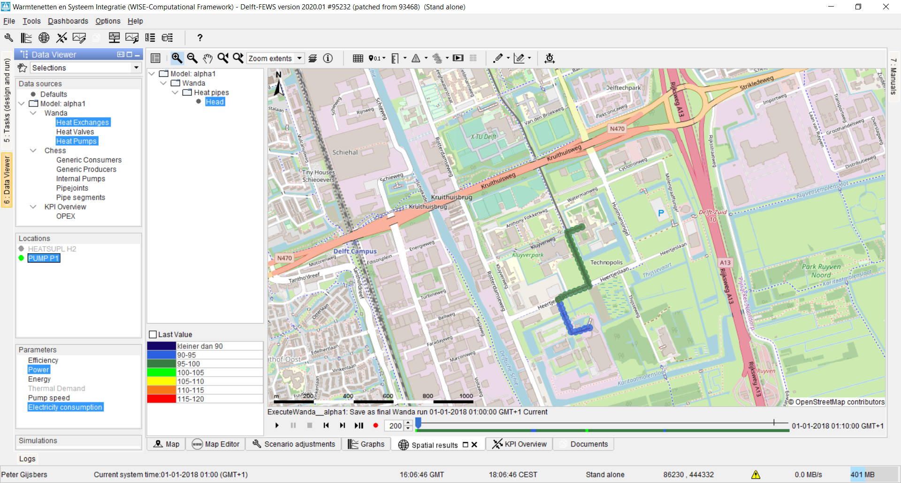
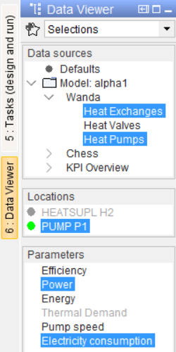
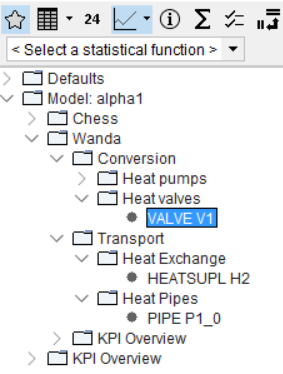
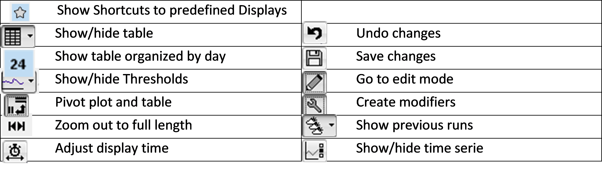

.. Warming Up Documentation documentation master file, created by
   sphinx-quickstart on Thu Oct  7 09:54:04 2021.
   You can adapt this file completely to your liking, but it should at least
   contain the root `toctree` directive.

Results viewing
====================================================

.. important::
    This sample documentation was generated on previous help doc **4-About_VisualizingModelResults**, needs to be updated.

Various visualization options exist to show the dynamic model results. Most of these visualizations address the dynamic nature of the models and show or animate timeseries.
1.	Timeseries graphs custom selected via the Data Viewer side bar (see :numref:`Figure 1`)
2.	Timeseries graphs in predefined layouts, selected via Graphs shortcuts :numref:`Figure 2`)
3.	Longitudinal Profile animations along pipelines (:numref:`Figure 3`)
4.	Spatial animations on a map (:numref:`Figure 4`)

.. _Figure 1:

.. _Figure 2:

.. _Figure 3:

.. _Figure 4:

Visualising timeseries
-----------------------------
.. important::
    This sample documentation was generated on previous help doc **5-HowTo_VisualizingTimeSeries**, needs to be updated.

Timeseries graphs are visualized in the Graphs tab. Two methods exist to select what timeseries to see:

1.	Custom selection via the Data Viewer side bar
2.	Predefined layouts via the Graphs Shortcuts

*@1: The Data Viewer side bar*
The Data Viewer (:numref:`Figure 5`) offers the ability to select any combination of timeseries to show as a timeseries in the Graphs tab. This tool is based on a concept of data filtering from data sources (i.e. models) via model locations to parameters (i.e. variables). Selections combining multiple data sources are allowed. Locations can also be selected from the Map tab.
Grey parameters indicate that this parameter is not available for the selected location(s).
You can compose your own Favourite selections for reuse by clicking on the star icon
Be aware that you need to activate the Graph tab yourselves.

*@2: Predefined displays in the Graph tab*
Using the Shortcuts button ( |shortcut| ) in the toolbar of the Graphs tab, you can get access to predefined timeseries combinations, currently accessed per location, grouped by model-component

When selecting Heat Pipes, a longitudinal profile along the trajectory of pipe P1 is shown.

The Graphs display toolbar (:numref:`Figure 7` and :numref:`Figure 8`) offers many options, with even more in the drop down list of the buttons. Zooming along the time axis can also be conducted by scrolling the mouse wheel

.. _Figure 5:

.. _Figure 6:

.. _Figure 7:
.. figure:: figures/results_viewing_figure7.png
   :align: center
   :width: 400
   :alt: Toolbar options to show tables, change zooming etc.

.. _Figure 8:

