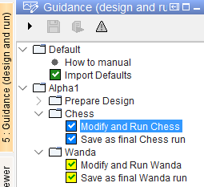
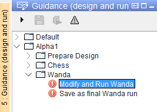
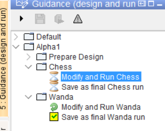

.. Warming Up Documentation documentation master file, created by
   sphinx-quickstart on Thu Oct  7 09:54:04 2021.
   You can adapt this file completely to your liking, but it should at least
   contain the root `toctree` directive.

Running workflows
====================================================

.. important::
    This sample documentation was generated on previous help doc **3-How_To_Run**, needs to be updated.

In order to run a model or another workflow, please conduct the following steps:

1. click on the sidebar option: ``Guidance (design and run)``
2. unfold the tree as appropriate

At the top of the Guidance panel a few icons are shown. Most important are two task execution icons:

*  pressing |run_temp| will start the model run with the results being kept in memory but not persistently saved to the database
*  pressing |run_perm| will start the model run and save the result persistently in the database

When unfolding the tree, the icons within the tree show the status of underlying tasks:

*  A black node, without any task execution icon at the top being enabled, indicates that there is no task to be executed (:numref:`Figure 1`, How to)
*  A black node with a task execution icon enabled indicates that the task has never been executed
*  A green check indicates that the run is successful and the results are persistently saved (:numref:`Figure 1`, Import Defaults)
*  A blue check indicates that the run is successful and results are available in memory (:numref:`Figure 1`, Chess)
*  A yellow check indicates that input has changed but no rerun is conducted yet. Results shown apply to the previous successful run (:numref:`Figure 1`, Wanda)
*  A red exclamation indicates that the run has failed (:numref:`Figure 2`, Wanda)
*  An |hourglass| indicates that a task is in the queue as another task is currently being executed (:numref:`Figure 3`, Chess)
*  An swirl indicates that a task is being executed (:numref:`Figure 3`, Wanda)

.. _Figure 1:

.. _Figure 2:

.. _Figure 3:

.. |run_temp|  image:: buttons/running_workflows_button1.gif

.. |hourglass| unicode:: U+231B