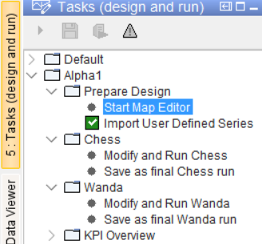
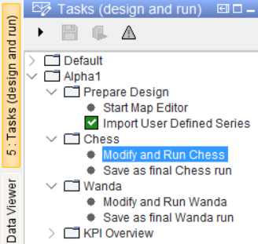

.. Warming Up Documentation documentation master file, created by
   sphinx-quickstart on Thu Oct  7 09:54:04 2021.
   You can adapt this file completely to your liking, but it should at least
   contain the root `toctree` directive.

Scenario Composition
====================================================

.. important::
    This sample documentation was generated on previous help doc **6_About_Scenarios**, needs to be updated.

To accommodate scenario’s various changes could be imagined:

1.	Changes in network topology (e.g. new consumers, producers, pipe connections)
2.	Changes in infrastructure dimensions (e.g. pipe diameters, buffer and pump capacities)
3.	Changes in heat demand or temperature profiles
4.	Changes in optimization goals or constraints

*@1*: These changes should be implemented via de Map Editor. These changes typically result in a new network, which require an update of the location-based data administration.
The Map Editor is accessible via the Tree under Prepare Design Start Map Editor (:numref:`Figure 1`)

*@2*: These changes can be applied via the Scenario adjustment Tab. They are location-specific attribute modifications to an existing network.

*@3*: These changes can be applied via the Scenario adjustment Tab.

*@4*: These changes can be applied via the Scenario Adjustment Tab. They are be either location-specific or model wide modifications on an existing network.

Note Scenario adjustments for Chess are not (yet) automatically applied to Wanda

.. _Figure 1:

.. _Figure 2:
