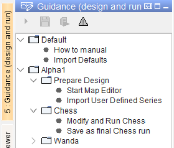

.. Warming Up Documentation documentation master file, created by
   sphinx-quickstart on Thu Oct  7 09:54:04 2021.
   You can adapt this file completely to your liking, but it should at least
   contain the root `toctree` directive.

Start situation: basic screen layout
====================================================

.. important::
    This sample documentation was generated on previous help doc **2-aboutTaskGuidance**, needs to be updated.

The purpose of the Workflow Guidance Tree is to guide the user through the steps of network preparation, scenario modification, model execution and analysis.

The Tree is composed of a set of folders, sub-folders and nodes. The nodes can be associated with displays and/or workflows to run a computation.

The first root folder holds the default activities to be conducted when starting with an empty database.

The next root-folders each will hold one Network being designed or analyzed.

Within each network folder, sub-folders are available.
The first sub-folder holds general Network Design tasks such as:

*  the creation of a network using the Map Editor
*  Importing User defined series for e.g. heat demands.

The other sub-folders are organized by model (e.g. Wanda and Chess). Per model two tasks are identified.

*  Modify the model input (e.g. heat demands, optimization parameters and model attributes) and run the model to analyze
*  Save the model inputs and the model results persistently in the database

With some tasks, the Workflow Guidance Tree automatically jumps to the associated display. However, the user is free to go to other displays for inspection and analysis.

With each folder and node in the tree, documentation is available. The Documentation overview side panel (typically on the right) shows the list of PDF-documents available.

