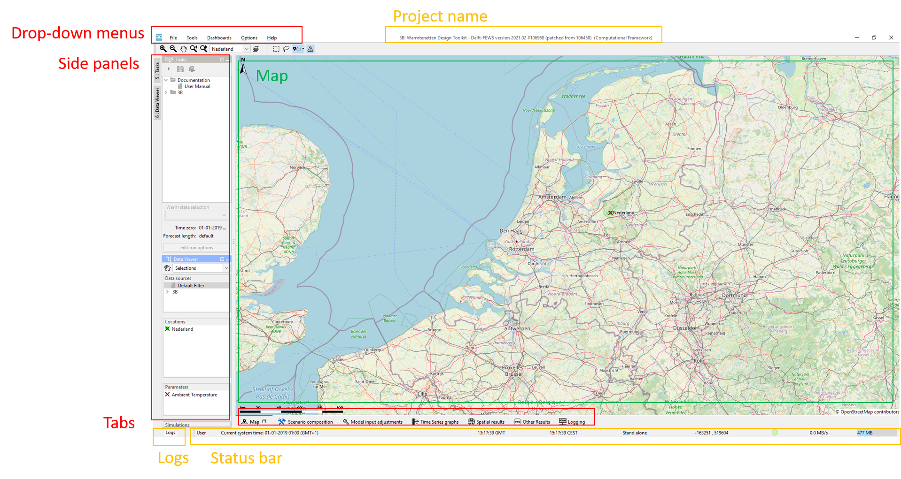
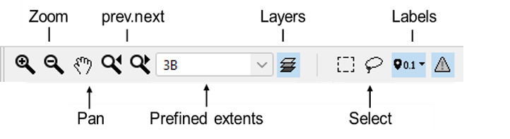
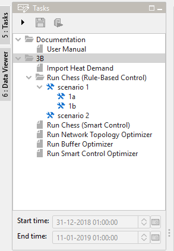

Start situation: basic screen layout
====================================================

.. important::
    This sample documentation was generated on previous help doc **2-aboutTaskGuidance**, needs to be updated.

The explorer
---------------------------------------------

The principal window of the computational framework is called the explorer.
The explorer have the following elements: the drop-down menus, side panels, tabs, log panel and status bar (:ref:`explorer`).

.. _explorer:

  Explorer overview (need to add highlight boxes)

In the middle of the explorer, the Map tab is open by default.
It provides a overview map of the study area.
There are various map controls at the top of the Map (:ref:`map_controls`).
Use the using the drop-down list in the map controls to adjust the zoom extent to current network.

.. _map_controls:

  Map controls

**Side Panels**

Side panels guides the users to navigate workflows and locations. There are two side panels configured:

*Tasks*

Located at the top of the left panel, the ``Tasks`` tree gives an overview of various workflows managed in the computational framework.
User could modify and run workflows in the Tasks tree.
See :ref:`Tasks Tree` for more information.

*Data Viewer*

Th second side panel - ``Data Viewer`` - is used to identify the scalar data associated with the locations on the map.
It is possible to filter the locations based on pre-defined filters, manual selection and parameters.
More information about the Data Viewer are given in :doc:`results_viewing`.

**Tabs**

Tabs allows user to easily access displays that are frequently used.

``Model input adjustment`` tab allows user to adjust model inputs and parameters.
``scenario composition`` tab allows user to create, modify and delete scenarios.
``Time Series graph``, ``Spatial results``, and ``Other results`` tabs allow user to view the model results. ``Other results`` tab is a web browser that allows pr-configured web page to be opened.
``Logging`` allows the user to access previous run status and logging messages.

More information about the included tabs are given in the next sections.

**Drop-down menus**

The drop-down menu bar provides access to all panels/displays configured in the computational framework.
Positions of the side panels and expand or dock options of all display windows can be customized and saved using File/Save layout option.

**Logs**

The Logs panel unfolds when clicking on the Logs button.
It displays high level messages generated by the model and the computations framework itself.

**Status Bar**

The Status Bar provides information about the status of the system.

.. _Tasks Tree:

Tasks Tree
---------------------------------------------

.. _tasks:

  Tasks Tree

the Tasks tree is to guide the user through various model workflows including model input and run time adjustments, scenarios compositions and model executions (:ref:`tasks`).
The Tree is composed of a set of folders and nodes. The nodes can be associated with displays and/or workflows to run a computation.
The workflow nodes can be duplicated and/or modified to compose scenarios. Once a scenario is created, the node will turn into a folder.

The first root folder ``Documentation`` holds one node ``User manual`` which is linked to the webpage of Warming Up Design Toolkit documentation.

Th second root folder is the network folder. It is initialized with six Network Design workflow nodes:

*  one general workflow ``Import Heat Demand`` that imports User defined series specified in th ESDL model, e.g. Heat demand profiles.
*  five model-based design workflow nodes that modify the network attributes and model parameters, and run the model for analysis

With some tasks, the associated display atomically open the pre-configured display. However, the user is free to go to other displays for inspection and analysis.

