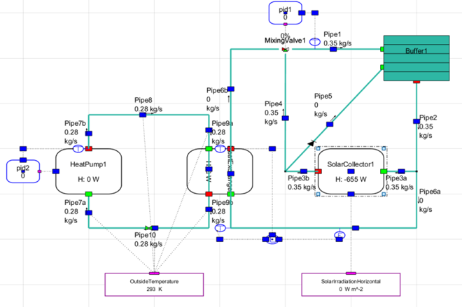

CHESS
=====

CHESS (Controlled Hybrid Energy Systems Simulator) is an in-house TNO’s
heat network simulator that solves flow/pressure (hydraulic solver) and
temperature distribution (thermal solver) iteratively.

The flows in a network are calculated using the laws of conservation of
mass and energy. The pressure loss due to friction along the pipe to the
average velocity of the fluid is calculated by solving *Darcy-Weisbach*
equation. For laminar flow calculation, the hydraulic resistance of a
pipe can be calculated by the *Hagen-Poiseuille* equation, which is
analytically derived from the *Navier–Stokes* equations. For turbulent
flow the friction factor is given by the *Haaland* approximation of the
*Colebrook-White* equation

The thermal solver of CHESS is built on Matlab’s ode23t solver. This
solver solves moderately stiff ordinary differential equations (ODEs)
and first order differential algebraic equations (DAEs). It solves
Conservation of Energy in a Control Volume for all nodes and pipes. The
temperature vector which the solver solves contains all temperatures
throughout all thermally coupled networks (e.g. through a heat
exchanger).

|image0|

Figure 1 CHESS (Controlled Hybrid Energy Systems Simulator) example heat
network schematic block

CHESS rule-based controller is used as a standard basic control of
Design Toolkit. User can assign the merit-order priority of sources and
demands allocation for operating the heat networks.

