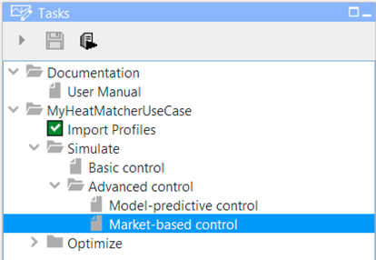
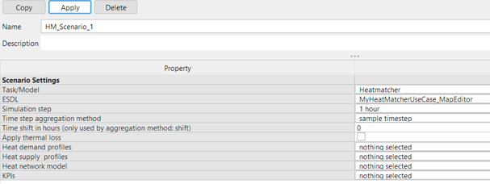
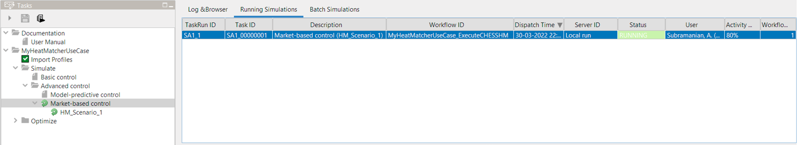

HeatMatcher for Networks
========================

*Market-based control* is one of the options of simulations with
‘Advanced control\`. It utilizes HeatMatcher for Networks as controller
of the simulation. When using HeatMatcher, each producer, consumer and
storage facility uses bids on a virtual market to express its eagerness
to produce or consume energy, based on its marginal costs. When the
market clears everybody receives the amount of energy they should
produce or consume in next period.

|image0|

To use market-based control, select it under **Simulate -> Advanced
control -> Market-based control**. It will utilize CHESS to simulate the
network with its Rule-based controller disabled, HeatMatcher will tell
CHESS how much each asset should consume or produce in each timestep.

|image1|

There is currently no additional configuration necessary, besides
configuration of the marginal costs in the ESDL-file.

|image2|

