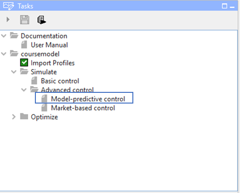
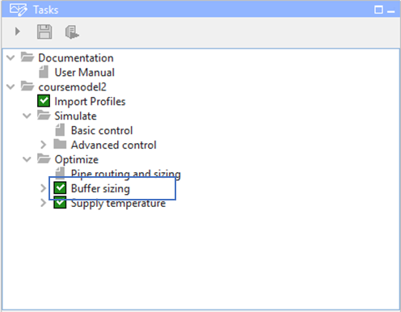
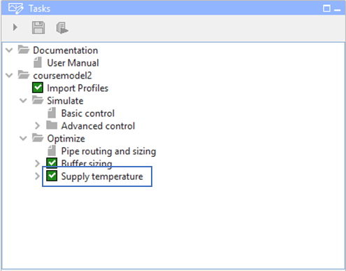

Model Predictive Control
========================

Three workflows utilize advanced control based on Model Predictive
Control (MPC) under the hood. MPC is an optimization approach that
considers operational aspects over a time horizon. These workflows are
briefly described below, whereas more background information on the
algorithms used can be found here: xxx

|image0|

**Simulate -> Advanced Control -> MPC:** The objective of this workflow
is to find a more cost-effective operational actuation in an automated
manner, compared to rule-based control that requires the user to define
a merit order. So it is a posteriori allocation of sources *as a result*
of the simulation versus a priori merit order. The MPC optimizes the
actuation once for the entire simulation time and uses these outcomes to
actuate CHESS with power allocations. The MPC optimizes to minimize
operational costs. For example, in the case of equal variable
operational costs for all sources, the optimization will try to minimize
heat losses and thereby the supply temperature.

|image1|

**Optimize -> Buffer Sizing:** The objective of this workflow is to find
the smallest suitable buffer size. Application include scenarios where
the user wants to outphase a back-bone heat supply or maximize the use
of a baseload source in combination with storage. The user can select a
maximum size of the buffer, production priorities and some hydraulic
constraints. The priorities (1 representing the most favored source) are
used by the optimization to maximize the allocation of more favored
sources, in combination with the buffer. Note that this workflow assumes
constant temperatures for the optimization. For details on this
constant-temperature approach, see the HeatMixin class in the RTC-Tools
Heat Network documentation.

|image2|

**Optimize -> Supply temperature:** The objective of this workflow is to
assess the minimum supply temperature in the network whilst still
meeting heat demand. This workflow can be used to see whether low
temperature heat sources (e.g. aquathermal, data centers, etc. ) are
suitable. The optimization will try to maximize the flow velocities
whilst meeting required minimum supply temperature and staying within
hydraulic limits. The optimization process is equivalent to the
**Simulate -> Advanced Control -> MPC** workflow, however here CHESS is
not ran after the MPC. This means that the results are solely based on
the internal model of the MPC. This increases the computational speed of
the workflow, however MPC has a slightly lower fidelity model compared
to CHESS.

RTC-Tools-heat-network FrameWork The MPC workflows utilize a
self-developed MPC framework called “rtc-tools-heat-network”. This
software repository can be installed as a python package and allows to
make a MPC application for heat networks. It contains heat network
physics, parsing of ESDL files to an internal model and an optimization
approach called goal programming. Rtc-tools-heat-network can be used to
define a workflow with appropriate optimization goals and the heat
network dynamics of interest.

`RTC-tools-heat-network
Documentation <http://warmingup.pages.ci.tno.nl/rtc-tools-heat-network/>`__
explains the theoretical optimization approach, implemented physics and
how to use the API. This documentation is meant for the advanced user
that has a specific need and therefore implements its own workflow.

