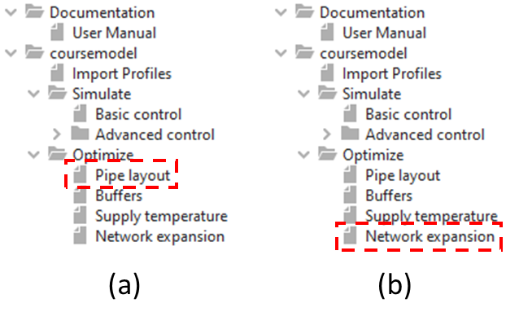

Topology Optimizer
==================

*Topology Optimizer* is design optimization tool which enables the user
to:

-  realize pre-set **goals** (e.g. minimizing cost),

-  by changing network design (e.g. **pipe** sizes or placement of
   storage **assets**),

-  while complying with operational **limits** (e.g. available pump
   head).

For grid simulation, *Topology Optimizer* makes use of the simulation
environment (solver and simulation settings) of *CHESS* (Basic Control).

Currently, there are two main applications of *Topology Optimizer*
within the WarmingUP Design Toolkit:

-  Determining optimal pipe sizes and routing for a fixed set of
   producer/consumer and storage assets (see Optimize->Pipe layout
   workflow, denoted as a in Figure 1),

-  Determining an optimal set of producer/consumer and storage assets
   (along with the piping that connects them) in the setting of a grid
   expansion (see Optimize->Network expansion workflow, denoted as b in
   Figure 1).

|image0|

Figure 1 – The two topology optimizer workflows within the WarmingUP
Design Toolkit.

For more detailed information on the inner workings of the *Topology
Optimizer*, please visit https://doi.org/10.1016/j.energy.2020.117688.

