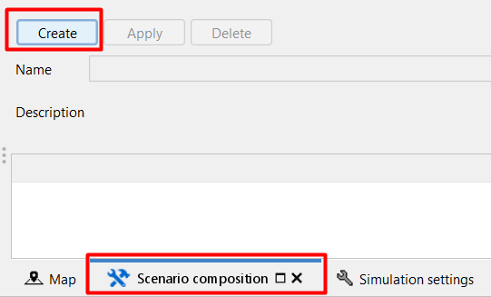
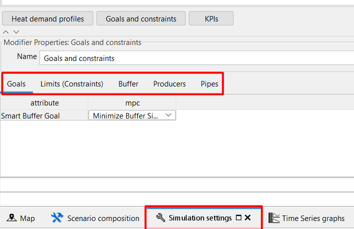

|image0|

https://peintinger.com/?p=365

Tested for version XXXXX

This tutorial is used to draw a single line / double line, wat gaan we
doen? In ieder geval moet er wel een double line ESDL opgeleverd worden

This tutorials shows you the steps to find out the answer to the
following questions:

-  What size does my buffer need to limit the use of a gas fired boiler?

-  What impact does a buffer of size X have on my network’s KPI’s?

-  Which of the following buffer locations is the most ideal for my
   network?

-  (possibly) What if, for the previous questions, the buffer is changed
   to an ATES?

-  (possibly) What if, for the previous questions, the heat demands are
   changed to an cold demand?

-  (bekijken of het handig is om de vraag in deze tutorial mee te nemen
   of dat er een aparte tutorial voor moet komen)

   What pipe topology and sizes are needed for your network, with or
   without a buffer?

To achieve these results we use the following **workflow** and
**packages**:

|image1|
|image2|

.. list-table:: Comparison
   :class: tight-table
+------------+--------------------------------------------------------------------------------------------------------------------------------------------------------------------------------------------------------------------------------------------------------------------------------------------------------------------------+
|  test      | In the ESDL MapEditor, we draw our existing or conceptual network in which we would like to add a buffer. Furthermore, we add the specifications of our buffer, heat producer(s), pipe(s) and consumer(s) and the network temperatures.                                                                                  |
+============+==========================================================================================================================================================================================================================================================================================================================+
| |image3|   | The network is loaded into the computational framework (CF), which allows us to add operational bounds (e.g. desired network pressures and velocities), prioritize producers and select the optimization goal. Finally, the CF allows the running of the optimization code from the Model Predictive Controller (MPC).   |
+------------+--------------------------------------------------------------------------------------------------------------------------------------------------------------------------------------------------------------------------------------------------------------------------------------------------------------------------+
|            | Results are presented in three views: KPI viewer (optional/unsure), data viewer and the optimisation HTML.                                                                                                                                                                                                               |
+------------+--------------------------------------------------------------------------------------------------------------------------------------------------------------------------------------------------------------------------------------------------------------------------------------------------------------------------+
|            | If needed, alternate specifications can be set in CF and the differences between results can be interpreted in the three views.                                                                                                                                                                                          |
+------------+--------------------------------------------------------------------------------------------------------------------------------------------------------------------------------------------------------------------------------------------------------------------------------------------------------------------------+

+------------+------------------------------------------------------------------------------------------------------------------------------------------------------------------------------------------------------------------------------------------------------------------------------------------------------------------------------+
| Step 1     | From the ‘Project Manager Dashboard’, click on the ‘Start ESDL map editor’ button.                                                                                                                                                                                                                                           |
+============+==============================================================================================================================================================================================================================================================================================================================+
| |image4|   | Click on the ‘Start editor’ button and log in.                                                                                                                                                                                                                                                                               |
+------------+------------------------------------------------------------------------------------------------------------------------------------------------------------------------------------------------------------------------------------------------------------------------------------------------------------------------------+
| |image3|   | In the top left of the window, go to: file -> new esdl and enter the name and description.                                                                                                                                                                                                                                   |
+------------+------------------------------------------------------------------------------------------------------------------------------------------------------------------------------------------------------------------------------------------------------------------------------------------------------------------------------+
|            | In the top left of the window, got to file -> Save to ESDL drive. Select the location and if needed add the additional network information.                                                                                                                                                                                  |
+------------+------------------------------------------------------------------------------------------------------------------------------------------------------------------------------------------------------------------------------------------------------------------------------------------------------------------------------+
|            | Go to view -> settings -> UI settings and in ‘view modes’, select CHESS.                                                                                                                                                                                                                                                     |
|            |                                                                                                                                                                                                                                                                                                                              |
|            | Go to view -> settings -> AssetDrawToolbar plugin -> EDR assets and locate the pipe type, insulation class and DN sizes needed for your simulation. Select the desired pipes and press the “>” button.                                                                                                                       |
|            |                                                                                                                                                                                                                                                                                                                              |
|            | Go to view -> settings -> AssetDrawToolbar plugin -> standard assets and locate select: ResidualHeatSource, HeatProducer, GeothermalProducer, HeatingDemand and Heatstorage and press the “>” button.                                                                                                                        |
|            |                                                                                                                                                                                                                                                                                                                              |
|            | Close the settings window.                                                                                                                                                                                                                                                                                                   |
+------------+------------------------------------------------------------------------------------------------------------------------------------------------------------------------------------------------------------------------------------------------------------------------------------------------------------------------------+
|            | In the top middle of the screen, click on the second dropdown menu and select ‘Pipe’ instead of ‘electricity cable’.                                                                                                                                                                                                         |
+------------+------------------------------------------------------------------------------------------------------------------------------------------------------------------------------------------------------------------------------------------------------------------------------------------------------------------------------+
| |image5|   | Locate the Asset toolbar in the lower left corner. Find the desired producer, click on the icon and click in the map in the desired location. Repeat these steps for any number of HeatingDemand(s) or HeatStorage(s).                                                                                                       |
|            |                                                                                                                                                                                                                                                                                                                              |
|            | Select the Joint icon in the asset toolbar and place these in locations where pipes are split (e.g. T-joints). Also place a Joint in between the producer, buffer and pipe network. Place two Joints at each location; one for Supply and one for the Return pipes                                                           |
|            |                                                                                                                                                                                                                                                                                                                              |
|            | Select the desired pipe in the asset toolbar. Start drawing the pipe routing by holding the ctrl button and going from out port(s) to in port(s). For example, hover over the producer icon, locate ‘[…].OutPort – Out’, hold ctrl, left mouse click, hover over the next asset, locate ‘[…]’.InPort – In’ and left click.   |
+------------+------------------------------------------------------------------------------------------------------------------------------------------------------------------------------------------------------------------------------------------------------------------------------------------------------------------------------+
| Step 2     | For **consumers (HeatingDemand)** ensure the following specifications are filled\*:                                                                                                                                                                                                                                          |
|            |                                                                                                                                                                                                                                                                                                                              |
|            | -  State = enabled                                                                                                                                                                                                                                                                                                           |
|            |                                                                                                                                                                                                                                                                                                                              |
|            | -  Demand profile, at either in or out port.                                                                                                                                                                                                                                                                                 |
|            |                                                                                                                                                                                                                                                                                                                              |
|            |    -  right click on the HeatingDemand and click ‘Set profile of […]’                                                                                                                                                                                                                                                        |
|            |                                                                                                                                                                                                                                                                                                                              |
|            |    -  profile class = Unittests profiledata\_demand[…]\_MW                                                                                                                                                                                                                                                                   |
|            |                                                                                                                                                                                                                                                                                                                              |
|            |    -  Multiplier, enter the anticipated maximum load                                                                                                                                                                                                                                                                         |
|            |                                                                                                                                                                                                                                                                                                                              |
|            |    -  Quantity and unit, select either ‘power in kW’ or ‘power in MW’                                                                                                                                                                                                                                                        |
|            |                                                                                                                                                                                                                                                                                                                              |
|            |    -  Click on the ‘Add’ button.                                                                                                                                                                                                                                                                                             |
|            |                                                                                                                                                                                                                                                                                                                              |
|            | -  Power (optional), gives a maximum power consumption that overrides the demand profile if demand profile > power.                                                                                                                                                                                                          |
+------------+------------------------------------------------------------------------------------------------------------------------------------------------------------------------------------------------------------------------------------------------------------------------------------------------------------------------------+
| |image6|   | For **producers** (ResidualHeatSource, HeatProducer, GeothermalProducer) ensure the following specifications are filled\*:                                                                                                                                                                                                   |
|            |                                                                                                                                                                                                                                                                                                                              |
|            | -  State = enabled                                                                                                                                                                                                                                                                                                           |
|            |                                                                                                                                                                                                                                                                                                                              |
|            | -  Power, enter the maximum production capacity in [W]                                                                                                                                                                                                                                                                       |
|            |                                                                                                                                                                                                                                                                                                                              |
|            | -  In Advanced Attributes, enter the Max Temperature and Min Temperature.                                                                                                                                                                                                                                                    |
+------------+------------------------------------------------------------------------------------------------------------------------------------------------------------------------------------------------------------------------------------------------------------------------------------------------------------------------------+
|            | For **buffers (HeatSTorage)** ensure the following specifications are filled\*:                                                                                                                                                                                                                                              |
|            |                                                                                                                                                                                                                                                                                                                              |
|            | -  State = enabled                                                                                                                                                                                                                                                                                                           |
|            |                                                                                                                                                                                                                                                                                                                              |
|            | -  Capacity, enter the maximum energy stored in the buffer in [J]                                                                                                                                                                                                                                                            |
|            |                                                                                                                                                                                                                                                                                                                              |
|            | -  Max Charge & Discharge rate (optional), enter these limits if needed.                                                                                                                                                                                                                                                     |
|            |                                                                                                                                                                                                                                                                                                                              |
|            | -  Fill level / temps                                                                                                                                                                                                                                                                                                        |
+------------+------------------------------------------------------------------------------------------------------------------------------------------------------------------------------------------------------------------------------------------------------------------------------------------------------------------------------+
|            | For **pipes** ensure the following specifications are filled\*:                                                                                                                                                                                                                                                              |
|            |                                                                                                                                                                                                                                                                                                                              |
|            | -  Inner Diameter, enter the pipes inner diameter in [m]                                                                                                                                                                                                                                                                     |
|            |                                                                                                                                                                                                                                                                                                                              |
|            | -  Material, add a table with the insulation properties. Link to technical docs.                                                                                                                                                                                                                                             |
+------------+------------------------------------------------------------------------------------------------------------------------------------------------------------------------------------------------------------------------------------------------------------------------------------------------------------------------------+
|            | In the top left, go Edit -> Energy carriers…                                                                                                                                                                                                                                                                                 |
|            |                                                                                                                                                                                                                                                                                                                              |
|            | In the right of the screen, select ‘Heat Commodity’ in the ‘Carrier type’ window.                                                                                                                                                                                                                                            |
|            |                                                                                                                                                                                                                                                                                                                              |
|            | In the Name field, enter ‘Supply’ and enter the desired ‘Supply temperature’ in [°C].                                                                                                                                                                                                                                        |
|            |                                                                                                                                                                                                                                                                                                                              |
|            | Create another Heat Commodity named ‘Return’ with the desired ‘Return temperature’ in [°C].                                                                                                                                                                                                                                  |
|            |                                                                                                                                                                                                                                                                                                                              |
|            | Select **all** supply pipes (link to selecting tips and tricks) and right click on one of the pipes. Click on ‘Set Carrier’ and select ‘Supply’. Repeat these steps for the return pipes.                                                                                                                                    |
+------------+------------------------------------------------------------------------------------------------------------------------------------------------------------------------------------------------------------------------------------------------------------------------------------------------------------------------------+
| Step 3     | In the top left of the window, go to: file -> save ESDL… and select a location on your computer to store the ESDL.                                                                                                                                                                                                           |
+------------+------------------------------------------------------------------------------------------------------------------------------------------------------------------------------------------------------------------------------------------------------------------------------------------------------------------------------+
| Step 4     | In the ‘Project Manager Dashboard’, click on the ‘Start new CF project’ -> local drive -> select the esdl model.                                                                                                                                                                                                             |
|            |                                                                                                                                                                                                                                                                                                                              |
|            | Alt+Tab to find the window where you can select the location where you want the model and its results to be saved and click ‘select folder’.                                                                                                                                                                                 |
+------------+------------------------------------------------------------------------------------------------------------------------------------------------------------------------------------------------------------------------------------------------------------------------------------------------------------------------------+
|            | After the Message Log displays the text ‘Done’, CF will automatically open.                                                                                                                                                                                                                                                  |
+------------+------------------------------------------------------------------------------------------------------------------------------------------------------------------------------------------------------------------------------------------------------------------------------------------------------------------------------+

\* red lines indicate specifications that are pre-filled when using the
EDR assets.

+------------------------+---------------------------------------------------------------------------------------------------------------------------------------------------------------------------------------------------------------------------------+
| Step 1                 | When the computational framework (CF) has loaded, locate the ‘tasks’ window in the top left of the screen. Click on the arrow in front of your model to display the possible workflows.                                         |
+========================+=================================================================================================================================================================================================================================+
|                        | Define start and end time.                                                                                                                                                                                                      |
|                        |                                                                                                                                                                                                                                 |
|                        | When using any Unittests profiledata\_demand[…] demand profile, …                                                                                                                                                               |
+------------------------+---------------------------------------------------------------------------------------------------------------------------------------------------------------------------------------------------------------------------------+
|                        | Select the ‘Import Heat Demand’ task and run the segment by clicking on the                                                                                                                                                     |
|                        |                                                                                                                                                                                                                                 |
|                        | |image7|                                                                                                                                                                                                                        |
+------------------------+---------------------------------------------------------------------------------------------------------------------------------------------------------------------------------------------------------------------------------+
|                        | The checkbox in front of the workflow indicates the status of the workflow:                                                                                                                                                     |
|                        |                                                                                                                                                                                                                                 |
|                        | |image8|\ workflow not initiated                                                                                                                                                                                                |
|                        |                                                                                                                                                                                                                                 |
|                        | |image9|\ workflow (check this) workflow ran in previous CF sessions and results are available.                                                                                                                                 |
|                        |                                                                                                                                                                                                                                 |
|                        | |image10| ?????????                                                                                                                                                                                                             |
|                        |                                                                                                                                                                                                                                 |
|                        | |image11|\ workflow completed                                                                                                                                                                                                   |
|                        |                                                                                                                                                                                                                                 |
|                        | |image12| error occurs during workflow                                                                                                                                                                                          |
+------------------------+---------------------------------------------------------------------------------------------------------------------------------------------------------------------------------------------------------------------------------+
| |image13|\ |image14|   | If an error occurs, information on the error can be found in the log; opened by either pressing the ‘Logs’ button in the lower left corner of the screen or by selecting the ‘logging’ tab in the lower middle of the screen.   |
|                        |                                                                                                                                                                                                                                 |
|                        | |image15|                                                                                                                                                                                                                       |
|                        |                                                                                                                                                                                                                                 |
|                        | Frequent errors are:                                                                                                                                                                                                            |
|                        |                                                                                                                                                                                                                                 |
|                        | -  No heat demand added in the ESDL =:> when the error log shows text ‘xfstsdsjkfjkshf’.                                                                                                                                        |
|                        |                                                                                                                                                                                                                                 |
|                        | -  Ongeldige getallin in de heat demand ->                                                                                                                                                                                      |
|                        |                                                                                                                                                                                                                                 |
|                        | -                                                                                                                                                                                                                               |
+------------------------+---------------------------------------------------------------------------------------------------------------------------------------------------------------------------------------------------------------------------------+
|                        |                                                                                                                                                                                                                                 |
+------------------------+---------------------------------------------------------------------------------------------------------------------------------------------------------------------------------------------------------------------------------+
|                        |                                                                                                                                                                                                                                 |
+------------------------+---------------------------------------------------------------------------------------------------------------------------------------------------------------------------------------------------------------------------------+
| Step 2                 | Wait till the workflow has completed                                                                                                                                                                                            |
+------------------------+---------------------------------------------------------------------------------------------------------------------------------------------------------------------------------------------------------------------------------+
|                        | Make changes? -> don’t forget apply.                                                                                                                                                                                            |
|                        |                                                                                                                                                                                                                                 |
|                        | Then changes to buffer settings.                                                                                                                                                                                                |
+------------------------+---------------------------------------------------------------------------------------------------------------------------------------------------------------------------------------------------------------------------------+
|                        | If done, select the ‘Run Buffer optimizer’ task and run the segment by clicking on the                                                                                                                                          |
|                        |                                                                                                                                                                                                                                 |
|                        | |image16|                                                                                                                                                                                                                       |
+------------------------+---------------------------------------------------------------------------------------------------------------------------------------------------------------------------------------------------------------------------------+
|                        | Limits(constraint) select any number of constraints.                                                                                                                                                                            |
+------------------------+---------------------------------------------------------------------------------------------------------------------------------------------------------------------------------------------------------------------------------+
|                        | In storages select any number of goals                                                                                                                                                                                          |
+------------------------+---------------------------------------------------------------------------------------------------------------------------------------------------------------------------------------------------------------------------------+
|                        | In producers priority instellen, 1 = hoogste priority (voor eigen use case moet ik die nog omdraaien)                                                                                                                           |
+------------------------+---------------------------------------------------------------------------------------------------------------------------------------------------------------------------------------------------------------------------------+
|                        | Pipes goal en upper en lower sizes aangeven.                                                                                                                                                                                    |
+------------------------+---------------------------------------------------------------------------------------------------------------------------------------------------------------------------------------------------------------------------------+
|                        | Apply.                                                                                                                                                                                                                          |
+------------------------+---------------------------------------------------------------------------------------------------------------------------------------------------------------------------------------------------------------------------------+
|                        | Make a scenario called base case: select the new scenario. Run the workflow.                                                                                                                                                    |
+------------------------+---------------------------------------------------------------------------------------------------------------------------------------------------------------------------------------------------------------------------------+
|                        |                                                                                                                                                                                                                                 |
+------------------------+---------------------------------------------------------------------------------------------------------------------------------------------------------------------------------------------------------------------------------+
|                        | Go to other results.                                                                                                                                                                                                            |
+------------------------+---------------------------------------------------------------------------------------------------------------------------------------------------------------------------------------------------------------------------------+
|                        |                                                                                                                                                                                                                                 |
+------------------------+---------------------------------------------------------------------------------------------------------------------------------------------------------------------------------------------------------------------------------+

|image17|\ At the end. Looking at the CF screen right now, what extra’s
can we check out on the other tabs? What can we see there? Or change?

Bijvoorbeeld: terug naar heat demand -> andere profilen invullen ->
apply -> in buffer optimizer workflow naar tab: scenario adjustment,
nieuwe maken (incl naam) en apply and dan runnen.

Voor meerdere demand scenarios -> alle locaties selecteren en apply
drukken!

Are there specs we changed in spot A, that we can only view or change
back in spot B?

.. |image0| image:: media/image1.png
   :width: 6.30000in
   :height: 8.07153in
.. |image1| image:: media/image2.png
   :width: 5.88542in
   :height: 0.90625in

.. |image3| image:: media/image4.png
   :width: 0.62639in
   :height: 0.62014in
.. |image4| image:: media/image5.png
   :width: 0.55970in
   :height: 0.55970in
.. |image5| image:: media/image7.png
   :width: 0.63200in
   :height: 0.63200in

.. |image9| image:: media/image20.png
   :width: 0.20833in
   :height: 0.20833in
.. |image10| image:: media/image21.png
   :width: 0.21701in
   :height: 0.20833in
.. |image11| image:: media/image22.png
   :width: 0.17708in
   :height: 0.19792in
.. |image12| image:: media/image23.png
   :width: 0.17708in
   :height: 0.15588in
.. |image13| image:: media/image24.png
   :width: 0.54167in
   :height: 0.54167in
.. |image14| image:: media/image15.png
   :width: 0.75000in
   :height: 0.75000in
.. |image15| image:: media/image26.png
   :width: 5.15672in
   :height: 0.24726in

.. |image17| image:: media/image24.png
   :width: 0.54167in
   :height: 0.54167in
