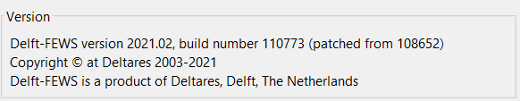
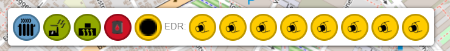
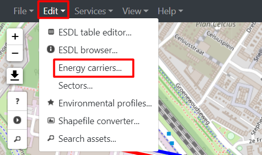
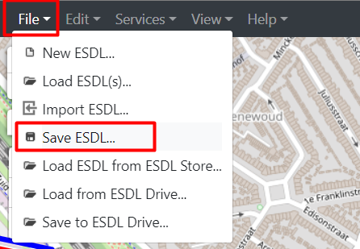
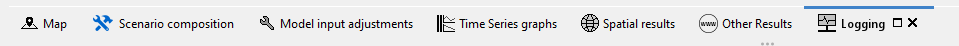
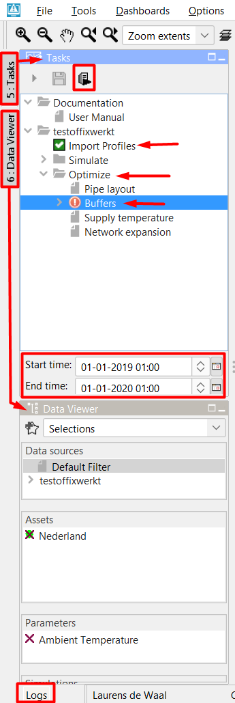
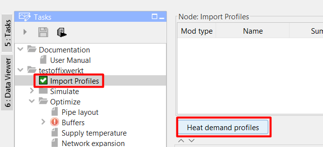

.. _buffer_sizing:

I want to size the buffer
=========================

Tested for:

|image0|

This tutorial is used to draw a double line network

This tutorials shows you the steps to find out the answer to the
following questions:

-  What size does my buffer need to limit the use of a gas fired boiler?

-  What impact does a buffer of size X have on my network’s KPI’s?

-  Which of the following buffer locations is the most ideal for my
   network?

-  (possibly) What if, for the previous questions, the buffer is changed
   to an ATES?

-  (possibly) What if, for the previous questions, the heat demands are
   changed to an cold demand?

-  What pipe topology and sizes are needed for your network, with or
   without a buffer?

To achieve these results we use the following **workflow** and
**packages**:

+------------+--------------------------------------------------------------------------------------------------------------------------------------------------------------------------------------------------------------------------------------------------------------------------------------------------------------------------+
| |image1|   | In the ESDL MapEditor, we draw our existing or conceptual network in which we would like to add a buffer. Furthermore, we add the specifications of our buffer, heat producer(s), pipe(s) and consumer(s) and the network temperatures.                                                                                  |
+------------+--------------------------------------------------------------------------------------------------------------------------------------------------------------------------------------------------------------------------------------------------------------------------------------------------------------------------+
| |image2|   | The network is loaded into the computational framework (CF), which allows us to add operational bounds (e.g. desired network pressures and velocities), prioritize producers and select the optimization goal. Finally, the CF allows the running of the optimization code from the Model Predictive Controller (MPC).   |
+------------+--------------------------------------------------------------------------------------------------------------------------------------------------------------------------------------------------------------------------------------------------------------------------------------------------------------------------+
|            | Results are presented in three views: KPI viewer (optional), data viewer and the optimisation HTML.                                                                                                                                                                                                                      |
+------------+--------------------------------------------------------------------------------------------------------------------------------------------------------------------------------------------------------------------------------------------------------------------------------------------------------------------------+
|            | If needed, alternate specifications can be set in CF and the differences between results can be interpreted in the three views.                                                                                                                                                                                          |
+------------+--------------------------------------------------------------------------------------------------------------------------------------------------------------------------------------------------------------------------------------------------------------------------------------------------------------------------+

+--------------+----------------------------------------------------------------------------------------------------------------------------------------------------------------------------------------------------------+
| **Step 1**   | **Setting up your map editor**                                                                                                                                                                           |
+==============+==========================================================================================================================================================================================================+
|              | From the ‘Project Manager Dashboard’, click on the ‘Start ESDL map editor’ button.                                                                                                                       |
+--------------+----------------------------------------------------------------------------------------------------------------------------------------------------------------------------------------------------------+
|              | The mapeditor is only tested on Chrome and Firefox. Therefore it is advised to use these webbrowsers.                                                                                                    |
+--------------+----------------------------------------------------------------------------------------------------------------------------------------------------------------------------------------------------------+
|              | Click on the ‘Start editor’ button and log in.                                                                                                                                                           |
+--------------+----------------------------------------------------------------------------------------------------------------------------------------------------------------------------------------------------------+
|              | In the top left of the window, go to: file -> new esdl and enter the name and description.                                                                                                               |
+--------------+----------------------------------------------------------------------------------------------------------------------------------------------------------------------------------------------------------+
|              | In the top left of the window, got to file -> Save to ESDL drive. Select the location and if needed add the additional network information.                                                              |
+--------------+----------------------------------------------------------------------------------------------------------------------------------------------------------------------------------------------------------+
|              | Go to view -> settings -> UI settings and in ‘view modes’, select CHESS.                                                                                                                                 |
+--------------+----------------------------------------------------------------------------------------------------------------------------------------------------------------------------------------------------------+
|              | Go to view -> settings -> AssetDrawToolbar plugin -> EDR assets and locate the pipe type, insulation class and DN sizes needed for your simulation. Select the desired pipes and press the “>” button.   |
+--------------+----------------------------------------------------------------------------------------------------------------------------------------------------------------------------------------------------------+
|              | Go to view -> settings -> AssetDrawToolbar plugin -> standard assets and locate select: ResidualHeatSource, HeatProducer, GeothermalProducer, HeatingDemand and Heatstorage and press the “>” button.    |
+--------------+----------------------------------------------------------------------------------------------------------------------------------------------------------------------------------------------------------+
|              | Close the settings window.                                                                                                                                                                               |
+--------------+----------------------------------------------------------------------------------------------------------------------------------------------------------------------------------------------------------+
|              | In the top middle of the screen, click on the second dropdown menu and select ‘Pipe’ instead of ‘electricity cable’.                                                                                     |
+--------------+----------------------------------------------------------------------------------------------------------------------------------------------------------------------------------------------------------+
|              | |image3|                                                                                                                                                                                                 |
+--------------+----------------------------------------------------------------------------------------------------------------------------------------------------------------------------------------------------------+

!note When drawing the network, it is important to constantly check that
you are placing EDR assets

+--------------+------------------------------------------------------------------------------------------------------------------------------------------------------------------------------------------------------------------------------------------------------------------------------------------------------------------------------+
| **Step 2**   | **Drawing the network**                                                                                                                                                                                                                                                                                                      |
+==============+==============================================================================================================================================================================================================================================================================================================================+
|              | Locate the Asset toolbar in the lower left corner. Find the desired producer, click on the icon and click in the map in the desired location. Repeat these steps for any number of HeatingDemand(s) or HeatStorage(s).                                                                                                       |
+--------------+------------------------------------------------------------------------------------------------------------------------------------------------------------------------------------------------------------------------------------------------------------------------------------------------------------------------------+
|              | Select the Joint icon in the asset toolbar and place these in locations where pipes are split (e.g. T-joints). Also place a Joint in between the producer, buffer and pipe network. Place two Joints at each location; one for Supply and one for the Return pipes                                                           |
+--------------+------------------------------------------------------------------------------------------------------------------------------------------------------------------------------------------------------------------------------------------------------------------------------------------------------------------------------+
|              | Select the desired pipe in the asset toolbar. Start drawing the pipe routing by holding the ctrl button and going from out port(s) to in port(s). For example, hover over the producer icon, locate ‘[…].OutPort – Out’, hold ctrl, left mouse click, hover over the next asset, locate ‘[…]’.InPort – In’ and left click.   |
+--------------+------------------------------------------------------------------------------------------------------------------------------------------------------------------------------------------------------------------------------------------------------------------------------------------------------------------------------+
|              | |image4|                                                                                                                                                                                                                                                                                                                     |
+--------------+------------------------------------------------------------------------------------------------------------------------------------------------------------------------------------------------------------------------------------------------------------------------------------------------------------------------------+

!note Draw the pipe(s) between joint(s) and HeatStorage(s) as followed:
draw from *Joint\_[…].OutPort – Out* to *HeatStorage\_[…].InPort – In*
if you are drawing the supply i.e. warm side.

+--------------+---------------------------------------------------------------------------------------------------------------------------------------------------------+
| **Step 3**   | **Setting up your network and asset properties**                                                                                                        |
+==============+=========================================================================================================================================================+
|              | By left clicking on an asset, the asset properties window opens on the right side of your screen.                                                       |
+--------------+---------------------------------------------------------------------------------------------------------------------------------------------------------+
|              | For **consumers (HeatingDemand)** ensure the following specifications are filled\*:                                                                     |
|              |                                                                                                                                                         |
|              | -  State = enabled (pre-filled when using the EDR assets)                                                                                               |
|              |                                                                                                                                                         |
|              | -  Demand profile, only at the ‘in’ port.                                                                                                               |
|              |                                                                                                                                                         |
|              |    -  right click on the HeatingDemand and click ‘Set profile of […]’                                                                                   |
|              |                                                                                                                                                         |
|              |    -  profile class = Unittests profiledata\_demand[…]\_MW                                                                                              |
|              |                                                                                                                                                         |
|              |    -  Multiplier, enter the anticipated maximum load                                                                                                    |
|              |                                                                                                                                                         |
|              |    -  Quantity and unit, select either ‘power in kW’ or ‘power in MW’                                                                                   |
|              |                                                                                                                                                         |
|              |    -  Click on the ‘Add’ button.                                                                                                                        |
|              |                                                                                                                                                         |
|              | -  Power (optional), gives a maximum power consumption that overrides the demand profile if demand profile > power.                                     |
+--------------+---------------------------------------------------------------------------------------------------------------------------------------------------------+
|              | For **producers** (ResidualHeatSource, HeatProducer, GeothermalProducer) ensure the following specifications are filled\*:                              |
|              |                                                                                                                                                         |
|              | -  State = enabled (pre-filled when using the EDR assets)                                                                                               |
|              |                                                                                                                                                         |
|              | -  Power, enter the maximum production capacity in [W]                                                                                                  |
|              |                                                                                                                                                         |
|              | -  In Advanced Attributes, enter the Max Temperature and Min Temperature.                                                                               |
+--------------+---------------------------------------------------------------------------------------------------------------------------------------------------------+
|              | For **buffers (HeatSTorage)** ensure the following specifications are filled\*:                                                                         |
|              |                                                                                                                                                         |
|              | -  State = enabled (pre-filled when using the EDR assets)                                                                                               |
|              |                                                                                                                                                         |
|              | -  Capacity, enter the maximum energy stored in the buffer in [J]                                                                                       |
|              |                                                                                                                                                         |
|              | -  Max Charge & Discharge rate (optional), enter these limits if needed.                                                                                |
|              |                                                                                                                                                         |
|              | -  Fill level / temps                                                                                                                                   |
+--------------+---------------------------------------------------------------------------------------------------------------------------------------------------------+
|              | For **pipes** ensure the following specifications are filled\*:                                                                                         |
|              |                                                                                                                                                         |
|              | -  Inner Diameter, enter the pipes inner diameter in [m] (pre-filled when using the EDR assets)                                                         |
|              |                                                                                                                                                         |
|              | -  Material, add a table with the insulation properties. (pre-filled when using the EDR assets)                                                         |
+--------------+---------------------------------------------------------------------------------------------------------------------------------------------------------+
|              | In the top left, go Edit -> Energy carriers…                                                                                                            |
|              |                                                                                                                                                         |
|              | In the right of the screen, select ‘Heat Commodity’ in the ‘Carrier type’ window.                                                                       |
|              |                                                                                                                                                         |
|              | In the Name field, enter ‘Supply’ and enter the desired ‘Supply temperature’ in [°C].                                                                   |
|              |                                                                                                                                                         |
|              | Create another Heat Commodity named ‘Return’ with the desired ‘Return temperature’ in [°C].                                                             |
|              |                                                                                                                                                         |
|              | Select **all** supply pipes and right click on one of the pipes. Click on ‘Set Carrier’ and select ‘Supply’. Repeat these steps for the return pipes.   |
|              |                                                                                                                                                         |
|              | |image5|                                                                                                                                                |
+--------------+---------------------------------------------------------------------------------------------------------------------------------------------------------+

    !note 1) The diameter menu does not add information 2) Do NOT use
    the Geothermal producer from the EDR database.

+--------------+------------------------------------------------------------------------------------------------------------------------------------------------+
| **Step 4**   | **Saving, exporting and importing your network into the computational framework (CF)**                                                         |
+==============+================================================================================================================================================+
|              | In the top left of the window, go to: file -> save ESDL… and select a location on your computer to store the ESDL.                             |
|              |                                                                                                                                                |
|              | |image6|                                                                                                                                       |
+--------------+------------------------------------------------------------------------------------------------------------------------------------------------+
|              | In the ‘Project Manager Dashboard’, click on the ‘Go to simulation tools’ button in the middle. -> local drive -> select the esdl model.       |
+--------------+------------------------------------------------------------------------------------------------------------------------------------------------+
|              | Click on the ‘Import network design’ button and drag your downloaded ESDL model into the open field.                                           |
|              |                                                                                                                                                |
|              | |image7|                                                                                                                                       |
+--------------+------------------------------------------------------------------------------------------------------------------------------------------------+
|              | Alt+Tab to find the window where you can select the location where you want the model and its results to be saved and click ‘select folder’.   |
+--------------+------------------------------------------------------------------------------------------------------------------------------------------------+
|              | After the Message Log displays the text ‘Done’, CF will automatically open.                                                                    |
+--------------+------------------------------------------------------------------------------------------------------------------------------------------------+

!note If you made a mistake, you have to close CF, make changes to the
ESDL model inside the ESDL MapEditor and repeat the steps starting from
step 3. You can select the same save location, but if you do, you have
to first delete the old model.

+--------------+---------------------------------------------------------------------------------------------------------------------------------------------------------------------------------------------------------------------------------+
| **Step 5**   | **Importing the heat demand data**                                                                                                                                                                                              |
+==============+=================================================================================================================================================================================================================================+
|              | When the computational framework (CF) has loaded, locate the ‘tasks’ window in the top left of the screen.                                                                                                                      |
+--------------+---------------------------------------------------------------------------------------------------------------------------------------------------------------------------------------------------------------------------------+
|              | In the bottom of the ‘tasks’ window, set the start and end time to match your demand profile data set selected in:                                                                                                              |
|              |                                                                                                                                                                                                                                 |
|              | *Step 3 Setting up your network and asset properties.*                                                                                                                                                                          |
+--------------+---------------------------------------------------------------------------------------------------------------------------------------------------------------------------------------------------------------------------------+
|              | When using any Unittests profiledata\_demand[…] demand profiles, ensure the start time starts at 01-01-2019 02:00.                                                                                                              |
+--------------+---------------------------------------------------------------------------------------------------------------------------------------------------------------------------------------------------------------------------------+
|              | In the top of your ‘tasks’ window, click on the arrow in front of your model to display the possible workflows.                                                                                                                 |
+--------------+---------------------------------------------------------------------------------------------------------------------------------------------------------------------------------------------------------------------------------+
|              | Select the ‘Import profiles’ task and run the segment by clicking on the right button.                                                                                                                                          |
|              |                                                                                                                                                                                                                                 |
|              | |image8|                                                                                                                                                                                                                        |
+--------------+---------------------------------------------------------------------------------------------------------------------------------------------------------------------------------------------------------------------------------+
|              | The checkbox in front of the workflow indicates the status of the workflow:                                                                                                                                                     |
|              |                                                                                                                                                                                                                                 |
|              |     |image9|\ workflow not initiated                                                                                                                                                                                            |
|              |                                                                                                                                                                                                                                 |
|              |     |image10|\ a green icon shows the workflow ran successfully.                                                                                                                                                                |
|              |                                                                                                                                                                                                                                 |
|              |     |image11|\ a yellow icon shows that the workflow ran successfully and the results are available, however your inputs have now changed.                                                                                      |
|              |                                                                                                                                                                                                                                 |
|              |     |image12| A red icon shows that an error occurred during workflow                                                                                                                                                           |
|              |                                                                                                                                                                                                                                 |
|              | The checkmarks are relevant to workflows, for scenarios the following icon is used. The colours represent the same status as with the checkmarks.                                                                               |
|              |                                                                                                                                                                                                                                 |
|              |     |image13|\ Scenario has run succesfully                                                                                                                                                                                     |
+--------------+---------------------------------------------------------------------------------------------------------------------------------------------------------------------------------------------------------------------------------+
|              | If an error occurs, information on the error can be found in the log; opened by either pressing the ‘Logs’ button in the lower left corner of the screen or by selecting the ‘logging’ tab in the lower middle of the screen.   |
|              |                                                                                                                                                                                                                                 |
|              | |image14|                                                                                                                                                                                                                       |
|              |                                                                                                                                                                                                                                 |
|              | Frequent errors are:                                                                                                                                                                                                            |
|              |                                                                                                                                                                                                                                 |
|              | -  If there is no heat demand added in the ESDL model, the error log shows text similar to: ‘Could not find a Timeseries for “name”.Heat\_demand”’                                                                              |
|              |                                                                                                                                                                                                                                 |
|              | -  If the model contains wrong number inside the heating demands, the error logs constantly presents ‘-999.0’ often.                                                                                                            |
+--------------+---------------------------------------------------------------------------------------------------------------------------------------------------------------------------------------------------------------------------------+
|              | |image15|                                                                                                                                                                                                                       |
+--------------+---------------------------------------------------------------------------------------------------------------------------------------------------------------------------------------------------------------------------------+

+--------------+--------------------------------------------------------------------------------------------------------------------------------------------------------------------------------+
| **Step 6**   | **Checking and possibly modifying your heat demand(s)**                                                                                                                        |
+==============+================================================================================================================================================================================+
|              | The workflow has completed when either:                                                                                                                                        |
|              |                                                                                                                                                                                |
|              | -  The icon in front of the workflow turns green,                                                                                                                              |
|              |                                                                                                                                                                                |
|              | -  A pop-up in the lower right of the screen tells you it has finished,                                                                                                        |
|              |                                                                                                                                                                                |
|              | -  In the log a text appears that states the workflow has finished                                                                                                             |
+--------------+--------------------------------------------------------------------------------------------------------------------------------------------------------------------------------+
|              | In the middle left of your screen, press the ‘Heat Demand profiles’ button to check if the right start and end time are used and the heat profile data has loaded correctly.   |
|              |                                                                                                                                                                                |
|              | |image16|                                                                                                                                                                      |
+--------------+--------------------------------------------------------------------------------------------------------------------------------------------------------------------------------+
|              | If you want to make changes, you can do so in the white boxes. Do not forget to click the ‘apply’ button in the middle right of your screen to save your changes.              |
+--------------+--------------------------------------------------------------------------------------------------------------------------------------------------------------------------------+

+--------------+---------------------------------------------------------------------------------------------------------------------------------------------------------------------------------------------------------------------------------------------------+
| **Step 7**   | **Checking and possibly modifying your buffer sizing goals and constraints**                                                                                                                                                                      |
+==============+===================================================================================================================================================================================================================================================+
|              | Select the ‘Buffers’ task.                                                                                                                                                                                                                        |
+--------------+---------------------------------------------------------------------------------------------------------------------------------------------------------------------------------------------------------------------------------------------------+
|              | Select the ‘Scenario composition’ tab in the lower left part of your screen.                                                                                                                                                                      |
+--------------+---------------------------------------------------------------------------------------------------------------------------------------------------------------------------------------------------------------------------------------------------+
|              | Click the ‘Create’ button in the top left part of your screen. |image17|                                                                                                                                                                          |
+--------------+---------------------------------------------------------------------------------------------------------------------------------------------------------------------------------------------------------------------------------------------------+
|              | The scenario you are currently creating is a base scenario which your future scenarios will be compared to. Name the scenario so it is clear what the base scenario simulates.                                                                    |
+--------------+---------------------------------------------------------------------------------------------------------------------------------------------------------------------------------------------------------------------------------------------------+
|              | Click the ‘Apply’ button in the top left part of your screen.                                                                                                                                                                                     |
+--------------+---------------------------------------------------------------------------------------------------------------------------------------------------------------------------------------------------------------------------------------------------+
|              | Ensure that you have used the desired start and end times.                                                                                                                                                                                        |
+--------------+---------------------------------------------------------------------------------------------------------------------------------------------------------------------------------------------------------------------------------------------------+
|              | In the middle lower section of your screen, go through the tabs and check if the properties are up to your liking.                                                                                                                                |
+--------------+---------------------------------------------------------------------------------------------------------------------------------------------------------------------------------------------------------------------------------------------------+
|              | Here you can find out more on optional changes to buffer properties.                                                                                                                                                                              |
|              |                                                                                                                                                                                                                                                   |
|              | Do not forget to click the ‘apply’ button in the middle right of your screen to save your changes.                                                                                                                                                |
+--------------+---------------------------------------------------------------------------------------------------------------------------------------------------------------------------------------------------------------------------------------------------+
|              | Run the segment by clicking on the right button.                                                                                                                                                                                                  |
|              |                                                                                                                                                                                                                                                   |
|              | |image18|                                                                                                                                                                                                                                         |
+--------------+---------------------------------------------------------------------------------------------------------------------------------------------------------------------------------------------------------------------------------------------------+
|              | If an error occurs, information on the error can be found in the log; opened by either pressing the ‘Logs’ button in the lower left corner of the screen or by selecting the ‘logging’ tab in the lower middle of the screen.                     |
|              |                                                                                                                                                                                                                                                   |
|              | |image19|                                                                                                                                                                                                                                         |
|              |                                                                                                                                                                                                                                                   |
|              | Frequent errors are:                                                                                                                                                                                                                              |
|              |                                                                                                                                                                                                                                                   |
|              | -  If your error contains many 1’s and -1’s, the flow velocity inside your pipe(s) is too low. Try using smaller diameters.                                                                                                                       |
|              |                                                                                                                                                                                                                                                   |
|              | -  A possible problem of crashing is caused because it’s impossible load the buffer before heat demand rises. Ensure that the sum of your heat demands in the chosen period is lower than the maximum power of your heat production facilities.   |
|              |                                                                                                                                                                                                                                                   |
|              | -  It might be that your heat demand(s) has 0 kW or negative kW’s at the beginning of your chosen time period.                                                                                                                                    |
+--------------+---------------------------------------------------------------------------------------------------------------------------------------------------------------------------------------------------------------------------------------------------+

+--------------+----------------------------------------------------------------------------------------------------------------------------------------------------------------------------------------------------------------------+
| **Step 8**   | **Viewing the results**                                                                                                                                                                                              |
+==============+======================================================================================================================================================================================================================+
|              | In the lower part of your screen, click on the ‘Other Results’ tab. Go to the URL bar in the top of your screen, click on the URL link and press enter to ensure that the latest results are presented.              |
+--------------+----------------------------------------------------------------------------------------------------------------------------------------------------------------------------------------------------------------------+
|              | In the lower part of your screen, click on the ‘Time Series graphs’ tab. Using the data viewer in the left of your screen in combination with this view, results of individual components over time are presented.   |
+--------------+----------------------------------------------------------------------------------------------------------------------------------------------------------------------------------------------------------------------+

!note You can use ctrl + click to view multiple parameters in the ‘Data
Viewer’ tab. If you want to compare results of different scenario’s, you
can use ctrl + click in the ‘Tasks’ tab. If you want to save your
current selection of parameters to easily switch back you can click the
star icon in the top left of your Data Viewer window, next to the
‘selections’ dropdown.

+--------------+-----------------------------------------------------------------------------------------------------------------------------------------------------------------------------------------------------------------------------------------------------------------------------------------------------------------------------------------------------------------+
| **Step 9**   | **Making and viewing a scenario**                                                                                                                                                                                                                                                                                                                               |
+==============+=================================================================================================================================================================================================================================================================================================================================================================+
|              | By changing the properties in step 6 and step 7 of this tutorial, it is possible to create different scenarios. Keep in mind to ‘name’ your property profiles in the ‘simulation settings’ tab accordingly and do not forget to press ‘Apply’ after making changes.                                                                                             |
|              |                                                                                                                                                                                                                                                                                                                                                                 |
|              | |image20|                                                                                                                                                                                                                                                                                                                                                       |
+--------------+-----------------------------------------------------------------------------------------------------------------------------------------------------------------------------------------------------------------------------------------------------------------------------------------------------------------------------------------------------------------+
|              | After making your changes, switch to the ‘Scenario composition’ tab and click either the ‘Create’ or ‘Copy’ button in the top of your screen. Select the desired property profiles for ‘Heat Demand (refresh and modify)’ and ‘Buffer Sizing goals and constraints’. Click the ‘Apply’ button, check your simulation start and end time and run the scenario.   |
+--------------+-----------------------------------------------------------------------------------------------------------------------------------------------------------------------------------------------------------------------------------------------------------------------------------------------------------------------------------------------------------------+

Tips at the end:

-  The Computational Framework automatically creates an ESDL to run the
   ‘Run Smart Control Optimizer’ workflow. This ESDL can be found in the
   WiseDesignToolkit\\[esdl name]\\Modules\\[esdl
   name]\\mpc\_buffer\\model folder.

-  Currently, an optimalisation is possible when the model has between
   500-1000 time steps (the amount of used assets does not add major
   complexity to the optimalisation algorithm). It is advised to use 250
   time steps for initial quick-scan calculations and to increase the
   amount of time steps once your model is tuned to your wishes. For
   larger time simulations it is advised to change the ‘Simulation step’
   in the ‘Scenario composition’ tab accordingly.

.. |image2| image:: media/image3.png
   :width: 0.62400in
   :height: 0.62234in

.. |image7| image:: media/image8.png
   :width: 2.51969in
   :height: 1.06693in
.. |image8| image:: media/image9.png
   :width: 1.82292in
   :height: 0.59375in

.. |image17| image:: media/image18.png
   :width: 2.42126in
   :height: 1.46457in
.. |image18| image:: media/image9.png
   :width: 1.82292in
   :height: 0.59375in

.. |image20| image:: media/image19.png
   :width: 3.18898in
   :height: 2.05906in
