.. _Conceptual_design:

I want to create a network
==========================

Tested for version *22.2.0-g28bd138-main* of the ESDL MapEditor.

This tutorial focus on the introduction to the ESDL MapEditor as well as
the creation of the first basic network in the MapEditor.

For more detailed information and tutorial to the ESDL MapEditor follow
this link: `Welcome to the ESDL MapEditor documentation — ESDL MapEditor
documentation
(esdl-mapeditor-documentation.readthedocs.io) <https://esdl-mapeditor-documentation.readthedocs.io/en/latest/index.html>`__

This tutorial shows the steps to find the answer to the following
questions:

1)  How to start up ESDL MapEditor?

2)  How to enable the asset draw toolbar?

3)  What are the different assets?

4)  How to place assets on the map?

5)  How to connect assets?

6)  How to setup the energy carriers?

7)  How to use ESDL Dual Pipe Service?

8)  How to use ESDL Validator?

9)  How to add heat demand profiles?

10) How to export, save/load the network?

To achieve these results the following workflows and packages are used:

+------------+-----------------------------------------------+
| |image0|   | ESDL MapEditor is used to create a network.   |
+------------+-----------------------------------------------+

+-------+--------------------------------------------------------------------------------------------------------------------------------------------------------------------------------------------------------------------------------------------------------------------------------------------------------------+
| 1     | \ **How to start up ESDL MapEditor?**                                                                                                                                                                                                                                                                        |
+=======+==============================================================================================================================================================================================================================================================================================================+
| 1.1   | Go to `ESDL MapEditor (hesi.energy) <https://mapeditor-beta.hesi.energy/editor>`__ and use credentials to login.                                                                                                                                                                                             |
+-------+--------------------------------------------------------------------------------------------------------------------------------------------------------------------------------------------------------------------------------------------------------------------------------------------------------------+
| 1.2   | Figure below presents the user interface (UI) of the ESDL MapEditor.                                                                                                                                                                                                                                         |
|       |                                                                                                                                                                                                                                                                                                              |
|       | |image1|                                                                                                                                                                                                                                                                                                     |
|       |                                                                                                                                                                                                                                                                                                              |
|       | 1 – Top Level Menus,                                                                                                                                                                                                                                                                                         |
|       |                                                                                                                                                                                                                                                                                                              |
|       | 2 – Asset Draw Toolbar,                                                                                                                                                                                                                                                                                      |
|       |                                                                                                                                                                                                                                                                                                              |
|       | 3 – Control Panel,                                                                                                                                                                                                                                                                                           |
|       |                                                                                                                                                                                                                                                                                                              |
|       | 4 – EDR & Standard Assets Menu,                                                                                                                                                                                                                                                                              |
|       |                                                                                                                                                                                                                                                                                                              |
|       | 5 – Layer Control.                                                                                                                                                                                                                                                                                           |
|       |                                                                                                                                                                                                                                                                                                              |
|       | For more detailed information into the user interface of ESDL, please see the following link: `The ESDL MapEditor user interface — ESDL MapEditor documentation (esdl-mapeditor-documentation.readthedocs.io) <https://esdl-mapeditor-documentation.readthedocs.io/en/latest/user_interface/index.html>`__   |
+-------+--------------------------------------------------------------------------------------------------------------------------------------------------------------------------------------------------------------------------------------------------------------------------------------------------------------+
| 2     | \ **How to enable the asset draw toolbar?**                                                                                                                                                                                                                                                                  |
+-------+--------------------------------------------------------------------------------------------------------------------------------------------------------------------------------------------------------------------------------------------------------------------------------------------------------------+
| 2.1   | Enabling the Asset Draw Toolbar (2).                                                                                                                                                                                                                                                                         |
|       |                                                                                                                                                                                                                                                                                                              |
|       | Proceed to Top Level Menus (1) -> View -> Settings.                                                                                                                                                                                                                                                          |
|       |                                                                                                                                                                                                                                                                                                              |
|       | In the “Application Settings” window proceed to “UI Settings”. Under “View Modes” select                                                                                                                                                                                                                     |
|       |                                                                                                                                                                                                                                                                                                              |
|       | CHESS as default view mode. This will enable CHESS based assets in the Asset Draw Toolbar.                                                                                                                                                                                                                   |
|       |                                                                                                                                                                                                                                                                                                              |
|       | Now Asset Draw Toolbar (2) should present the proper assets at the toolbar in the bottom left part of the browser window.                                                                                                                                                                                    |
+-------+--------------------------------------------------------------------------------------------------------------------------------------------------------------------------------------------------------------------------------------------------------------------------------------------------------------+
| 3     | **What are the different assets?**                                                                                                                                                                                                                                                                           |
+-------+--------------------------------------------------------------------------------------------------------------------------------------------------------------------------------------------------------------------------------------------------------------------------------------------------------------+
| 3.1   | |image2|                                                                                                                                                                                                                                                                                                     |
|       |                                                                                                                                                                                                                                                                                                              |
|       | Description by asset’s basic functionality:                                                                                                                                                                                                                                                                  |
|       |                                                                                                                                                                                                                                                                                                              |
|       | Consumption: (Blue) the demand for energy (neighbourhood, municipality, region, etc.),                                                                                                                                                                                                                       |
|       |                                                                                                                                                                                                                                                                                                              |
|       | Conversion: (Purple) the ability to convert energy (gas heater, heat pump).                                                                                                                                                                                                                                  |
|       |                                                                                                                                                                                                                                                                                                              |
|       | Production: (Green) the ability to produce energy (generic producer),                                                                                                                                                                                                                                        |
|       |                                                                                                                                                                                                                                                                                                              |
|       | Storage: (Red) the ability to store energy (heat buffer),                                                                                                                                                                                                                                                    |
|       |                                                                                                                                                                                                                                                                                                              |
|       | Transport: (Yellow) the ability to transport energy (district heating, pipes),                                                                                                                                                                                                                               |
+-------+--------------------------------------------------------------------------------------------------------------------------------------------------------------------------------------------------------------------------------------------------------------------------------------------------------------+

+-------+-----------------------------------------------------------------------------------------------------------------------------------------------------------------+
| 4     | **How to place assets on the map?**                                                                                                                             |
+=======+=================================================================================================================================================================+
| 4.1   | Lets add the first asset to the map.                                                                                                                            |
|       |                                                                                                                                                                 |
|       | For this scenario let start with the Production asset. Click on it (bottom left part of the screen, asset with a letter “P”) and drag it anywhere on the map.   |
|       |                                                                                                                                                                 |
|       | |image3|                                                                                                                                                        |
+-------+-----------------------------------------------------------------------------------------------------------------------------------------------------------------+
| 4.2   | If the placement of the asset is not satisfactory. One can enable edit in the Control Panel and move any asset.                                                 |
|       |                                                                                                                                                                 |
|       | |image4|                                                                                                                                                        |
|       |                                                                                                                                                                 |
|       | Do not forget to click “Save” to save the changes made during the edit.                                                                                         |
+-------+-----------------------------------------------------------------------------------------------------------------------------------------------------------------+

+-------+--------------------------------------------------------------------------------------------------------------------------------+
| 4.3   | Lets add more assets to the network, for this scenario, another Production asset and a couple of Consumption assets will do.   |
|       |                                                                                                                                |
|       | |image5|                                                                                                                       |
|       |                                                                                                                                |
|       | Now there are assets present on the map but currently they do not do anything.                                                 |
|       |                                                                                                                                |
|       | They require a connection.                                                                                                     |
+=======+================================================================================================================================+
+-------+--------------------------------------------------------------------------------------------------------------------------------+

+--------+---------------------------------------------------------------------------------------------------------------------------------------------------------------------------------+
| 4.4    | However, before that, there is one more asset that needs to be added.                                                                                                           |
|        |                                                                                                                                                                                 |
|        | Proceed to EDR & Standard Assets Menu (4).                                                                                                                                      |
|        |                                                                                                                                                                                 |
|        | Select the first drop down menu, where it the text “Area” is visible and locate the asset called “Joint”, to be found under Transport section of the drop-down menu.            |
|        |                                                                                                                                                                                 |
|        | Joints are used to connect several pipes together.                                                                                                                              |
|        |                                                                                                                                                                                 |
|        | Once the “Joint” asset is selected, it can be placed on the map similar to placement done in the previous steps.                                                                |
|        |                                                                                                                                                                                 |
|        | |image6|                                                                                                                                                                        |
+========+=================================================================================================================================================================================+
| 5      | **How to connect assets?**                                                                                                                                                      |
+--------+---------------------------------------------------------------------------------------------------------------------------------------------------------------------------------+
| 5.1    | When the mouse is hovered over an asset, the connection points will appear. Most commonly “In” and “Out” ports.                                                                 |
|        |                                                                                                                                                                                 |
|        | |image7|                                                                                                                                                                        |
|        |                                                                                                                                                                                 |
|        | |image8|                                                                                                                                                                        |
|        |                                                                                                                                                                                 |
|        | These ports will help to represent the network through a Supply and Return paths.                                                                                               |
+--------+---------------------------------------------------------------------------------------------------------------------------------------------------------------------------------+
| 5.2    | Lets draw a supply pipe path of the network. The direction of a Supply path would be from a Producer (Out Port) to a Consumer (In Port).                                        |
|        |                                                                                                                                                                                 |
|        | Click on a Transportation Asset, Pipe in this case.                                                                                                                             |
|        |                                                                                                                                                                                 |
|        | |image9|                                                                                                                                                                        |
|        |                                                                                                                                                                                 |
|        | Once clicked, Control Panel will have the following options available: Finish, Delete last point, Cancel.                                                                       |
|        |                                                                                                                                                                                 |
|        | Mouse point will change and now pipes can be drawn on the map.                                                                                                                  |
|        |                                                                                                                                                                                 |
|        | Start clicking around the map to start drawing the pipe.                                                                                                                        |
|        |                                                                                                                                                                                 |
|        | Click on the “Out” port of the Producer.                                                                                                                                        |
|        |                                                                                                                                                                                 |
|        | |image10|                                                                                                                                                                       |
|        |                                                                                                                                                                                 |
|        | Drag the line to the “In” port of the Joint.                                                                                                                                    |
|        |                                                                                                                                                                                 |
|        | |image11| |image12|                                                                                                                                                             |
|        |                                                                                                                                                                                 |
|        | Click on the “In” port of the Joint to stop drawing the pipe.                                                                                                                   |
|        |                                                                                                                                                                                 |
|        | Continue drowning the pipe, from the “Out” port of the Joint to the “In” port of the Joint near the Consumer.                                                                   |
|        |                                                                                                                                                                                 |
|        | |image13|                                                                                                                                                                       |
|        |                                                                                                                                                                                 |
|        | If there is need, press “Edit” in the control panel to edit the pipe or asset positions.                                                                                        |
|        |                                                                                                                                                                                 |
|        | |image14| |image15|                                                                                                                                                             |
|        |                                                                                                                                                                                 |
|        | Click “Save” when done.                                                                                                                                                         |
|        |                                                                                                                                                                                 |
|        | Finish the network. Do not forget to connect Joints (Out) and Consumers (In).                                                                                                   |
|        |                                                                                                                                                                                 |
|        | |image16|                                                                                                                                                                       |
|        |                                                                                                                                                                                 |
|        | This is only one of many possible results.                                                                                                                                      |
+--------+---------------------------------------------------------------------------------------------------------------------------------------------------------------------------------+
| 6      | **How to setup the energy carriers?**                                                                                                                                           |
+--------+---------------------------------------------------------------------------------------------------------------------------------------------------------------------------------+
| 6.1    | Now lets add an “Energy Carrier” to the network.                                                                                                                                |
|        |                                                                                                                                                                                 |
|        | Proceed to Top Level Menus -> Edit -> Energy carriers…. Upon clicking a window “Energy Carriers and Commodities” will appear.                                                   |
|        |                                                                                                                                                                                 |
|        | Under “Carrier type” select a “Heat Commodity”.                                                                                                                                 |
|        |                                                                                                                                                                                 |
|        | “Name” – Supply.                                                                                                                                                                |
|        |                                                                                                                                                                                 |
|        | “Supply Temperature” – desired return temperature, in this example, 70.                                                                                                         |
|        |                                                                                                                                                                                 |
|        | “Return Temperature” – 0.                                                                                                                                                       |
|        |                                                                                                                                                                                 |
|        | Click “Add”. Once added, a colour picker can be used to select a colour. This colour will be used for pipes.                                                                    |
|        |                                                                                                                                                                                 |
|        | |image17|                                                                                                                                                                       |
+--------+---------------------------------------------------------------------------------------------------------------------------------------------------------------------------------+
| 6.2    | Now with commodity created, lets add it to the network.                                                                                                                         |
|        |                                                                                                                                                                                 |
|        | Right click on any return path pipe and select “Set Carrier” option. Select the created “Return” commodity. After the page refresh the commodities will update the network.     |
+--------+---------------------------------------------------------------------------------------------------------------------------------------------------------------------------------+
| 7      | **How to use ESDL Dual Pipe Service?**                                                                                                                                          |
+--------+---------------------------------------------------------------------------------------------------------------------------------------------------------------------------------+
| 7.1    | Now the return part of the network could be created using the previous steps. However, instead, one of the services will be used to aid with that.                              |
|        |                                                                                                                                                                                 |
|        | Go to Top Level Menus -> Services -> External ESDL services. In a newly showed window open “ESDL Dual Pipe Service”. Run service.                                               |
|        |                                                                                                                                                                                 |
|        | After a couple of seconds, the created network layer will be duplicated, but now it has a Return part of the network. See Layer Control part of the UI.                         |
|        |                                                                                                                                                                                 |
|        | |image18|                                                                                                                                                                       |
|        |                                                                                                                                                                                 |
|        | Use Edit button from Control Panel to edit and re-position the pipes if need be.                                                                                                |
|        |                                                                                                                                                                                 |
|        | In Layer Control part of the user interface, the original network can be removed.                                                                                               |
+--------+---------------------------------------------------------------------------------------------------------------------------------------------------------------------------------+
| 8      | **How to use ESDL Validator?**                                                                                                                                                  |
+--------+---------------------------------------------------------------------------------------------------------------------------------------------------------------------------------+
| 8.1    | Now ports of all assets can be checked to validate that all connections are correct.                                                                                            |
|        |                                                                                                                                                                                 |
|        | This can be done manually, but there is another ESDL external service that helps with that.                                                                                     |
|        |                                                                                                                                                                                 |
|        | Once again, go to Go to Top Level Menus -> Services -> External ESDL services.                                                                                                  |
|        |                                                                                                                                                                                 |
|        | In a newly showed window open “ESDL Validator”.                                                                                                                                 |
|        |                                                                                                                                                                                 |
|        | Under schema, select “CHESS validation schema”. Press select and Run ESDL service.                                                                                              |
|        |                                                                                                                                                                                 |
|        | If there are any errors, they will be presented in the same asset feedback window and also highlighted on the map.                                                              |
|        |                                                                                                                                                                                 |
|        | For example, if one of the pipes is removed at one of the producers the following errors will show:                                                                             |
|        |                                                                                                                                                                                 |
|        | |image19|                                                                                                                                                                       |
|        |                                                                                                                                                                                 |
|        | If the service does not find any errors, the following message will be displayed.                                                                                               |
|        |                                                                                                                                                                                 |
|        | |image20|                                                                                                                                                                       |
+--------+---------------------------------------------------------------------------------------------------------------------------------------------------------------------------------+
| 9      | **How to add heat demand profiles?**                                                                                                                                            |
+--------+---------------------------------------------------------------------------------------------------------------------------------------------------------------------------------+
| 9.1    | To have a working network Consumers need a demand profile.                                                                                                                      |
|        |                                                                                                                                                                                 |
|        | To add a profile, right click on a consumer asset on the map and select: Set profile of InPort: In. In a new window under “Add profile to port:” modify the desired settings:   |
|        |                                                                                                                                                                                 |
|        | -  Under, “profile class” select from a variety of available profiles or upload own profile.                                                                                    |
|        |                                                                                                                                                                                 |
|        | -  Make sure “multiplier” is present, any value besides 0.                                                                                                                      |
|        |                                                                                                                                                                                 |
|        | -  “Type” could remain the same.                                                                                                                                                |
|        |                                                                                                                                                                                 |
|        | -  “Quantity and Unit” depend on the selected profile. Typical to use “power in kW”.                                                                                            |
+--------+---------------------------------------------------------------------------------------------------------------------------------------------------------------------------------+
| 10     | **How to export, save/load the network?**                                                                                                                                       |
+--------+---------------------------------------------------------------------------------------------------------------------------------------------------------------------------------+
| 10.1   | Under Top Level Menus -> File -> Save ESDL. Save the file.                                                                                                                      |
|        |                                                                                                                                                                                 |
|        | Top Level Menus can also be used to load an existing ESDL network or a network modified or resulted from other WISE toolkit applications.                                       |
|        |                                                                                                                                                                                 |
|        | Now there is an ESDL file with a full and hopefully working network that can be used further with the rest of WISE Toolkit.                                                     |
|        |                                                                                                                                                                                 |
|        | Good luck!                                                                                                                                                                      |
+--------+---------------------------------------------------------------------------------------------------------------------------------------------------------------------------------+

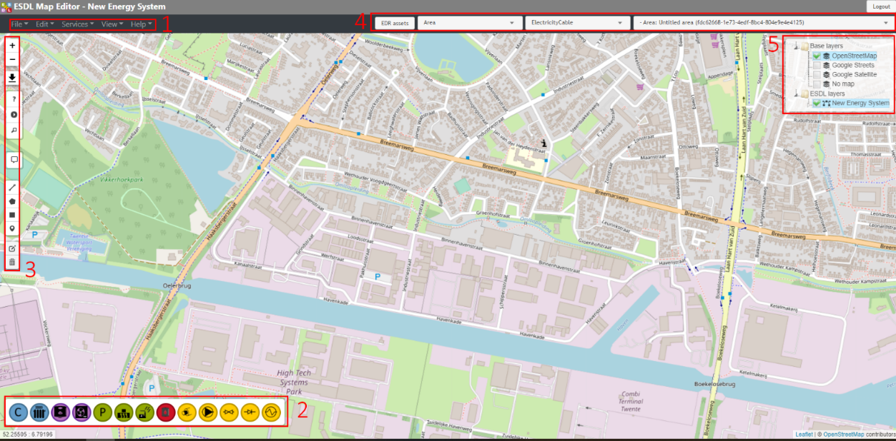
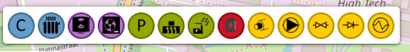
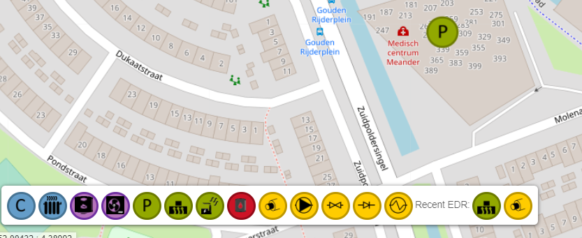
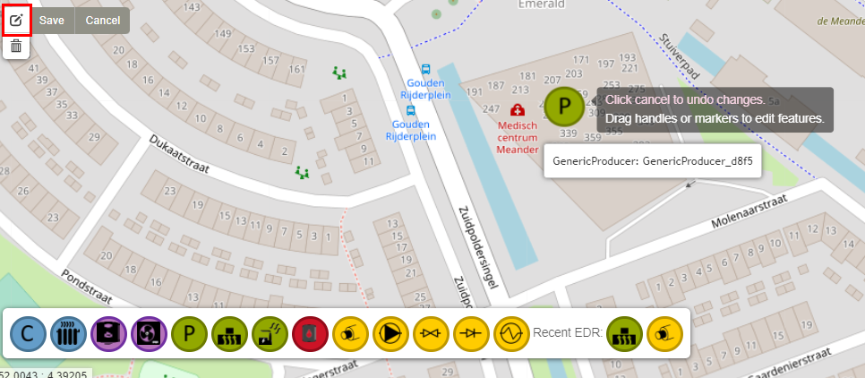
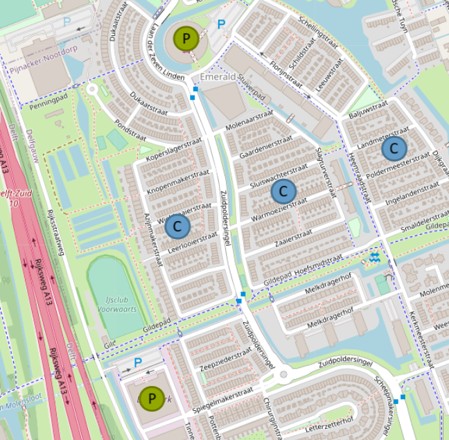
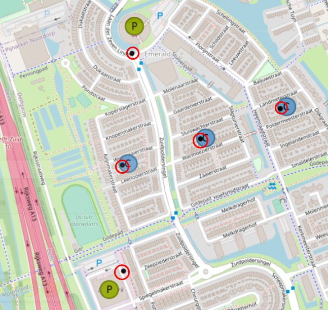
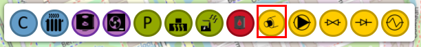
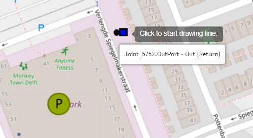
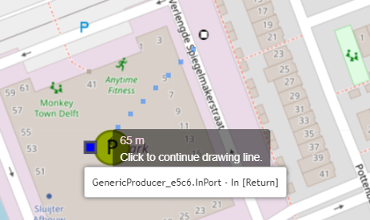
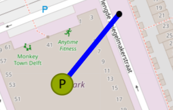
.. |image11| image:: media/image12.png
   :width: 2.02767in
   :height: 3.91026in
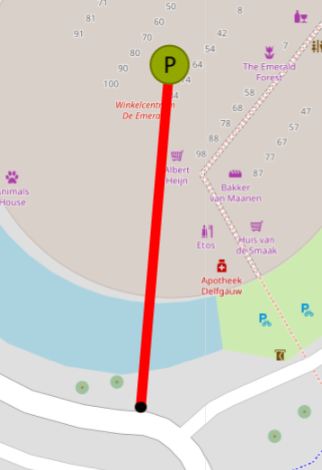
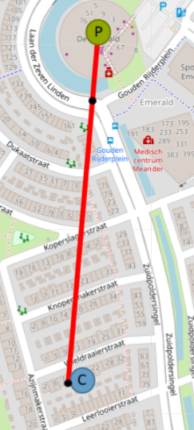
.. |image14| image:: media/image15.png
   :width: 2.98641in
   :height: 3.09615in
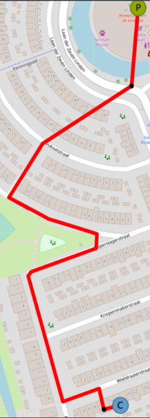
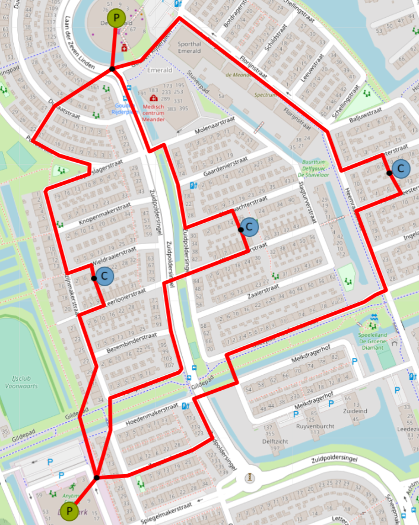
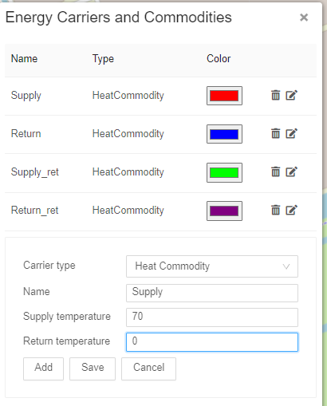
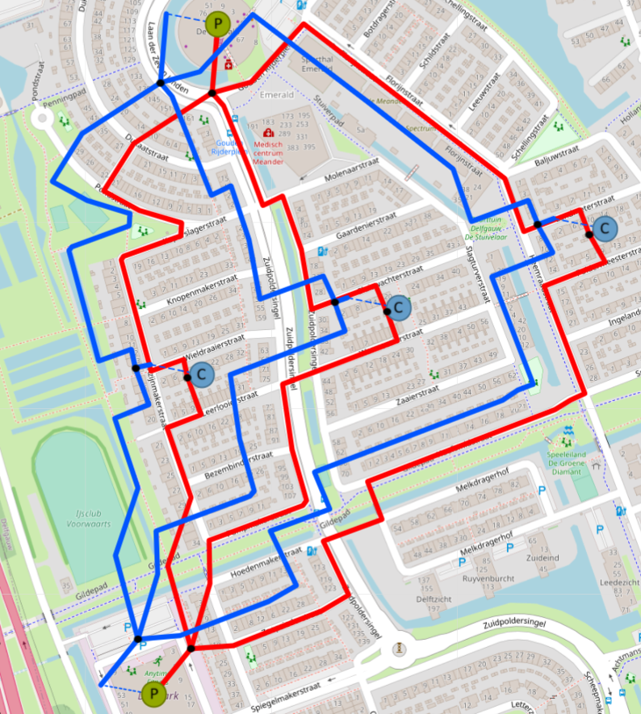
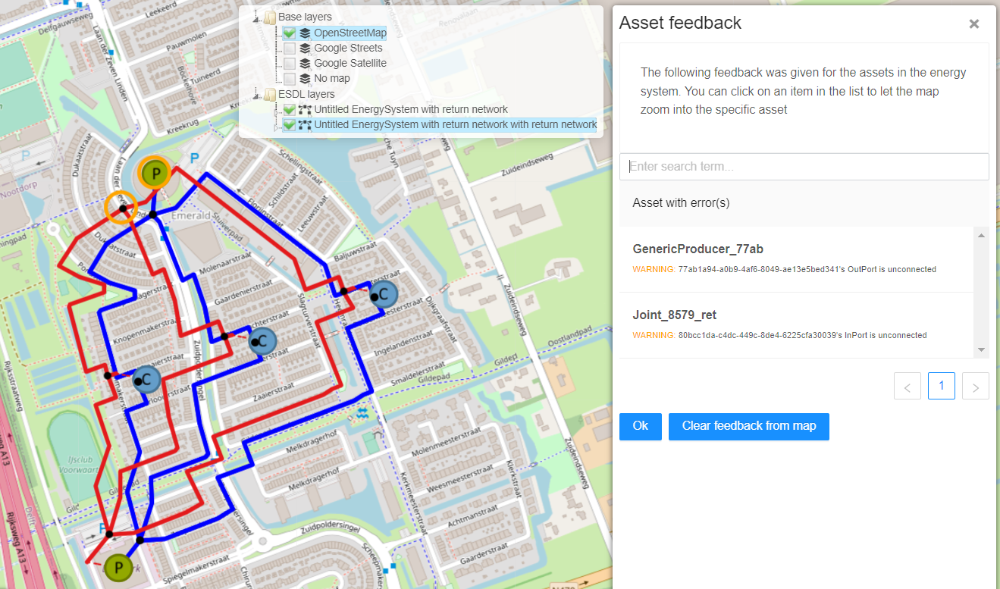
.. |image20| image:: media/image21.png
   :width: 4.18333in
   :height: 1.55000in
