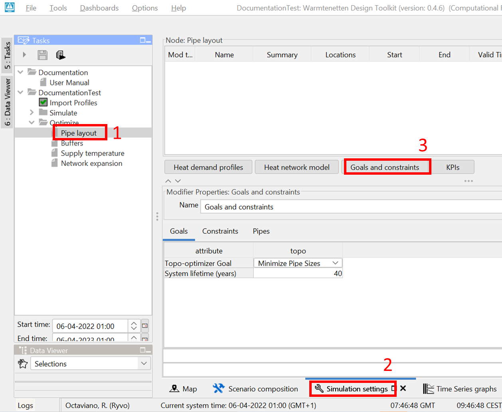
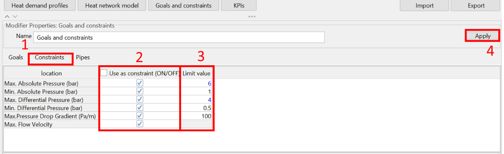
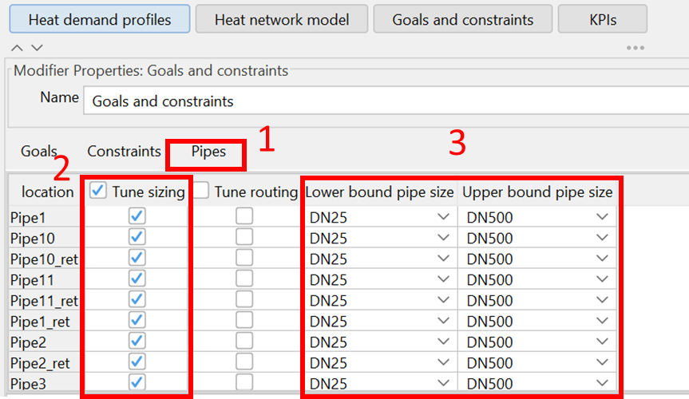

.. _diam_opti:

I want to optimize the pipe sizing
==================================

Tested for version beta 0.4.2 of the WarmingUp Design Toolkit.

The tutorial deals with optimizing the topology of a heat network. This
tutorial shows the steps to find the answer to the following questions:

1) How to minimize pipe sizing in the network?

This tutorial builds upon the preceding tutorial topic ‘I want to
simulate an existing network’, see `I want to simulate an existing
network — Warming Up Design toolkit 0.3 documentation
(readthedocs-hosted.com) <https://warmingup-designtoolkitdocumentation.readthedocs-hosted.com/en/latest/workflows/existing/index.html>`__

To achieve these results the following packages are used:

+------------+-----------------------------------------------------------------------------------+
| |image0|   | The Computational Framework is used to run the workflows and create scenarios     |
+------------+-----------------------------------------------------------------------------------+
| |image1|   | Within the Computational Framework CHESS is used to simulate the network.         |
+------------+-----------------------------------------------------------------------------------+
| |image15|  | Within the Computational Framework the Energy Network Topology Optimizer is used. |
+------------+-----------------------------------------------------------------------------------+

+-----------+------------------------------------------------------------------------------------------------------------------------------------------+
| \ **1**   | .. rubric:: **How to minimize pipe sizing in the network?**                                                                              |
|           |    :name: how-to-minimize-pipe-sizing-in-the-network                                                                                     |
+===========+==========================================================================================================================================+
| 1.1       | | 1) Go to Optimize-> Pipe layout in the Tasks panel.                                                                                    |
|           | | 2) Click on the ‘Simulation settings’ tab                                                                                              |
|           |                                                                                                                                          |
|           | 3) Click on the ‘Goals and constraints’ tab                                                                                              |
|           |                                                                                                                                          |
|           | |image2|                                                                                                                                 |
+-----------+------------------------------------------------------------------------------------------------------------------------------------------+
| 1.2       | Defining the goals:                                                                                                                      |
|           |                                                                                                                                          |
|           | 1) Open the goals under the tab ‘Goals’                                                                                                  |
|           |                                                                                                                                          |
|           | 2) Set the goal to the desired goal, in this case ‘Minimize Pipe Sizes’                                                                  |
|           |                                                                                                                                          |
|           | 3) Set the system lifetime in years                                                                                                      |
|           |                                                                                                                                          |
|           | |image3|                                                                                                                                 |
+-----------+------------------------------------------------------------------------------------------------------------------------------------------+
| 1.3       | Defining the constraints:                                                                                                                |
|           |                                                                                                                                          |
|           | 1) Open the ‘Constraints’ tab                                                                                                            |
|           |                                                                                                                                          |
|           | 2) Click on the checkboxes to turn on/off specific constraints                                                                           |
|           |                                                                                                                                          |
|           | 3) Define the constraints as desired (the flow velocities are a pipe characteristic and are defined in the EDR database <Link to EDR>)   |
|           |                                                                                                                                          |
|           | 4) Click the ‘Apply’ button                                                                                                              |
|           |                                                                                                                                          |
|           | |image4|                                                                                                                                 |
+-----------+------------------------------------------------------------------------------------------------------------------------------------------+
| 1.4       | Defining bounds on pipe sizes and selecting the pipe characteristics to be optimized/tuned:                                              |
|           |                                                                                                                                          |
|           | 1) Open the ‘Pipes’ tab                                                                                                                  |
|           |                                                                                                                                          |
|           | 2) Select the ‘Tune sizing’ via the checkboxes.                                                                                          |
|           |                                                                                                                                          |
|           | 3) Setting the lower and upper bounds of the pipe sizes (Tip: these can be copied and pasted similar to in excel)                        |
|           |                                                                                                                                          |
|           | |image5|                                                                                                                                 |
+-----------+------------------------------------------------------------------------------------------------------------------------------------------+
| 1.5       | Creating the scenario modifiers                                                                                                          |
|           |                                                                                                                                          |
|           | 1) Give the scenario a distinguishable name                                                                                              |
|           |                                                                                                                                          |
|           | 2) Click the ‘Apply’ button to save the scenario modifiers                                                                               |
|           |                                                                                                                                          |
|           | |image6|                                                                                                                                 |
+-----------+------------------------------------------------------------------------------------------------------------------------------------------+
| 1.6       | The desired scenario modifier is now created and can be used in a scenario.                                                              |
|           |                                                                                                                                          |
|           | |image7|                                                                                                                                 |
+-----------+------------------------------------------------------------------------------------------------------------------------------------------+
| 1.7       | Creating a scenario with the topo-optimizer modifier                                                                                     |
|           |                                                                                                                                          |
|           | 1) Open the tab ‘Scenario composition’                                                                                                   |
|           |                                                                                                                                          |
|           | 2) Click on ‘Create’                                                                                                                     |
|           |                                                                                                                                          |
|           | |image8|                                                                                                                                 |
+-----------+------------------------------------------------------------------------------------------------------------------------------------------+
| 1.8       | Creating a scenario with the topo-optimizer modifier                                                                                     |
|           |                                                                                                                                          |
|           | 1) Give the scenario a name                                                                                                              |
|           |                                                                                                                                          |
|           | 2) Set the scenario as follows:                                                                                                          |
|           |                                                                                                                                          |
|           |    a. Task: select ‘Optimize Pipe layout’                                                                                                |
|           |                                                                                                                                          |
|           |    b. ESDL: select the desired ESDL file                                                                                                 |
|           |                                                                                                                                          |
|           |    c. Simulation step: set the time to 1 hour                                                                                            |
|           |                                                                                                                                          |
|           |    d. Apply thermal loss: Leave the box unchecked                                                                                        |
|           |                                                                                                                                          |
|           |    e. Heat Demand profiles: select ‘nothing selected’, as no heat demand is modified                                                     |
|           |                                                                                                                                          |
|           |    f. Heat Supply profiles: select ‘nothing selected’, as no heat demand is modified                                                     |
|           |                                                                                                                                          |
|           |    g. Heat network model: select ‘nothing selected’, as no CHESS parameters are modified                                                 |
|           |                                                                                                                                          |
|           |    h. Goals and constraints: select ‘Minimize Pipe Sizes PN6’                                                                            |
|           |                                                                                                                                          |
|           |    i. KPIs: select ‘nothing selected’, as no KPI parameters are modified                                                                 |
|           |                                                                                                                                          |
|           | 3) Click on ‘Apply’ to create the scenario                                                                                               |
|           |                                                                                                                                          |
|           | 4) The scenario has now been created and is ready to run                                                                                 |
|           |                                                                                                                                          |
|           | |image9|                                                                                                                                 |
+-----------+------------------------------------------------------------------------------------------------------------------------------------------+
| 1.9       | Running the scenario                                                                                                                     |
|           |                                                                                                                                          |
|           | 1) Select the scenario you want to run                                                                                                   |
|           |                                                                                                                                          |
|           | 2) Set the simulation period (for fast results limit this to when the peak demand occurs)                                                |
|           |                                                                                                                                          |
|           | 3) Run the Scenario                                                                                                                      |
|           |                                                                                                                                          |
|           |     |image10|                                                                                                                            |
+-----------+------------------------------------------------------------------------------------------------------------------------------------------+
| 1.10      | Viewing the results                                                                                                                      |
|           |                                                                                                                                          |
|           | There are different ways to inspect the results after optimizing the pipe layout:                                                        |
|           |                                                                                                                                          |
|           | 1) Under the tab “Spatial results”:                                                                                                      |
|           |                                                                                                                                          |
|           | a) It is possible to see the optimal inner diameters of the pipelines                                                                    |
|           |                                                                                                                                          |
|           |    |image11|                                                                                                                             |
|           |                                                                                                                                          |
|           | b) It is possible to see the maximum flow velocity compared to a limit                                                                   |
|           |                                                                                                                                          |
|           |     |image12|                                                                                                                            |
|           |                                                                                                                                          |
|           | 1) Under the tab “Other results”:                                                                                                        |
|           |                                                                                                                                          |
|           | a) It is possible to see the optimization results in tabular format                                                                      |
|           |                                                                                                                                          |
|           |     |image13|                                                                                                                            |
+-----------+------------------------------------------------------------------------------------------------------------------------------------------+

