I want to simulate an existing network

**Goals**

-  Start an existing project in CF

-  Simulate existing network in Chess

-  View results after simulation of the existing network

**How to start an existing network in CF**

1. Start WiseDesingToolkit by clicking WiseDesignToolkit.cmd in the
installation folder.

*Help what if Wise Design Toolkit is blocked?*

*Note: When opened the start screen should look like this*

|image0|

2. Select start new CF project

|image1|

3. Choose desired location to open ESDL from (local drive of ESDL drive)

*Note: This tutorial will focus on an existing project on the ESDL
drive*

|image2|

4. Login to ESDL drive and navigate to the desired ESDL file

*Note: To acquire the accounts to log in please contact……*

|image3|

5. Select the desired map location to store the project

6. Specify the project name and click OK

|image4|

*Have a bit of patience the first time and it should look like*

|image5|

*
*

**How to simulate your existing network in Chess **

1. Navigatie to the Tasks panel (1) (upper left) and expand the project
(2)

|image6|

2. Select 'Import Heat Demand' (1) and click on the Run Task (2)

*When successfully finished you should get a green box (right picture)*

|image7|\ |image8|

*
*

3. Informative: If you want to check or alter the imported Heat Demand
click the Heat Demand button

|image9|\ 4. Click on Run Chess (Rule-Based Control) in the Tasks panel
(1) then click scenario composition (2)

|image10|

*
*

5. Click create, specify a desired name and click apply

*Further scenario composition is described in ….*

|image11|

*And it should look like this in the taskspanel*

|image12|

6. Select Test case in the task panel and click the run Tasks button

*Note.When successfully finished it should look like the screenshot on
the right*

|image13|\ |image14|

*Note. In the Logs panel (bottom left) you can follow the progress of
any task you run*

|image15|

*
*

**How to view results after simulation your network**

1. To view spatial results

   a. Select the tab 'spatial results' and zoom to the existing network

|image16|

a. To view the spatial results, select any type of asset and result you
   like in the results panel top left next to the tasks panel

|image17|

1. To view the results in the time series tab

   a. Select Time series graphs (1)

   b. select the simulation method (2) à in this case chess

   c. select the desired assets (3)

   d. Select the desired data you want to show (4)

    |image18|

.. |image0| image:: media/image1.png
   :width: 6.30000in
   :height: 2.30139in
.. |image1| image:: media/image1.png
   :width: 5.31758in
   :height: 3.38961in
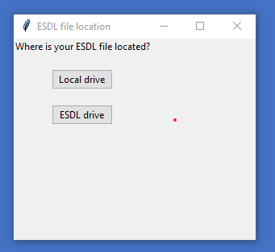
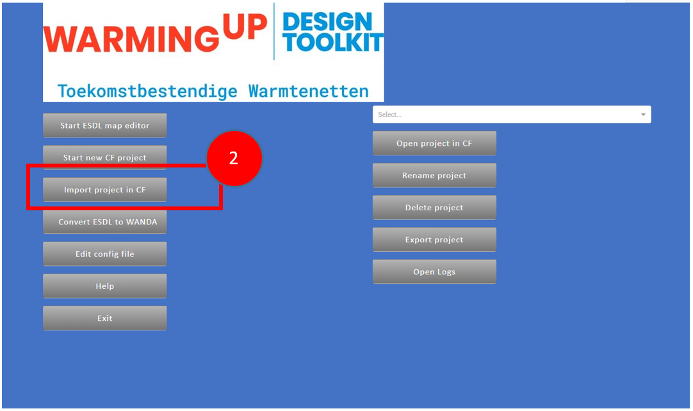
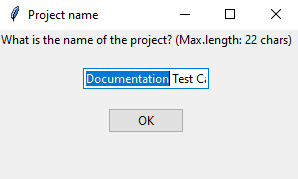
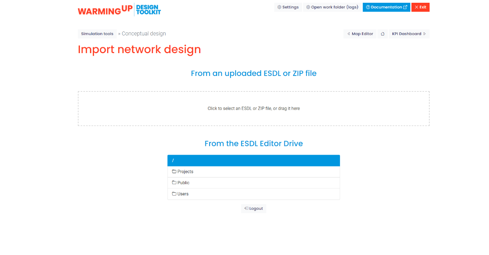
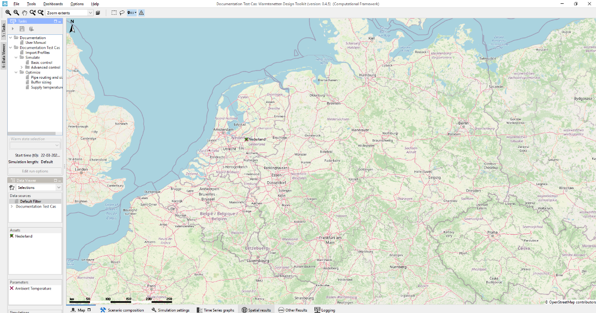
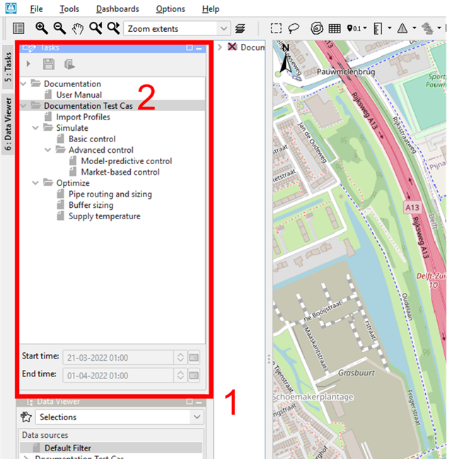
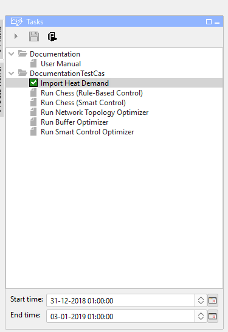
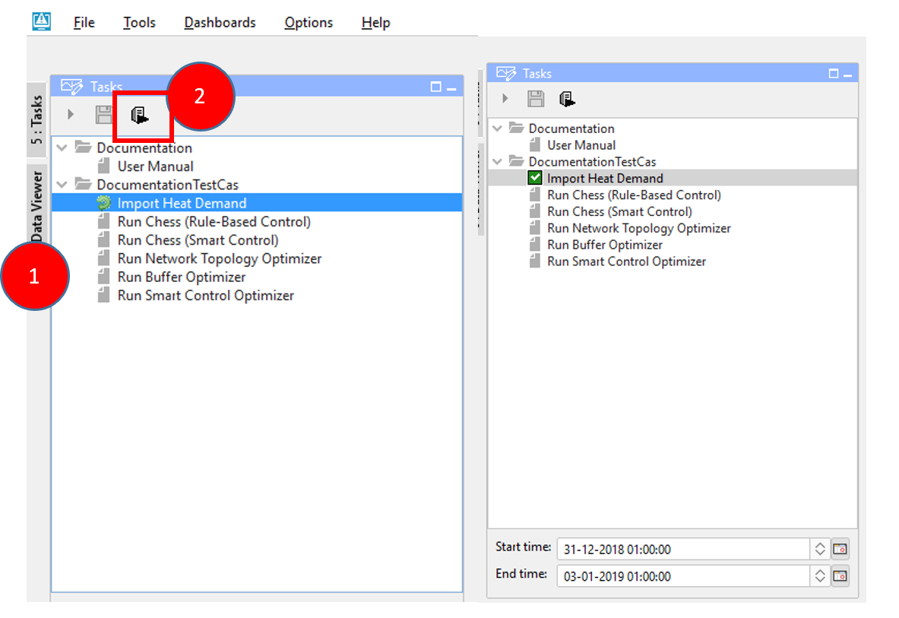
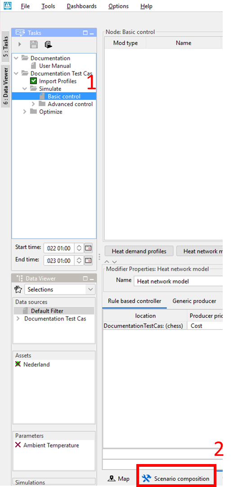
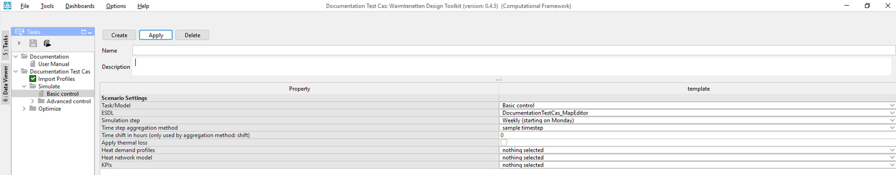
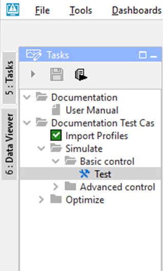
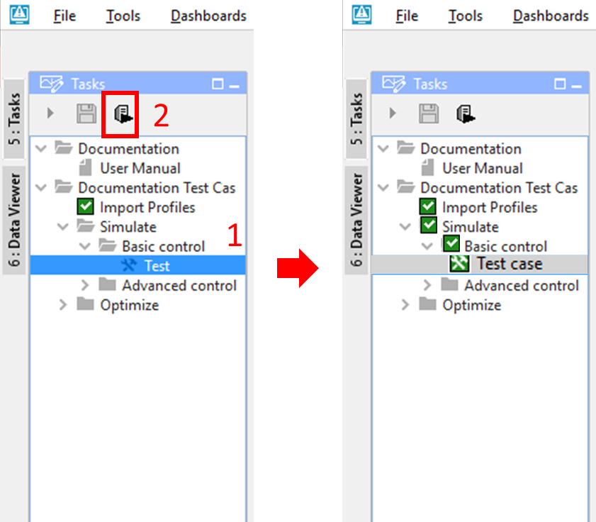
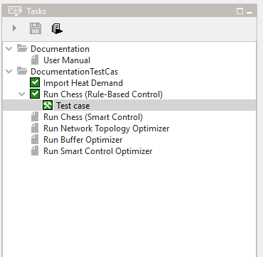
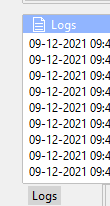
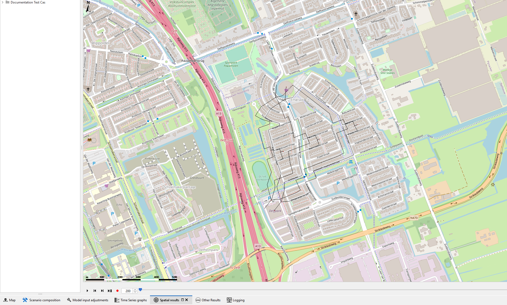
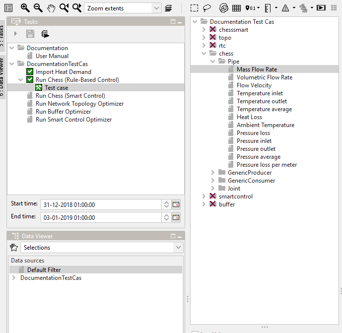
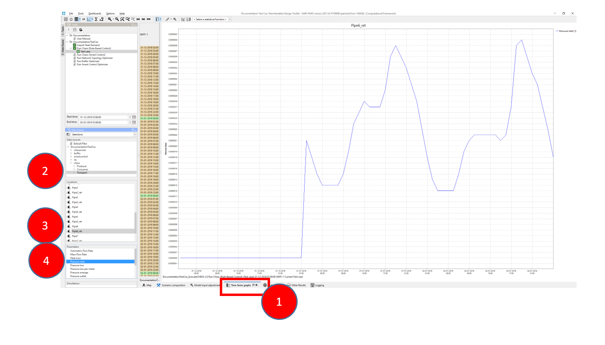
