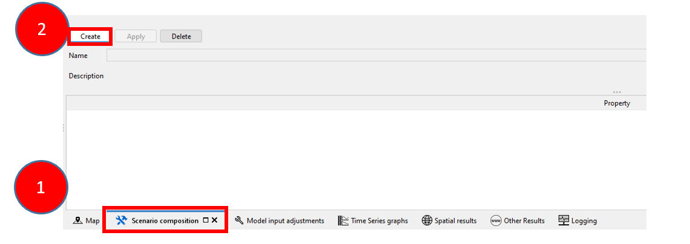
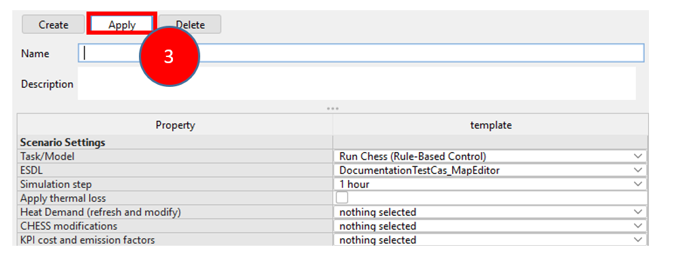
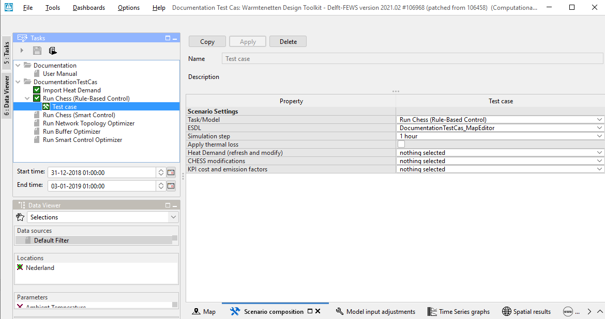
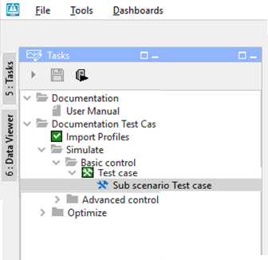
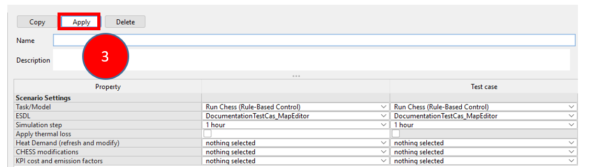
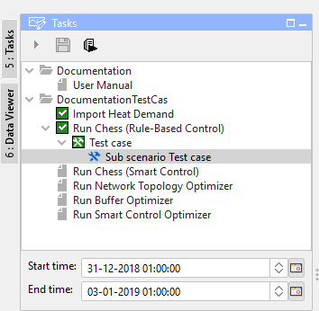
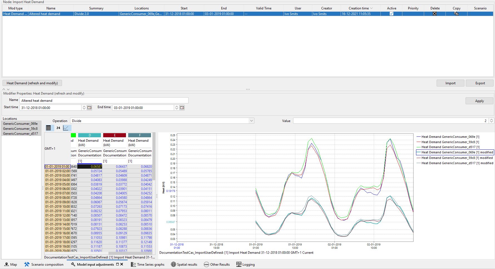
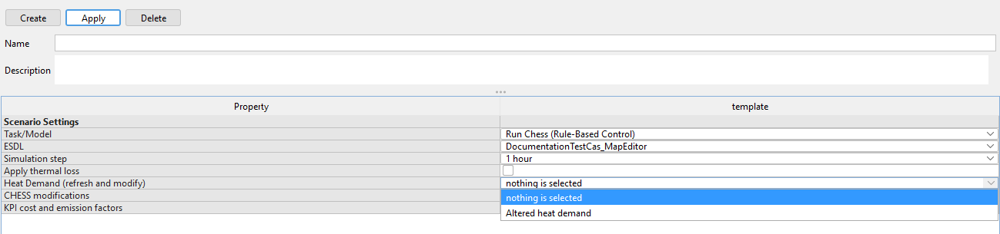

.. _Exisiting:

I want to simulate an existing network
======================================

Tested for version CF build number 109802

This tutorial focuses on the simulation of an existing network in the
computational framework (CF) as well as the possibilities to alter
(sub-) scenario's and to change the imported heat demand.

This tutorial shows the steps to find the answer to the following
questions:

1) `How to import an existing network in the computational framework
   (CF)? <#how-to-import-an-existing-network-in-the-computational-framework-cf>`__

2) `How to simulate your existing
   network? <#how-to-simulate-your-existing-network>`__

3) `How to view results after simulating your
   network? <#how-to-view-results-after-simulating-your-network>`__

4) `How to alter scenarios? <#how-to-alter-scenarios>`__

5) `How to create a sub-scenario? <#how-to-create-a-sub-scenario>`__

6) `How to change the imported heat
   demand? <#how-to-change-the-imported-heat-demand>`__

This tutorial uses the ESDL created in the tutorial: `I want to create a
network <https://warmingup-designtoolkitdocumentation.readthedocs-hosted.com/en/latest/workflows/conceptual/index.html>`__.
Alternatively, you can also use the :download:`course model ESDL <examples/coursemodel2.esdl>`.

To achieve these results the following workflows and packages are used:

+------------+-----------------------------------------------------------------------------------------------------------------------------------------------------------------------------------------+
| |image0|   | The network is loaded into the Computational Framework (CF), which allows to alter heat demand, simulate and optimize heat networks, define (sub) scenario's and related *modifiers*.   |
+============+=========================================================================================================================================================================================+
| |image1|   | In the CF environment, CHESS is used to simulate the network.                                                                                                                           |
+------------+-----------------------------------------------------------------------------------------------------------------------------------------------------------------------------------------+

If these packages haven’t been installed yet, please follow the
tutorial: `I want to install the
toolkit <https://warmingup-designtoolkitdocumentation.readthedocs-hosted.com/en/latest/workflows/installation/index.html>`__

+-----------------------+-------------------------------------------------------------------------------------------------------------------------------------------------------------------------------------------------------------------------------------------------------------------------------+
| .. rubric:: 1         | .. rubric:: How to import an existing network in the computational framework (CF)                                                                                                                                                                                             |
|    :name: section     |    :name: how-to-import-an-existing-network-in-the-computational-framework-cf                                                                                                                                                                                                 |
+=======================+===============================================================================================================================================================================================================================================================================+
| 1.1                   | Start the WarmingUP Design Toolkit by clicking WiseDesignToolkit.cmd in the installation folder. Your start screen looks like this:                                                                                                                                           |
|                       |                                                                                                                                                                                                                                                                               |
|                       | |image2|                                                                                                                                                                                                                                                                      |
+-----------------------+-------------------------------------------------------------------------------------------------------------------------------------------------------------------------------------------------------------------------------------------------------------------------------+
| 1.2                   | Click the button “Go to Simulation tools”.                                                                                                                                                                                                                                    |
|                       |                                                                                                                                                                                                                                                                               |
|                       | |image3|                                                                                                                                                                                                                                                                      |
+-----------------------+-------------------------------------------------------------------------------------------------------------------------------------------------------------------------------------------------------------------------------------------------------------------------------+
| 1.3                   | Under the tab “Conceptual Design”, click the button “Import Network Design”.                                                                                                                                                                                                  |
|                       |                                                                                                                                                                                                                                                                               |
|                       | |image4|                                                                                                                                                                                                                                                                      |
|                       |                                                                                                                                                                                                                                                                               |
|                       | *Note: This tutorial will focus on an existing project on the ESDL Editor Drive*                                                                                                                                                                                              |
+-----------------------+-------------------------------------------------------------------------------------------------------------------------------------------------------------------------------------------------------------------------------------------------------------------------------+
| 1.4                   | Navigate to your saved ESDL file and open it.                                                                                                                                                                                                                                 |
+-----------------------+-------------------------------------------------------------------------------------------------------------------------------------------------------------------------------------------------------------------------------------------------------------------------------+
| 1.5                   | Select the desired location of the folder to store the project                                                                                                                                                                                                                |
+-----------------------+-------------------------------------------------------------------------------------------------------------------------------------------------------------------------------------------------------------------------------------------------------------------------------+
| 1.6                   | Specify the project name and click OK. The Computational Framework starts up, and should look this (have a bit of patience the first time you start it)                                                                                                                       |
|                       |                                                                                                                                                                                                                                                                               |
|                       | |image5|                                                                                                                                                                                                                                                                      |
+-----------------------+-------------------------------------------------------------------------------------------------------------------------------------------------------------------------------------------------------------------------------------------------------------------------------+
| .. rubric:: 2         | .. rubric:: How to simulate your existing network                                                                                                                                                                                                                             |
|    :name: section-1   |    :name: how-to-simulate-your-existing-network                                                                                                                                                                                                                               |
+-----------------------+-------------------------------------------------------------------------------------------------------------------------------------------------------------------------------------------------------------------------------------------------------------------------------+
| 2.1                   | Navigate to the Tasks panel (1) (upper left) and expand the project (2).                                                                                                                                                                                                      |
|                       |                                                                                                                                                                                                                                                                               |
|                       | *The tasks panel gives an overview of the possible tasks/models within CF. In this tutorial we will apply the tasks of importin heat demand profiles and running a simulation with basic control.*                                                                            |
|                       |                                                                                                                                                                                                                                                                               |
|                       | |image6|                                                                                                                                                                                                                                                                      |
+-----------------------+-------------------------------------------------------------------------------------------------------------------------------------------------------------------------------------------------------------------------------------------------------------------------------+
| 2.2                   | Select 'Import Profiles' (1) and click on the Run button (2).                                                                                                                                                                                                                 |
|                       |                                                                                                                                                                                                                                                                               |
|                       | This step imports the heat demand profiles as defined in the heat network design in the ESDL MapEditor .                                                                                                                                                                      |
|                       |                                                                                                                                                                                                                                                                               |
|                       | |image7|                                                                                                                                                                                                                                                                      |
+-----------------------+-------------------------------------------------------------------------------------------------------------------------------------------------------------------------------------------------------------------------------------------------------------------------------+
| 2.3                   | Informative: If you want to check or alter the imported heat demand, click the “Heat demand profiles” button.                                                                                                                                                                 |
|                       |                                                                                                                                                                                                                                                                               |
|                       | |image8|                                                                                                                                                                                                                                                                      |
|                       |                                                                                                                                                                                                                                                                               |
|                       | *Note: the topic 6: How to change the imported heat demand? is described further in this tutorial*.                                                                                                                                                                           |
+-----------------------+-------------------------------------------------------------------------------------------------------------------------------------------------------------------------------------------------------------------------------------------------------------------------------+
| 2.4                   | In order to correctly simulate your network, it is needed to compose a scenario. In a scenario a selection of logical attributes is bundled. The abilities to alter scenarios are described in 4: How to alter scenarios, in this tutorial.                                   |
|                       |                                                                                                                                                                                                                                                                               |
|                       | Click on Simulate-> Basic Control in the Tasks panel (1) then click Scenario composition (2).                                                                                                                                                                                 |
|                       |                                                                                                                                                                                                                                                                               |
|                       | |image9|                                                                                                                                                                                                                                                                      |
+-----------------------+-------------------------------------------------------------------------------------------------------------------------------------------------------------------------------------------------------------------------------------------------------------------------------+
| 2.5                   | Click create, specify a desired name and click apply                                                                                                                                                                                                                          |
|                       |                                                                                                                                                                                                                                                                               |
|                       | |image10|                                                                                                                                                                                                                                                                     |
|                       |                                                                                                                                                                                                                                                                               |
|                       | The scenario is now created and it should look like this in the Tasks panel                                                                                                                                                                                                   |
|                       |                                                                                                                                                                                                                                                                               |
|                       | |image11|                                                                                                                                                                                                                                                                     |
+-----------------------+-------------------------------------------------------------------------------------------------------------------------------------------------------------------------------------------------------------------------------------------------------------------------------+
| 2.6                   | Select (1) the case (here called “Test”) in the Tasks panel and click the Run (2) button                                                                                                                                                                                      |
|                       |                                                                                                                                                                                                                                                                               |
|                       | |image12|                                                                                                                                                                                                                                                                     |
+-----------------------+-------------------------------------------------------------------------------------------------------------------------------------------------------------------------------------------------------------------------------------------------------------------------------+
| .. rubric:: 3         | .. rubric:: How to view results after simulating your network                                                                                                                                                                                                                 |
|    :name: section-2   |    :name: how-to-view-results-after-simulating-your-network                                                                                                                                                                                                                   |
+-----------------------+-------------------------------------------------------------------------------------------------------------------------------------------------------------------------------------------------------------------------------------------------------------------------------+
| 3.1                   | Within CF there are multiple ways to view the results of a simulation. The following steps describe the actions needed to be able to view these results.                                                                                                                      |
|                       |                                                                                                                                                                                                                                                                               |
|                       | To view spatial results                                                                                                                                                                                                                                                       |
|                       |                                                                                                                                                                                                                                                                               |
|                       | Select the tab 'spatial results' and zoom to the existing network                                                                                                                                                                                                             |
|                       |                                                                                                                                                                                                                                                                               |
|                       | |image13|                                                                                                                                                                                                                                                                     |
|                       |                                                                                                                                                                                                                                                                               |
|                       | To view the spatial results, select any type of asset and result you like in the results panel top left next to the tasks panel                                                                                                                                               |
|                       |                                                                                                                                                                                                                                                                               |
|                       |     |image14|                                                                                                                                                                                                                                                                 |
+-----------------------+-------------------------------------------------------------------------------------------------------------------------------------------------------------------------------------------------------------------------------------------------------------------------------+
| 3.2                   | To view the results in the time series tab                                                                                                                                                                                                                                    |
|                       |                                                                                                                                                                                                                                                                               |
|                       | 1. Select Time series graphs                                                                                                                                                                                                                                                  |
|                       |                                                                                                                                                                                                                                                                               |
|                       | 2. Select the simulation method à in this case Basic Control                                                                                                                                                                                                                  |
|                       |                                                                                                                                                                                                                                                                               |
|                       | 3. Select the desired assets                                                                                                                                                                                                                                                  |
|                       |                                                                                                                                                                                                                                                                               |
|                       | 4. Select the desired data you want to show                                                                                                                                                                                                                                   |
|                       |                                                                                                                                                                                                                                                                               |
|                       | |image15|                                                                                                                                                                                                                                                                     |
+-----------------------+-------------------------------------------------------------------------------------------------------------------------------------------------------------------------------------------------------------------------------------------------------------------------------+
| .. rubric:: 4         | .. rubric:: How to alter scenario's                                                                                                                                                                                                                                           |
|    :name: section-3   |    :name: how-to-alter-scenarios                                                                                                                                                                                                                                              |
+-----------------------+-------------------------------------------------------------------------------------------------------------------------------------------------------------------------------------------------------------------------------------------------------------------------------+
| 4.1                   | *In order to compare different scenarios, it is possible to alter and add scenarios within CF. The following steps describe the abilities to alter the scenarios.*                                                                                                            |
|                       |                                                                                                                                                                                                                                                                               |
|                       | To start a scenario composition                                                                                                                                                                                                                                               |
|                       |                                                                                                                                                                                                                                                                               |
|                       | 1. Select the tab 'Scenario composition’                                                                                                                                                                                                                                      |
|                       |                                                                                                                                                                                                                                                                               |
|                       | 2. Select the button 'Create'                                                                                                                                                                                                                                                 |
|                       |                                                                                                                                                                                                                                                                               |
|                       | |image16|                                                                                                                                                                                                                                                                     |
+-----------------------+-------------------------------------------------------------------------------------------------------------------------------------------------------------------------------------------------------------------------------------------------------------------------------+
| 4.2                   | Within the scenario composition manager, you can specify a scenario by its settings:                                                                                                                                                                                          |
|                       |                                                                                                                                                                                                                                                                               |
|                       | a) Adding a specific name;                                                                                                                                                                                                                                                    |
|                       |                                                                                                                                                                                                                                                                               |
|                       | b) Define the Task you would like to run                                                                                                                                                                                                                                      |
|                       |                                                                                                                                                                                                                                                                               |
|                       | c) Define the ESDL MapEditor model you would like to use (your original one or one that has previously been optimized)                                                                                                                                                        |
|                       |                                                                                                                                                                                                                                                                               |
|                       | d) Define the simulation step and related parameters                                                                                                                                                                                                                          |
|                       |                                                                                                                                                                                                                                                                               |
|                       | e) Define the heat demand (standard model demand or an altered demand)                                                                                                                                                                                                        |
|                       |                                                                                                                                                                                                                                                                               |
|                       | f) Define the heat network model                                                                                                                                                                                                                                              |
|                       |                                                                                                                                                                                                                                                                               |
|                       | g) Any KPI cost and emission factors added                                                                                                                                                                                                                                    |
+-----------------------+-------------------------------------------------------------------------------------------------------------------------------------------------------------------------------------------------------------------------------------------------------------------------------+
| 4.3                   | To save the composed scenario select 'Apply' (3)                                                                                                                                                                                                                              |
|                       |                                                                                                                                                                                                                                                                               |
|                       | |image17|                                                                                                                                                                                                                                                                     |
+-----------------------+-------------------------------------------------------------------------------------------------------------------------------------------------------------------------------------------------------------------------------------------------------------------------------+
| 4.4                   | Eventually the result should look like this                                                                                                                                                                                                                                   |
|                       |                                                                                                                                                                                                                                                                               |
|                       | |image18|                                                                                                                                                                                                                                                                     |
+-----------------------+-------------------------------------------------------------------------------------------------------------------------------------------------------------------------------------------------------------------------------------------------------------------------------+
| .. rubric:: 5         | .. rubric:: How to create a-sub scenario                                                                                                                                                                                                                                      |
|    :name: section-4   |    :name: how-to-create-a-sub-scenario                                                                                                                                                                                                                                        |
+-----------------------+-------------------------------------------------------------------------------------------------------------------------------------------------------------------------------------------------------------------------------------------------------------------------------+
| 5.1                   | To create a sub-scenario on an existing scenario                                                                                                                                                                                                                              |
|                       |                                                                                                                                                                                                                                                                               |
|                       | 1. Select the scenario you would like to use as the base scenario                                                                                                                                                                                                             |
|                       |                                                                                                                                                                                                                                                                               |
|                       | 2. Select the tab 'scenario composition'                                                                                                                                                                                                                                      |
|                       |                                                                                                                                                                                                                                                                               |
|                       | 3. Select the button 'copy'                                                                                                                                                                                                                                                   |
|                       |                                                                                                                                                                                                                                                                               |
|                       |     |image19|                                                                                                                                                                                                                                                                 |
+-----------------------+-------------------------------------------------------------------------------------------------------------------------------------------------------------------------------------------------------------------------------------------------------------------------------+
| 5.2                   | Within the scenario composition manager, you can specify the sub-scenario by changing any setting you would like:                                                                                                                                                             |
|                       |                                                                                                                                                                                                                                                                               |
|                       | a) Adding a specific name for the sub-scenario;                                                                                                                                                                                                                               |
|                       |                                                                                                                                                                                                                                                                               |
|                       | b) Define the Task you would like to run                                                                                                                                                                                                                                      |
|                       |                                                                                                                                                                                                                                                                               |
|                       | c) Define the ESDL MapEditor model you would like to use (your original one or one that has previously been optimized)                                                                                                                                                        |
|                       |                                                                                                                                                                                                                                                                               |
|                       | d) Define the simulation step and related parameters                                                                                                                                                                                                                          |
|                       |                                                                                                                                                                                                                                                                               |
|                       | e) Define the heat demand (standard model demand or an altered demand)                                                                                                                                                                                                        |
|                       |                                                                                                                                                                                                                                                                               |
|                       | f) Define the heat network model                                                                                                                                                                                                                                              |
|                       |                                                                                                                                                                                                                                                                               |
|                       | g) Any KPI cost and emission factors added                                                                                                                                                                                                                                    |
+-----------------------+-------------------------------------------------------------------------------------------------------------------------------------------------------------------------------------------------------------------------------------------------------------------------------+
| 5.3                   | To save the composed scenario select 'Apply' (3)                                                                                                                                                                                                                              |
|                       |                                                                                                                                                                                                                                                                               |
|                       | |image20|                                                                                                                                                                                                                                                                     |
+-----------------------+-------------------------------------------------------------------------------------------------------------------------------------------------------------------------------------------------------------------------------------------------------------------------------+
| 5.4                   | Eventually the result should look like                                                                                                                                                                                                                                        |
|                       |                                                                                                                                                                                                                                                                               |
|                       | |image21|                                                                                                                                                                                                                                                                     |
+-----------------------+-------------------------------------------------------------------------------------------------------------------------------------------------------------------------------------------------------------------------------------------------------------------------------+
| .. rubric:: 6         | .. rubric:: How to change the imported Heat Demand                                                                                                                                                                                                                            |
|    :name: section-5   |    :name: how-to-change-the-imported-heat-demand                                                                                                                                                                                                                              |
+-----------------------+-------------------------------------------------------------------------------------------------------------------------------------------------------------------------------------------------------------------------------------------------------------------------------+
| 6.1                   | *Within the simulation of the ESDL model it can be useful to alter the heat demand. This altered heat demand is saved with a unique name and can be chosen within a scenario. This enables the possibility to compare simulation results based on different heat demands. *   |
|                       |                                                                                                                                                                                                                                                                               |
|                       | To change the imported heat demand                                                                                                                                                                                                                                            |
|                       |                                                                                                                                                                                                                                                                               |
|                       | 1. Select 'Import Heat Demand' in the tasks panel                                                                                                                                                                                                                             |
|                       |                                                                                                                                                                                                                                                                               |
|                       | 2. Select the button 'Heat Demand profiles'                                                                                                                                                                                                                                   |
|                       |                                                                                                                                                                                                                                                                               |
|                       | |image22|                                                                                                                                                                                                                                                                     |
+-----------------------+-------------------------------------------------------------------------------------------------------------------------------------------------------------------------------------------------------------------------------------------------------------------------------+
| 6.2                   | It's possible to alter the heat demand manually or automatically                                                                                                                                                                                                              |
|                       |                                                                                                                                                                                                                                                                               |
|                       | Manually: Alter the values one by one or by copy paste form a spreadsheet program in the table itself (blue numbers can be altered)                                                                                                                                           |
|                       |                                                                                                                                                                                                                                                                               |
|                       | |image23|                                                                                                                                                                                                                                                                     |
|                       |                                                                                                                                                                                                                                                                               |
|                       | Automatically:                                                                                                                                                                                                                                                                |
|                       |                                                                                                                                                                                                                                                                               |
|                       | 1. Select the drop-down box next to 'Operation'                                                                                                                                                                                                                               |
|                       |                                                                                                                                                                                                                                                                               |
|                       | 2. Define a value corresponding to the selected operation                                                                                                                                                                                                                     |
|                       |                                                                                                                                                                                                                                                                               |
|                       | 3. The altered demand profile is displayed in the graph                                                                                                                                                                                                                       |
|                       |                                                                                                                                                                                                                                                                               |
|                       | 4. Specify the desired name                                                                                                                                                                                                                                                   |
|                       |                                                                                                                                                                                                                                                                               |
|                       | 5. Select apply                                                                                                                                                                                                                                                               |
|                       |                                                                                                                                                                                                                                                                               |
|                       | |image24|                                                                                                                                                                                                                                                                     |
+-----------------------+-------------------------------------------------------------------------------------------------------------------------------------------------------------------------------------------------------------------------------------------------------------------------------+
| 6.3                   | The altered heat demand is saved and can be selected in any (sub) scenario                                                                                                                                                                                                    |
|                       |                                                                                                                                                                                                                                                                               |
|                       | *Note: following pictures 1 and 2 are informative *                                                                                                                                                                                                                           |
|                       |                                                                                                                                                                                                                                                                               |
|                       | |image25|\ *Figure 1 Example of a saved heat demand*                                                                                                                                                                                                                          |
|                       |                                                                                                                                                                                                                                                                               |
|                       | |image26|\ *Figure 2 Example of a saved heat demand in the scenario composition tool (link to How to alter scenario's)*                                                                                                                                                       |
+-----------------------+-------------------------------------------------------------------------------------------------------------------------------------------------------------------------------------------------------------------------------------------------------------------------------+

.. |image0| image:: media/image1.png
   :width: 0.61940in
   :height: 0.64861in
.. |image1| image:: media/image2.png
   :width: 0.97761in
   :height: 0.64793in
.. |image2| image:: media/image3.png
   :width: 4.95283in
   :height: 2.87162in
.. |image3| image:: media/image4.png
   :width: 4.95156in
   :height: 2.86972in
.. |image4| image:: media/image5.png
   :width: 5.65694in
   :height: 2.94236in
.. |image5| image:: media/image6.png
   :width: 5.65694in
   :height: 2.98125in
.. |image6| image:: media/image7.png
   :width: 4.25974in
   :height: 4.32468in
.. |image7| image:: media/image8.png
   :width: 5.65460in
   :height: 3.15761in
.. |image8| image:: media/image9.png
   :width: 4.81823in
   :height: 2.58184in
.. |image9| image:: media/image10.png
   :width: 3.52708in
   :height: 7.22083in
.. |image10| image:: media/image11.png
   :width: 5.63481in
   :height: 1.64583in
.. |image11| image:: media/image12.png
   :width: 2.11948in
   :height: 3.52464in
.. |image12| image:: media/image13.png
   :width: 4.34891in
   :height: 3.80597in
.. |image13| image:: media/image14.png
   :width: 5.65694in
   :height: 3.45972in
.. |image14| image:: media/image15.png
   :width: 5.42529in
   :height: 5.28475in
.. |image15| image:: media/image16.png
   :width: 5.52543in
   :height: 4.19765in
.. |image16| image:: media/image17.png
   :width: 5.00000in
   :height: 1.83333in
.. |image17| image:: media/image18.png
   :width: 5.68889in
   :height: 1.65016in

.. |image24| image:: media/image25.png
   :width: 5.00000in
   :height: 3.61458in

