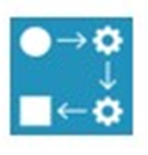
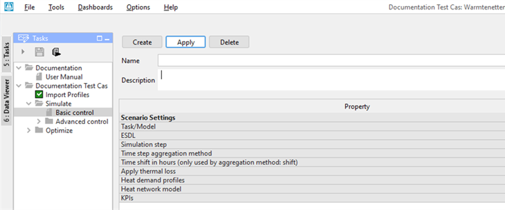

.. _Exisiting:

I want to simulate an existing network
======================================

Tested for version CF build number 109802

This tutorial focuses on the simulation of an existing network in the
computational framework (CF) as well as the possibilities to alter
(sub-) scenario's and to change the imported heat demand.

This tutorial shows the steps to find the answer to the following
questions:

1) `How to import an existing network in the computational framework
   (CF)? <#how-to-import-an-existing-network-in-the-computational-framework-cf>`__

2) `How to simulate your existing
   network? <#how-to-simulate-your-existing-network>`__

3) `How to view results after simulating your
   network? <#how-to-view-results-after-simulating-your-network>`__

4) `How to alter scenarios? <#how-to-alter-scenarios>`__

5) `How to create a sub-scenario? <#how-to-create-a-sub-scenario>`__

6) `How to change the imported heat
   demand? <#how-to-change-the-imported-heat-demand>`__

This tutorial uses the ESDL created in the tutorial: `I want to create a
network <https://warmingup-designtoolkitdocumentation.readthedocs-hosted.com/en/latest/workflows/conceptual/index.html>`__

.. raw:: html

    

        Alternatively, you can also use the
        <a download="coursemodel2.esdl" href="data:text/esdl;base64,PD94bWwgdmVyc2lvbj0nMS4wJyBlbmNvZGluZz0nVVRGLTgnPz4KPGVzZGw6RW5lcmd5U3lzdGVtIHhtbG5zOnhzaT0iaHR0cDovL3d3dy53My5vcmcvMjAwMS9YTUxTY2hlbWEtaW5zdGFuY2UiIHhtbG5zOmVzZGw9Imh0dHA6Ly93d3cudG5vLm5sL2VzZGwiIGRlc2NyaXB0aW9uPSJiYXNpYyIgdmVyc2lvbj0iMjIiIGVzZGxWZXJzaW9uPSJ2MjExMSIgbmFtZT0iY291cnNlX21vZGVsIHdpdGggcmV0dXJuIG5ldHdvcmsiIGlkPSIzYjIxYWI0OS1mZDk0LTRkZGEtODc4ZC1kY2FmNjUxZGVkNzhfd2l0aF9yZXR1cm5fbmV0d29yayI+CiAgPGVuZXJneVN5c3RlbUluZm9ybWF0aW9uIHhzaTp0eXBlPSJlc2RsOkVuZXJneVN5c3RlbUluZm9ybWF0aW9uIiBpZD0iOWE3NmI4MDAtNmUyYy00ZTk5LWE5YTUtODU5ZjdiYWRkMDYxIj4KICAgIDxxdWFudGl0eUFuZFVuaXRzIHhzaTp0eXBlPSJlc2RsOlF1YW50aXR5QW5kVW5pdHMiIGlkPSI1NGZkYThmYy1lNzI1LTRjNDQtOGE0OS03MjZhODExYmEwNjkiPgogICAgICA8cXVhbnRpdHlBbmRVbml0IHhzaTp0eXBlPSJlc2RsOlF1YW50aXR5QW5kVW5pdFR5cGUiIGlkPSJlYjA3YmNjYi0yMDNmLTQwN2UtYWY5OC1lNjg3NjU2YTIyMWQiIGRlc2NyaXB0aW9uPSJFbmVyZ3kgaW4gR0oiIG11bHRpcGxpZXI9IkdJR0EiIHBoeXNpY2FsUXVhbnRpdHk9IkVORVJHWSIgdW5pdD0iSk9VTEUiLz4KICAgICAgPHF1YW50aXR5QW5kVW5pdCB4c2k6dHlwZT0iZXNkbDpRdWFudGl0eUFuZFVuaXRUeXBlIiBpZD0iZTk0MDVmYzgtNWU1Ny00ZGY1LTg1ODQtNGJhYmVlN2NkZjFiIiBkZXNjcmlwdGlvbj0iUG93ZXIgaW4gTVciIHVuaXQ9IldBVFQiIHBoeXNpY2FsUXVhbnRpdHk9IlBPV0VSIiBtdWx0aXBsaWVyPSJNRUdBIi8+CiAgICA8L3F1YW50aXR5QW5kVW5pdHM+CiAgICA8Y2FycmllcnMgeHNpOnR5cGU9ImVzZGw6Q2FycmllcnMiIGlkPSJlODQ0MjNkOS1iNjE3LTRmYTAtYjExMy0xYmExMmRhYWNhYWYiPgogICAgICA8Y2FycmllciB4c2k6dHlwZT0iZXNkbDpIZWF0Q29tbW9kaXR5IiByZXR1cm5UZW1wZXJhdHVyZT0iNDAuMCIgc3VwcGx5VGVtcGVyYXR1cmU9IjgwLjAiIGlkPSJlOTZjNDg1Mi1iMmJjLTQzYmUtOGZhNy01YWU1ZTI1YTE4ODNfcmV0IiBuYW1lPSJzdXBwbHlfcmV0Ii8+CiAgICAgIDxjYXJyaWVyIHhzaTp0eXBlPSJlc2RsOkhlYXRDb21tb2RpdHkiIHJldHVyblRlbXBlcmF0dXJlPSI0MC4wIiBzdXBwbHlUZW1wZXJhdHVyZT0iODAuMCIgaWQ9ImJhYzIwMmZlLTdjNWYtNDYyMy04YWRlLWJhZGJjNjA3YTE2ZV9yZXQiIG5hbWU9IlJldHVybl9yZXQiLz4KICAgIDwvY2FycmllcnM+CiAgPC9lbmVyZ3lTeXN0ZW1JbmZvcm1hdGlvbj4KICA8aW5zdGFuY2UgeHNpOnR5cGU9ImVzZGw6SW5zdGFuY2UiIG5hbWU9IlVudGl0bGVkIGluc3RhbmNlIiBpZD0iOGRiMzMzN2UtNDQwZS00OGQxLWIxZTktNmY4NmM0Zjc2MzIwIj4KICAgIDxhcmVhIHhzaTp0eXBlPSJlc2RsOkFyZWEiIG5hbWU9IlVudGl0bGVkIGFyZWEiIGlkPSJhM2YzYjVkOS0yZmFhLTQ4NjItYTViMC1kMDJiMjE5MDUyZGQiPgogICAgICA8YXNzZXQgeHNpOnR5cGU9ImVzZGw6SGVhdGluZ0RlbWFuZCIgbWF4VGVtcGVyYXR1cmU9IjEyMC4wIiBtaW5UZW1wZXJhdHVyZT0iNDAuMCIgcG93ZXI9IjUwMDAwMDAuMCIgbmFtZT0iSGVhdGluZ0RlbWFuZF9jYzYxIiBpZD0iY2M2MWM1MmEtMjlhNi00NWQzLTgxZTgtY2UxOGJhMTJmMzE5Ij4KICAgICAgICA8cG9ydCB4c2k6dHlwZT0iZXNkbDpJblBvcnQiIG5hbWU9IkluIiBpZD0iYzNlYjU5YmMtMDM3ZC00Njg0LTkxOGUtZGYwZjU0YWY1YjNkIiBjYXJyaWVyPSJlOTZjNDg1Mi1iMmJjLTQzYmUtOGZhNy01YWU1ZTI1YTE4ODNfcmV0IiBjb25uZWN0ZWRUbz0iOWUxYzU4YWItZWMxOS00OTY0LTkyOGYtZDJhNTgyYWY2Y2U4Ii8+CiAgICAgICAgPHBvcnQgeHNpOnR5cGU9ImVzZGw6T3V0UG9ydCIgY29ubmVjdGVkVG89Ijk5NjI4YTc5LWUzMWMtNGE5OS1iZjRhLTJmNzg4YTVkNTM0MyIgbmFtZT0iT3V0IiBpZD0iZmNmOTZjNTUtODI2NC00MWE1LTkwZWUtMDk3N2EzOTRhNDZhIiBjYXJyaWVyPSJiYWMyMDJmZS03YzVmLTQ2MjMtOGFkZS1iYWRiYzYwN2ExNmVfcmV0Ij4KICAgICAgICAgIDxwcm9maWxlIHhzaTp0eXBlPSJlc2RsOkluZmx1eERCUHJvZmlsZSIgc3RhcnREYXRlPSIyMDE5LTAxLTAxVDAxOjAwOjAwLjAwMDAwMCswMDAwIiBob3N0PSJ3dS1wcm9maWxlcy5lc2RsLWJldGEuaGVzaS5lbmVyZ3kiIHBvcnQ9IjQ0MyIgZGF0YWJhc2U9ImVuZXJneV9wcm9maWxlcyIgbWVhc3VyZW1lbnQ9IlVuaXR0ZXN0cyBwcm9maWxlZGF0YSIgZmllbGQ9ImRlbWFuZDVfTVciIGlkPSI3MmZiN2YyNy1hOWUwLTRmNjQtODAxMC0xY2YzNGFiMGFjYTEiIGZpbHRlcnM9IiIgZW5kRGF0ZT0iMjAyMC0wMS0wMVQwMDowMDowMC4wMDAwMDArMDAwMCI+CiAgICAgICAgICAgIDxwcm9maWxlUXVhbnRpdHlBbmRVbml0IHhzaTp0eXBlPSJlc2RsOlF1YW50aXR5QW5kVW5pdFJlZmVyZW5jZSIgcmVmZXJlbmNlPSJlOTQwNWZjOC01ZTU3LTRkZjUtODU4NC00YmFiZWU3Y2RmMWIiLz4KICAgICAgICAgIDwvcHJvZmlsZT4KICAgICAgICA8L3BvcnQ+CiAgICAgICAgPGdlb21ldHJ5IHhzaTp0eXBlPSJlc2RsOlBvaW50IiBsYXQ9IjUyLjAxOTA2NzgyMzUyODA0IiBsb249IjQuNDMxNTI0Mjc2NzMzMzk5Ii8+CiAgICAgIDwvYXNzZXQ+CiAgICAgIDxhc3NldCB4c2k6dHlwZT0iZXNkbDpIZWF0aW5nRGVtYW5kIiBtYXhUZW1wZXJhdHVyZT0iMTIwLjAiIG1pblRlbXBlcmF0dXJlPSI0MC4wIiBwb3dlcj0iNTAwMDAwMC4wIiBuYW1lPSJIZWF0aW5nRGVtYW5kXzg4MDUiIGlkPSI4ODA1NzMxYS04NzgwLTQ3YjQtODIwNC03NmJhMDc0NTY0YmMiPgogICAgICAgIDxwb3J0IHhzaTp0eXBlPSJlc2RsOkluUG9ydCIgbmFtZT0iSW4iIGlkPSI2OTQ2NDc5OS0zZWMzLTQ5MjgtYTVkYS02MTU4YTYyMzdjNzYiIGNhcnJpZXI9ImU5NmM0ODUyLWIyYmMtNDNiZS04ZmE3LTVhZTVlMjVhMTg4M19yZXQiIGNvbm5lY3RlZFRvPSI4OGI2YzM1Yy03ZWViLTQyZTktYmE0ZS00OTFmYTZjN2E2ZmMiLz4KICAgICAgICA8cG9ydCB4c2k6dHlwZT0iZXNkbDpPdXRQb3J0IiBjb25uZWN0ZWRUbz0iMTQ2N2JlZTctZWQ5MC00OWQ1LTgzOTUtMzU5NTQwOGFkMWVlIiBuYW1lPSJPdXQiIGlkPSJjODYyNWI3Zi1lOWFkLTQzMjctODk5ZS0wYzZlOTFlODczY2IiIGNhcnJpZXI9ImJhYzIwMmZlLTdjNWYtNDYyMy04YWRlLWJhZGJjNjA3YTE2ZV9yZXQiPgogICAgICAgICAgPHByb2ZpbGUgeHNpOnR5cGU9ImVzZGw6SW5mbHV4REJQcm9maWxlIiBzdGFydERhdGU9IjIwMTktMDEtMDFUMDE6MDA6MDAuMDAwMDAwKzAwMDAiIGhvc3Q9Ind1LXByb2ZpbGVzLmVzZGwtYmV0YS5oZXNpLmVuZXJneSIgcG9ydD0iNDQzIiBkYXRhYmFzZT0iZW5lcmd5X3Byb2ZpbGVzIiBtZWFzdXJlbWVudD0iVW5pdHRlc3RzIHByb2ZpbGVkYXRhIiBmaWVsZD0iZGVtYW5kMl9NVyIgaWQ9ImE4YzNjMDk1LTFiNTYtNGMyNi04ZmJkLTIzMWI1Yzk1YjFjYiIgZmlsdGVycz0iIiBlbmREYXRlPSIyMDIwLTAxLTAxVDAwOjAwOjAwLjAwMDAwMCswMDAwIj4KICAgICAgICAgICAgPHByb2ZpbGVRdWFudGl0eUFuZFVuaXQgeHNpOnR5cGU9ImVzZGw6UXVhbnRpdHlBbmRVbml0UmVmZXJlbmNlIiByZWZlcmVuY2U9ImU5NDA1ZmM4LTVlNTctNGRmNS04NTg0LTRiYWJlZTdjZGYxYiIvPgogICAgICAgICAgPC9wcm9maWxlPgogICAgICAgIDwvcG9ydD4KICAgICAgICA8Z2VvbWV0cnkgeHNpOnR5cGU9ImVzZGw6UG9pbnQiIGxhdD0iNTIuMDA5NDAwNjk0MTg3NCIgbG9uPSI0LjM5NjE2MjAzMzA4MTA1NiIvPgogICAgICA8L2Fzc2V0PgogICAgICA8YXNzZXQgeHNpOnR5cGU9ImVzZGw6SGVhdGluZ0RlbWFuZCIgbWF4VGVtcGVyYXR1cmU9IjEyMC4wIiBtaW5UZW1wZXJhdHVyZT0iNDAuMCIgcG93ZXI9IjUwMDAwMDAuMCIgbmFtZT0iSGVhdGluZ0RlbWFuZF8xNTZjIiBpZD0iMTU2YzRhZmItNDEwNi00Mjg2LThmNDEtZmJmOGVkYzZlNWNlIj4KICAgICAgICA8cG9ydCB4c2k6dHlwZT0iZXNkbDpJblBvcnQiIG5hbWU9IkluIiBpZD0iYWQzNzdmYTctNzEwZi00NWU3LTkxNDQtMTUyMWJlZjVjMWFiIiBjYXJyaWVyPSJlOTZjNDg1Mi1iMmJjLTQzYmUtOGZhNy01YWU1ZTI1YTE4ODNfcmV0IiBjb25uZWN0ZWRUbz0iMjJiZTJhZTEtMTBjMC00MmViLWFiZDktNmIxMTViODAwMjgzIi8+CiAgICAgICAgPHBvcnQgeHNpOnR5cGU9ImVzZGw6T3V0UG9ydCIgY29ubmVjdGVkVG89ImZkYmFiNzYzLTNlMDUtNDlkNi05MjcxLTIwNzAzNWMxNGJjYiIgbmFtZT0iT3V0IiBpZD0iZjQ2MDkwYjktZGNkNi00MzNmLWIwMjEtMDYxYzgzOWU2MzRjIiBjYXJyaWVyPSJiYWMyMDJmZS03YzVmLTQ2MjMtOGFkZS1iYWRiYzYwN2ExNmVfcmV0Ij4KICAgICAgICAgIDxwcm9maWxlIHhzaTp0eXBlPSJlc2RsOkluZmx1eERCUHJvZmlsZSIgc3RhcnREYXRlPSIyMDE5LTAxLTAxVDAxOjAwOjAwLjAwMDAwMCswMDAwIiBob3N0PSJ3dS1wcm9maWxlcy5lc2RsLWJldGEuaGVzaS5lbmVyZ3kiIHBvcnQ9IjQ0MyIgZGF0YWJhc2U9ImVuZXJneV9wcm9maWxlcyIgbWVhc3VyZW1lbnQ9IlVuaXR0ZXN0cyBwcm9maWxlZGF0YSIgZmllbGQ9ImRlbWFuZDNfTVciIGlkPSI0ZDUxYjhiMS05NmQ1LTQwMmEtOWM5MC0zZmRmYzVjN2MxYmYiIGZpbHRlcnM9IiIgZW5kRGF0ZT0iMjAyMC0wMS0wMVQwMDowMDowMC4wMDAwMDArMDAwMCI+CiAgICAgICAgICAgIDxwcm9maWxlUXVhbnRpdHlBbmRVbml0IHhzaTp0eXBlPSJlc2RsOlF1YW50aXR5QW5kVW5pdFJlZmVyZW5jZSIgcmVmZXJlbmNlPSJlOTQwNWZjOC01ZTU3LTRkZjUtODU4NC00YmFiZWU3Y2RmMWIiLz4KICAgICAgICAgIDwvcHJvZmlsZT4KICAgICAgICA8L3BvcnQ+CiAgICAgICAgPGdlb21ldHJ5IHhzaTp0eXBlPSJlc2RsOlBvaW50IiBDUlM9IldHUzg0IiBsYXQ9IjUyLjA0MjgzMDU3MDYwMTU3IiBsb249IjQuMzkxMDk4MDIyNDYwOTM4Ii8+CiAgICAgIDwvYXNzZXQ+CiAgICAgIDxhc3NldCB4c2k6dHlwZT0iZXNkbDpKb2ludCIgbmFtZT0iSm9pbnRfMTEyNiIgaWQ9IjExMjYyZjM1LTNkNTEtNGNlMy05YTY5LTZlYjRhNmM0NmM5ZCI+CiAgICAgICAgPHBvcnQgeHNpOnR5cGU9ImVzZGw6SW5Qb3J0IiBuYW1lPSJJbiIgaWQ9ImE4Nzc5ZjhhLTNkNjEtNGE5Ny1iZmI0LTM1MDI5MTc1ZWM5NyIgY2Fycmllcj0iZTk2YzQ4NTItYjJiYy00M2JlLThmYTctNWFlNWUyNWExODgzX3JldCIgY29ubmVjdGVkVG89IjdjMTc4YTdjLWY2Y2ItNGYzMy04YzRhLTA3NmQ5MTMxZWQ4YSIvPgogICAgICAgIDxwb3J0IHhzaTp0eXBlPSJlc2RsOk91dFBvcnQiIGNvbm5lY3RlZFRvPSJhODliNTA0NS1mODE1LTQxMjYtYTRjOC1kYzEyNWE5OWMwZjggYjlhZjY1NDAtOGNhZS00MWNlLWIwYzMtNDUyOGUwMjdkM2IzIiBuYW1lPSJPdXQiIGlkPSJmZDU2MmUwNy1hNjBjLTRmNWMtOTA4NC1kNTFlNzM2ZmY1NDUiIGNhcnJpZXI9ImU5NmM0ODUyLWIyYmMtNDNiZS04ZmE3LTVhZTVlMjVhMTg4M19yZXQiLz4KICAgICAgICA8Z2VvbWV0cnkgeHNpOnR5cGU9ImVzZGw6UG9pbnQiIENSUz0iV0dTODQiIGxhdD0iNTIuMDE5MDkwOTMyMzMxODEiIGxvbj0iNC40MDE0MTkxNjI3NTAyNDUiLz4KICAgICAgPC9hc3NldD4KICAgICAgPGFzc2V0IHhzaTp0eXBlPSJlc2RsOlBpcGUiIGRpYW1ldGVyPSJETjgwIiByZWxhdGVkPSJQaXBlMV9yZXQiIG5hbWU9IlBpcGUxIiBsZW5ndGg9IjE1MzMuMiIgaW5uZXJEaWFtZXRlcj0iMC4wODI1IiBpZD0iUGlwZTEiPgogICAgICAgIDxnZW9tZXRyeSB4c2k6dHlwZT0iZXNkbDpMaW5lIiBDUlM9IldHUzg0Ij4KICAgICAgICAgIDxwb2ludCB4c2k6dHlwZT0iZXNkbDpQb2ludCIgbGF0PSI1Mi4wMTkwOTA5MzIzMzE4MSIgbG9uPSI0LjQwMTQxOTE2Mjc1MDI0NSIvPgogICAgICAgICAgPHBvaW50IHhzaTp0eXBlPSJlc2RsOlBvaW50IiBsYXQ9IjUyLjAxNTYzNDM4Mjg5OTQ4IiBsb249IjQuMzkxNjEzMDA2NTkxNzk4Ii8+CiAgICAgICAgICA8cG9pbnQgeHNpOnR5cGU9ImVzZGw6UG9pbnQiIGxhdD0iNTIuMDA5NDAwNjk0MTg3NCIgbG9uPSI0LjM5NjE2MjAzMzA4MTA1NiIvPgogICAgICAgIDwvZ2VvbWV0cnk+CiAgICAgICAgPHBvcnQgeHNpOnR5cGU9ImVzZGw6SW5Qb3J0IiBuYW1lPSJJbiIgaWQ9ImE4OWI1MDQ1LWY4MTUtNDEyNi1hNGM4LWRjMTI1YTk5YzBmOCIgY2Fycmllcj0iZTk2YzQ4NTItYjJiYy00M2JlLThmYTctNWFlNWUyNWExODgzX3JldCIgY29ubmVjdGVkVG89ImZkNTYyZTA3LWE2MGMtNGY1Yy05MDg0LWQ1MWU3MzZmZjU0NSIvPgogICAgICAgIDxwb3J0IHhzaTp0eXBlPSJlc2RsOk91dFBvcnQiIGNvbm5lY3RlZFRvPSI2OTQ2NDc5OS0zZWMzLTQ5MjgtYTVkYS02MTU4YTYyMzdjNzYiIG5hbWU9Ik91dCIgaWQ9Ijg4YjZjMzVjLTdlZWItNDJlOS1iYTRlLTQ5MWZhNmM3YTZmYyIgY2Fycmllcj0iZTk2YzQ4NTItYjJiYy00M2JlLThmYTctNWFlNWUyNWExODgzX3JldCIvPgogICAgICA8L2Fzc2V0PgogICAgICA8YXNzZXQgeHNpOnR5cGU9ImVzZGw6UGlwZSIgZGlhbWV0ZXI9IkROMjAwIiByZWxhdGVkPSJQaXBlMl9yZXQiIG5hbWU9IlBpcGUyIiBsZW5ndGg9IjQ0LjQiIGlubmVyRGlhbWV0ZXI9IjAuMjEwMSIgaWQ9IlBpcGUyIj4KICAgICAgICA8Z2VvbWV0cnkgeHNpOnR5cGU9ImVzZGw6TGluZSIgQ1JTPSJXR1M4NCI+CiAgICAgICAgICA8cG9pbnQgeHNpOnR5cGU9ImVzZGw6UG9pbnQiIGxhdD0iNTIuMDE5NDM3NTYyOTU1Njk0IiBsb249IjQuNDAxMDk3Mjk3NjY4NDU4Ii8+CiAgICAgICAgICA8cG9pbnQgeHNpOnR5cGU9ImVzZGw6UG9pbnQiIGxhdD0iNTIuMDE5MDkwOTMyMzMxODEiIGxvbj0iNC40MDE0MTkxNjI3NTAyNDUiLz4KICAgICAgICA8L2dlb21ldHJ5PgogICAgICAgIDxwb3J0IHhzaTp0eXBlPSJlc2RsOkluUG9ydCIgbmFtZT0iSW4iIGlkPSIzMGY3NDZmZi1hY2E3LTRlNTUtOTQ2ZS0zZGNhZjJhYzc1NjkiIGNhcnJpZXI9ImU5NmM0ODUyLWIyYmMtNDNiZS04ZmE3LTVhZTVlMjVhMTg4M19yZXQiIGNvbm5lY3RlZFRvPSIyNjgwNGFlMS1kYmZiLTQ1OTQtYmIzYy1mZWYwNjkwNTkwNzQiLz4KICAgICAgICA8cG9ydCB4c2k6dHlwZT0iZXNkbDpPdXRQb3J0IiBjb25uZWN0ZWRUbz0iYTg3NzlmOGEtM2Q2MS00YTk3LWJmYjQtMzUwMjkxNzVlYzk3IiBuYW1lPSJPdXQiIGlkPSI3YzE3OGE3Yy1mNmNiLTRmMzMtOGM0YS0wNzZkOTEzMWVkOGEiIGNhcnJpZXI9ImU5NmM0ODUyLWIyYmMtNDNiZS04ZmE3LTVhZTVlMjVhMTg4M19yZXQiLz4KICAgICAgPC9hc3NldD4KICAgICAgPGFzc2V0IHhzaTp0eXBlPSJlc2RsOkpvaW50IiBuYW1lPSJKb2ludF85MWIwIiBpZD0iOTFiMGUwNTctODRjZC00ZGIzLThkMmQtY2FlMDIwNzdjYmFmIj4KICAgICAgICA8cG9ydCB4c2k6dHlwZT0iZXNkbDpJblBvcnQiIG5hbWU9IkluIiBpZD0iNjgyOWNmNGQtMGRkOS00M2FjLTg1ODEtODdiOTk5OGNhNWJjIiBjYXJyaWVyPSJlOTZjNDg1Mi1iMmJjLTQzYmUtOGZhNy01YWU1ZTI1YTE4ODNfcmV0IiBjb25uZWN0ZWRUbz0iNjA3ZTllZDMtM2UyZS00YzA4LWJmZmUtMGQ3MTM0MjBjY2U3Ii8+CiAgICAgICAgPHBvcnQgeHNpOnR5cGU9ImVzZGw6T3V0UG9ydCIgY29ubmVjdGVkVG89ImUzYjdkMGE1LWU3ZDctNGNiMi04YTMzLWU1NmQyMDc3NjE2YiA3NTgyMTJlMS1hYjdmLTQ0YjEtYTIwMy02ZWQ0MmViM2M2YmMgZTJiM2Q5MDMtZTRjMi00NzlhLWI1MjAtNTM3MzZjOGExZDc4IiBuYW1lPSJPdXQiIGlkPSI0MTYyOTFkMi1jNWY3LTRhODctOTE5YS02NTU5MjRiOTBlYjIiIGNhcnJpZXI9ImU5NmM0ODUyLWIyYmMtNDNiZS04ZmE3LTVhZTVlMjVhMTg4M19yZXQiLz4KICAgICAgICA8Z2VvbWV0cnkgeHNpOnR5cGU9ImVzZGw6UG9pbnQiIENSUz0iV0dTODQiIGxhdD0iNTIuMDI1NzgzNzI5ODE0NTIiIGxvbj0iNC40MjI0NzE4MjEzMDgxMzciLz4KICAgICAgPC9hc3NldD4KICAgICAgPGFzc2V0IHhzaTp0eXBlPSJlc2RsOlBpcGUiIGRpYW1ldGVyPSJETjEwMCIgcmVsYXRlZD0iUGlwZTNfcmV0IiBuYW1lPSJQaXBlMyIgbGVuZ3RoPSIxMTU3LjMiIGlubmVyRGlhbWV0ZXI9IjAuMTA3MSIgaWQ9IlBpcGUzIj4KICAgICAgICA8Z2VvbWV0cnkgeHNpOnR5cGU9ImVzZGw6TGluZSIgQ1JTPSJXR1M4NCI+CiAgICAgICAgICA8cG9pbnQgeHNpOnR5cGU9ImVzZGw6UG9pbnQiIGxhdD0iNTIuMDI1NzgzNzI5ODE0NTIiIGxvbj0iNC40MjI0NzE4MjEzMDgxMzciLz4KICAgICAgICAgIDxwb2ludCB4c2k6dHlwZT0iZXNkbDpQb2ludCIgbGF0PSI1Mi4wMjMxODc2MDQ0NTQ1NSIgbG9uPSI0LjQyNTA0NDA1OTc1MzQxOSIvPgogICAgICAgICAgPHBvaW50IHhzaTp0eXBlPSJlc2RsOlBvaW50IiBsYXQ9IjUyLjAyMDM0ODY5MzUwMDU2IiBsb249IjQuNDI2OTc1MjUwMjQ0MTQxNSIvPgogICAgICAgICAgPHBvaW50IHhzaTp0eXBlPSJlc2RsOlBvaW50IiBsYXQ9IjUyLjAxODM4MTE1NjQ4MzA5NSIgbG9uPSI0LjQyODEzMzk2NDUzODU3NSIvPgogICAgICAgICAgPHBvaW50IHhzaTp0eXBlPSJlc2RsOlBvaW50IiBsYXQ9IjUyLjAxOTA2NzgyMzUyODA0IiBsb249IjQuNDMxNTI0Mjc2NzMzMzk5Ii8+CiAgICAgICAgPC9nZW9tZXRyeT4KICAgICAgICA8cG9ydCB4c2k6dHlwZT0iZXNkbDpJblBvcnQiIG5hbWU9IkluIiBpZD0iZTNiN2QwYTUtZTdkNy00Y2IyLThhMzMtZTU2ZDIwNzc2MTZiIiBjYXJyaWVyPSJlOTZjNDg1Mi1iMmJjLTQzYmUtOGZhNy01YWU1ZTI1YTE4ODNfcmV0IiBjb25uZWN0ZWRUbz0iNDE2MjkxZDItYzVmNy00YTg3LTkxOWEtNjU1OTI0YjkwZWIyIi8+CiAgICAgICAgPHBvcnQgeHNpOnR5cGU9ImVzZGw6T3V0UG9ydCIgY29ubmVjdGVkVG89ImMzZWI1OWJjLTAzN2QtNDY4NC05MThlLWRmMGY1NGFmNWIzZCIgbmFtZT0iT3V0IiBpZD0iOWUxYzU4YWItZWMxOS00OTY0LTkyOGYtZDJhNTgyYWY2Y2U4IiBjYXJyaWVyPSJlOTZjNDg1Mi1iMmJjLTQzYmUtOGZhNy01YWU1ZTI1YTE4ODNfcmV0Ii8+CiAgICAgIDwvYXNzZXQ+CiAgICAgIDxhc3NldCB4c2k6dHlwZT0iZXNkbDpQaXBlIiBkaWFtZXRlcj0iRE4xMDAiIHJlbGF0ZWQ9IlBpcGU0X3JldCIgbmFtZT0iUGlwZTQiIGxlbmd0aD0iMjk4Mi4yIiBpbm5lckRpYW1ldGVyPSIwLjEwNzEiIGlkPSJQaXBlNCI+CiAgICAgICAgPGdlb21ldHJ5IHhzaTp0eXBlPSJlc2RsOkxpbmUiIENSUz0iV0dTODQiPgogICAgICAgICAgPHBvaW50IHhzaTp0eXBlPSJlc2RsOlBvaW50IiBsYXQ9IjUyLjAyNTc4MzcyOTgxNDUyIiBsb249IjQuNDIyNDcxODIxMzA4MTM3Ii8+CiAgICAgICAgICA8cG9pbnQgeHNpOnR5cGU9ImVzZGw6UG9pbnQiIGxhdD0iNTIuMDMwNTAxOTIxNDYwNzc1IiBsb249IjQuNDE5NDY1MDY1MDAyNDQyIi8+CiAgICAgICAgICA8cG9pbnQgeHNpOnR5cGU9ImVzZGw6UG9pbnQiIGxhdD0iNTIuMDMzMzc5NzkwNDIzMDc2IiBsb249IjQuNDE2MzUzNzAyNTQ1MTY3Ii8+CiAgICAgICAgICA8cG9pbnQgeHNpOnR5cGU9ImVzZGw6UG9pbnQiIGxhdD0iNTIuMDM1OTQwNjc0MDEzNTI0IiBsb249IjQuNDA4NjA3NDgyOTEwMTU3Ii8+CiAgICAgICAgICA8cG9pbnQgeHNpOnR5cGU9ImVzZGw6UG9pbnQiIGxhdD0iNTIuMDM2ODM4MjY4NTk0NjIiIGxvbj0iNC40MDUwNjY5NjcwMTA0OTkiLz4KICAgICAgICAgIDxwb2ludCB4c2k6dHlwZT0iZXNkbDpQb2ludCIgbGF0PSI1Mi4wMzgxMDU0MzAyNjM5NSIgbG9uPSI0LjQwMDkyNTYzNjI5MTUwNSIvPgogICAgICAgICAgPHBvaW50IHhzaTp0eXBlPSJlc2RsOlBvaW50IiBsYXQ9IjUyLjA0MjExNzg3MTkyNDk5IiBsb249IjQuMzkzMDA3NzU1Mjc5NTQyIi8+CiAgICAgICAgICA8cG9pbnQgeHNpOnR5cGU9ImVzZGw6UG9pbnQiIGxhdD0iNTIuMDQyODMwNTcwNjAxNTciIGxvbj0iNC4zOTEwOTgwMjI0NjA5MzgiLz4KICAgICAgICA8L2dlb21ldHJ5PgogICAgICAgIDxwb3J0IHhzaTp0eXBlPSJlc2RsOkluUG9ydCIgbmFtZT0iSW4iIGlkPSI3NTgyMTJlMS1hYjdmLTQ0YjEtYTIwMy02ZWQ0MmViM2M2YmMiIGNhcnJpZXI9ImU5NmM0ODUyLWIyYmMtNDNiZS04ZmE3LTVhZTVlMjVhMTg4M19yZXQiIGNvbm5lY3RlZFRvPSI0MTYyOTFkMi1jNWY3LTRhODctOTE5YS02NTU5MjRiOTBlYjIiLz4KICAgICAgICA8cG9ydCB4c2k6dHlwZT0iZXNkbDpPdXRQb3J0IiBjb25uZWN0ZWRUbz0iYWQzNzdmYTctNzEwZi00NWU3LTkxNDQtMTUyMWJlZjVjMWFiIiBuYW1lPSJPdXQiIGlkPSIyMmJlMmFlMS0xMGMwLTQyZWItYWJkOS02YjExNWI4MDAyODMiIGNhcnJpZXI9ImU5NmM0ODUyLWIyYmMtNDNiZS04ZmE3LTVhZTVlMjVhMTg4M19yZXQiLz4KICAgICAgPC9hc3NldD4KICAgICAgPGFzc2V0IHhzaTp0eXBlPSJlc2RsOlBpcGUiIGRpYW1ldGVyPSJETjE1MCIgcmVsYXRlZD0iUGlwZTVfcmV0IiBuYW1lPSJQaXBlNSIgbGVuZ3RoPSIxNjI0LjciIGlubmVyRGlhbWV0ZXI9IjAuMTYwMyIgaWQ9IlBpcGU1Ij4KICAgICAgICA8Z2VvbWV0cnkgeHNpOnR5cGU9ImVzZGw6TGluZSIgQ1JTPSJXR1M4NCI+CiAgICAgICAgICA8cG9pbnQgeHNpOnR5cGU9ImVzZGw6UG9pbnQiIGxhdD0iNTIuMDE5MDkwOTMyMzMxODEiIGxvbj0iNC40MDE0MTkxNjI3NTAyNDUiLz4KICAgICAgICAgIDxwb2ludCB4c2k6dHlwZT0iZXNkbDpQb2ludCIgbGF0PSI1Mi4wMjE0OTc0ODM4MjI4NiIgbG9uPSI0LjQwODM3MTQ0ODUxNjg0NyIvPgogICAgICAgICAgPHBvaW50IHhzaTp0eXBlPSJlc2RsOlBvaW50IiBsYXQ9IjUyLjAyMzMwNjQzODY1ODQiIGxvbj0iNC40MTQ2ODAwMDQxMTk4NzQiLz4KICAgICAgICAgIDxwb2ludCB4c2k6dHlwZT0iZXNkbDpQb2ludCIgbGF0PSI1Mi4wMjUwODU2MTMwMTQ3OTUiIGxvbj0iNC40MTk4MDU3MDU1NDczMzQiLz4KICAgICAgICAgIDxwb2ludCB4c2k6dHlwZT0iZXNkbDpQb2ludCIgbGF0PSI1Mi4wMjU2NzE1MDM3MzU0OSIgbG9uPSI0LjQyMTU5NDczODk2MDI2NyIvPgogICAgICAgICAgPHBvaW50IHhzaTp0eXBlPSJlc2RsOlBvaW50IiBsYXQ9IjUyLjAyNTc4MzcyOTgxNDUyIiBsb249IjQuNDIyNDcxODIxMzA4MTM3Ii8+CiAgICAgICAgPC9nZW9tZXRyeT4KICAgICAgICA8cG9ydCB4c2k6dHlwZT0iZXNkbDpJblBvcnQiIG5hbWU9IkluIiBpZD0iYjlhZjY1NDAtOGNhZS00MWNlLWIwYzMtNDUyOGUwMjdkM2IzIiBjYXJyaWVyPSJlOTZjNDg1Mi1iMmJjLTQzYmUtOGZhNy01YWU1ZTI1YTE4ODNfcmV0IiBjb25uZWN0ZWRUbz0iZmQ1NjJlMDctYTYwYy00ZjVjLTkwODQtZDUxZTczNmZmNTQ1Ii8+CiAgICAgICAgPHBvcnQgeHNpOnR5cGU9ImVzZGw6T3V0UG9ydCIgY29ubmVjdGVkVG89IjY4MjljZjRkLTBkZDktNDNhYy04NTgxLTg3Yjk5OThjYTViYyIgbmFtZT0iT3V0IiBpZD0iNjA3ZTllZDMtM2UyZS00YzA4LWJmZmUtMGQ3MTM0MjBjY2U3IiBjYXJyaWVyPSJlOTZjNDg1Mi1iMmJjLTQzYmUtOGZhNy01YWU1ZTI1YTE4ODNfcmV0Ii8+CiAgICAgIDwvYXNzZXQ+CiAgICAgIDxhc3NldCB4c2k6dHlwZT0iZXNkbDpKb2ludCIgbmFtZT0iSm9pbnRfMTEyNl9yZXQiIGlkPSJjNmZlYzMxZS0yYzRhLTQyM2QtOTM3Yy03ZmMyOGVhODFhMjEiPgogICAgICAgIDxwb3J0IHhzaTp0eXBlPSJlc2RsOkluUG9ydCIgbmFtZT0icmV0X3BvcnQiIGlkPSJjMDZmNTgyZC0xOTIyLTQ3ZTMtYWUwNC1hNzQwYjI4MzUzZTMiIGNhcnJpZXI9ImJhYzIwMmZlLTdjNWYtNDYyMy04YWRlLWJhZGJjNjA3YTE2ZV9yZXQiIGNvbm5lY3RlZFRvPSJiNGEzMGQ4Ni1kZjdhLTQxMzYtOTE3MC01NTA4NzgxODgwMGQgMzVmZjZjNTEtZWNkYy00MTljLTllNjctOGRiYmY0Y2NhYTQyIi8+CiAgICAgICAgPHBvcnQgeHNpOnR5cGU9ImVzZGw6T3V0UG9ydCIgY29ubmVjdGVkVG89ImZiMTUzZDdjLTJkYzMtNGY1My1iYmVlLWYwMDYwZWZlZjFjNyIgbmFtZT0icmV0X3BvcnQiIGlkPSIzOWMwOGViYi1iN2Q4LTRhODUtYTIyNi04MDBjMjI1YThhNjEiIGNhcnJpZXI9ImJhYzIwMmZlLTdjNWYtNDYyMy04YWRlLWJhZGJjNjA3YTE2ZV9yZXQiLz4KICAgICAgICA8Z2VvbWV0cnkgeHNpOnR5cGU9ImVzZGw6UG9pbnQiIENSUz0iV0dTODQiIGxhdD0iNTIuMDE5MTgwOTMyNDIxODA0IiBsb249IjQuNDAwNzE5MTQ1MDE1OTEyIi8+CiAgICAgIDwvYXNzZXQ+CiAgICAgIDxhc3NldCB4c2k6dHlwZT0iZXNkbDpKb2ludCIgbmFtZT0iSm9pbnRfOTFiMF9yZXQiIGlkPSJiN2E0NmIwOS03NzlmLTRhNTctYjczZS1hYjcwN2VjNjU4NDIiPgogICAgICAgIDxwb3J0IHhzaTp0eXBlPSJlc2RsOkluUG9ydCIgbmFtZT0icmV0X3BvcnQiIGlkPSI5YTVjMmU3ZS1lOTcwLTQ1NjEtODUzOC05YTQwMDBkZWU0MTYiIGNhcnJpZXI9ImJhYzIwMmZlLTdjNWYtNDYyMy04YWRlLWJhZGJjNjA3YTE2ZV9yZXQiIGNvbm5lY3RlZFRvPSIwMDJhNTgwMi1lNTViLTQwMjUtYWJlOS04ZDUwOGNmZGQ3OGMgMGMxNDJiZmItNGIzOC00NGFhLWI4OGYtNzFkYTI0NzUyNWVmIDZkYTI3MGQ4LThiYTYtNDUwMi1iNjgyLTJhNThlMzk2OTUwNCIvPgogICAgICAgIDxwb3J0IHhzaTp0eXBlPSJlc2RsOk91dFBvcnQiIGNvbm5lY3RlZFRvPSJiYmI0ODJmYS1mOThlLTQyMTktYWI3ZS1kODY4NGIwYjRlNjYiIG5hbWU9InJldF9wb3J0IiBpZD0iMzM4MzA3OGEtNzJkYS00YWYxLWJhZGYtNjg2ZjQzYzczMDE4IiBjYXJyaWVyPSJiYWMyMDJmZS03YzVmLTQ2MjMtOGFkZS1iYWRiYzYwN2ExNmVfcmV0Ii8+CiAgICAgICAgPGdlb21ldHJ5IHhzaTp0eXBlPSJlc2RsOlBvaW50IiBDUlM9IldHUzg0IiBsYXQ9IjUyLjAyNTg3MzcyOTkwNDUyIiBsb249IjQuNDIxNzk2MjQ1MTI2MDI5Ii8+CiAgICAgIDwvYXNzZXQ+CiAgICAgIDxhc3NldCB4c2k6dHlwZT0iZXNkbDpQaXBlIiBkaWFtZXRlcj0iRE44MCIgcmVsYXRlZD0iUGlwZTEiIG5hbWU9IlBpcGUxX3JldCIgbGVuZ3RoPSIxNTMzLjIiIGlubmVyRGlhbWV0ZXI9IjAuMDgyNSIgaWQ9IlBpcGUxX3JldCI+CiAgICAgICAgPGdlb21ldHJ5IHhzaTp0eXBlPSJlc2RsOkxpbmUiPgogICAgICAgICAgPHBvaW50IHhzaTp0eXBlPSJlc2RsOlBvaW50IiBDUlM9IldHUzg0IiBsYXQ9IjUyLjAwOTQ5MDY5NDI3NzM5NiIgbG9uPSI0LjM5NTQyMzI1ODYxMzkiLz4KICAgICAgICAgIDxwb2ludCB4c2k6dHlwZT0iZXNkbDpQb2ludCIgQ1JTPSJXR1M4NCIgbGF0PSI1Mi4wMTU3MjQzODI5ODk0NzUiIGxvbj0iNC4zOTA4OTk2NDcyNjE3Mzg1Ii8+CiAgICAgICAgICA8cG9pbnQgeHNpOnR5cGU9ImVzZGw6UG9pbnQiIENSUz0iV0dTODQiIGxhdD0iNTIuMDE5MTgwOTMyNDIxODA0IiBsb249IjQuNDAwNzE5MTQ1MDE1OTEyIi8+CiAgICAgICAgPC9nZW9tZXRyeT4KICAgICAgICA8cG9ydCB4c2k6dHlwZT0iZXNkbDpJblBvcnQiIG5hbWU9IkluX3JldCIgaWQ9IjE0NjdiZWU3LWVkOTAtNDlkNS04Mzk1LTM1OTU0MDhhZDFlZSIgY2Fycmllcj0iYmFjMjAyZmUtN2M1Zi00NjIzLThhZGUtYmFkYmM2MDdhMTZlX3JldCIgY29ubmVjdGVkVG89ImM4NjI1YjdmLWU5YWQtNDMyNy04OTllLTBjNmU5MWU4NzNjYiIvPgogICAgICAgIDxwb3J0IHhzaTp0eXBlPSJlc2RsOk91dFBvcnQiIGNvbm5lY3RlZFRvPSJjMDZmNTgyZC0xOTIyLTQ3ZTMtYWUwNC1hNzQwYjI4MzUzZTMiIG5hbWU9Ik91dF9yZXQiIGlkPSJiNGEzMGQ4Ni1kZjdhLTQxMzYtOTE3MC01NTA4NzgxODgwMGQiIGNhcnJpZXI9ImJhYzIwMmZlLTdjNWYtNDYyMy04YWRlLWJhZGJjNjA3YTE2ZV9yZXQiLz4KICAgICAgPC9hc3NldD4KICAgICAgPGFzc2V0IHhzaTp0eXBlPSJlc2RsOlBpcGUiIGRpYW1ldGVyPSJETjIwMCIgcmVsYXRlZD0iUGlwZTIiIG5hbWU9IlBpcGUyX3JldCIgbGVuZ3RoPSI0NC40IiBpbm5lckRpYW1ldGVyPSIwLjIxMDEiIGlkPSJQaXBlMl9yZXQiPgogICAgICAgIDxnZW9tZXRyeSB4c2k6dHlwZT0iZXNkbDpMaW5lIj4KICAgICAgICAgIDxwb2ludCB4c2k6dHlwZT0iZXNkbDpQb2ludCIgQ1JTPSJXR1M4NCIgbGF0PSI1Mi4wMTkxODA5MzI0MjE4MDQiIGxvbj0iNC40MDA3MTkxNDUwMTU5MTIiLz4KICAgICAgICAgIDxwb2ludCB4c2k6dHlwZT0iZXNkbDpQb2ludCIgQ1JTPSJXR1M4NCIgbGF0PSI1Mi4wMTk1Mjc1NjMwNDU2OSIgbG9uPSI0LjQwMDM5ODU4OTkyMjIwMyIvPgogICAgICAgIDwvZ2VvbWV0cnk+CiAgICAgICAgPHBvcnQgeHNpOnR5cGU9ImVzZGw6SW5Qb3J0IiBuYW1lPSJJbl9yZXQiIGlkPSJmYjE1M2Q3Yy0yZGMzLTRmNTMtYmJlZS1mMDA2MGVmZWYxYzciIGNhcnJpZXI9ImJhYzIwMmZlLTdjNWYtNDYyMy04YWRlLWJhZGJjNjA3YTE2ZV9yZXQiIGNvbm5lY3RlZFRvPSIzOWMwOGViYi1iN2Q4LTRhODUtYTIyNi04MDBjMjI1YThhNjEiLz4KICAgICAgICA8cG9ydCB4c2k6dHlwZT0iZXNkbDpPdXRQb3J0IiBjb25uZWN0ZWRUbz0iNTdlZGQ2MDItNzdlMi00ZDE3LTliNzEtMzhiNDg1Yjc1MjA3IiBuYW1lPSJPdXRfcmV0IiBpZD0iMDk1ZjJjMzYtMzk1Zi00MTgzLWE3NjAtODBkNTM2MmUxZGUzIiBjYXJyaWVyPSJiYWMyMDJmZS03YzVmLTQ2MjMtOGFkZS1iYWRiYzYwN2ExNmVfcmV0Ii8+CiAgICAgIDwvYXNzZXQ+CiAgICAgIDxhc3NldCB4c2k6dHlwZT0iZXNkbDpQaXBlIiBkaWFtZXRlcj0iRE4xMDAiIHJlbGF0ZWQ9IlBpcGUzIiBuYW1lPSJQaXBlM19yZXQiIGxlbmd0aD0iMTE1Ny4zIiBpbm5lckRpYW1ldGVyPSIwLjEwNzEiIGlkPSJQaXBlM19yZXQiPgogICAgICAgIDxnZW9tZXRyeSB4c2k6dHlwZT0iZXNkbDpMaW5lIj4KICAgICAgICAgIDxwb2ludCB4c2k6dHlwZT0iZXNkbDpQb2ludCIgQ1JTPSJXR1M4NCIgbGF0PSI1Mi4wMTkxNTc4MjM2MTgwNCIgbG9uPSI0LjQzMDgyNDE3MTQ4ODQ5NzUiLz4KICAgICAgICAgIDxwb2ludCB4c2k6dHlwZT0iZXNkbDpQb2ludCIgQ1JTPSJXR1M4NCIgbGF0PSI1Mi4wMTg0NzExNTY1NzMwOSIgbG9uPSI0LjQyNzQzMTI0ODc2NTY1MSIvPgogICAgICAgICAgPHBvaW50IHhzaTp0eXBlPSJlc2RsOlBvaW50IiBDUlM9IldHUzg0IiBsYXQ9IjUyLjAyMDQzODY5MzU5MDU1NiIgbG9uPSI0LjQyNjI3OTk2MjE4MjkxMSIvPgogICAgICAgICAgPHBvaW50IHhzaTp0eXBlPSJlc2RsOlBvaW50IiBDUlM9IldHUzg0IiBsYXQ9IjUyLjAyMzI3NzYwNDU0NDU0NiIgbG9uPSI0LjQyNDM1OTIxMTc3MDM2Ii8+CiAgICAgICAgICA8cG9pbnQgeHNpOnR5cGU9ImVzZGw6UG9pbnQiIENSUz0iV0dTODQiIGxhdD0iNTIuMDI1ODczNzI5OTA0NTIiIGxvbj0iNC40MjE3OTYyNDUxMjYwMjkiLz4KICAgICAgICA8L2dlb21ldHJ5PgogICAgICAgIDxwb3J0IHhzaTp0eXBlPSJlc2RsOkluUG9ydCIgbmFtZT0iSW5fcmV0IiBpZD0iOTk2MjhhNzktZTMxYy00YTk5LWJmNGEtMmY3ODhhNWQ1MzQzIiBjYXJyaWVyPSJiYWMyMDJmZS03YzVmLTQ2MjMtOGFkZS1iYWRiYzYwN2ExNmVfcmV0IiBjb25uZWN0ZWRUbz0iZmNmOTZjNTUtODI2NC00MWE1LTkwZWUtMDk3N2EzOTRhNDZhIi8+CiAgICAgICAgPHBvcnQgeHNpOnR5cGU9ImVzZGw6T3V0UG9ydCIgY29ubmVjdGVkVG89IjlhNWMyZTdlLWU5NzAtNDU2MS04NTM4LTlhNDAwMGRlZTQxNiIgbmFtZT0iT3V0X3JldCIgaWQ9IjAwMmE1ODAyLWU1NWItNDAyNS1hYmU5LThkNTA4Y2ZkZDc4YyIgY2Fycmllcj0iYmFjMjAyZmUtN2M1Zi00NjIzLThhZGUtYmFkYmM2MDdhMTZlX3JldCIvPgogICAgICA8L2Fzc2V0PgogICAgICA8YXNzZXQgeHNpOnR5cGU9ImVzZGw6UGlwZSIgZGlhbWV0ZXI9IkROMTAwIiByZWxhdGVkPSJQaXBlNCIgbmFtZT0iUGlwZTRfcmV0IiBsZW5ndGg9IjI5ODIuMiIgaW5uZXJEaWFtZXRlcj0iMC4xMDcxIiBpZD0iUGlwZTRfcmV0Ij4KICAgICAgICA8Z2VvbWV0cnkgeHNpOnR5cGU9ImVzZGw6TGluZSI+CiAgICAgICAgICA8cG9pbnQgeHNpOnR5cGU9ImVzZGw6UG9pbnQiIENSUz0iV0dTODQiIGxhdD0iNTIuMDQyOTIwNTcwNjkxNTciIGxvbj0iNC4zOTA0Nzc1MDIyOTY3ODMiLz4KICAgICAgICAgIDxwb2ludCB4c2k6dHlwZT0iZXNkbDpQb2ludCIgQ1JTPSJXR1M4NCIgbGF0PSI1Mi4wNDIyMDc4NzIwMTQ5ODQiIGxvbj0iNC4zOTIzODUxMTcyMDk2MTUiLz4KICAgICAgICAgIDxwb2ludCB4c2k6dHlwZT0iZXNkbDpQb2ludCIgQ1JTPSJXR1M4NCIgbGF0PSI1Mi4wMzgxOTU0MzAzNTM5NDQiIGxvbj0iNC40MDAyOTA3OTMzNTk1ODUiLz4KICAgICAgICAgIDxwb2ludCB4c2k6dHlwZT0iZXNkbDpQb2ludCIgQ1JTPSJXR1M4NCIgbGF0PSI1Mi4wMzY5MjgyNjg2ODQ2MiIgbG9uPSI0LjQwNDQyODE2NzQ5MTQwMSIvPgogICAgICAgICAgPHBvaW50IHhzaTp0eXBlPSJlc2RsOlBvaW50IiBDUlM9IldHUzg0IiBsYXQ9IjUyLjAzNjAzMDY3NDEwMzUyIiBsb249IjQuNDA3OTY1ODUwMTQxNjgxIi8+CiAgICAgICAgICA8cG9pbnQgeHNpOnR5cGU9ImVzZGw6UG9pbnQiIENSUz0iV0dTODQiIGxhdD0iNTIuMDMzNDY5NzkwNTEzMDc0IiBsb249IjQuNDE1NzAzODQzNTUzMDciLz4KICAgICAgICAgIDxwb2ludCB4c2k6dHlwZT0iZXNkbDpQb2ludCIgQ1JTPSJXR1M4NCIgbGF0PSI1Mi4wMzA1OTE5MjE1NTA3NyIgbG9uPSI0LjQxODgwNTcwMDkyMjE2MiIvPgogICAgICAgICAgPHBvaW50IHhzaTp0eXBlPSJlc2RsOlBvaW50IiBDUlM9IldHUzg0IiBsYXQ9IjUyLjAyNTg3MzcyOTkwNDUyIiBsb249IjQuNDIxNzk2MjQ1MTI2MDI5Ii8+CiAgICAgICAgPC9nZW9tZXRyeT4KICAgICAgICA8cG9ydCB4c2k6dHlwZT0iZXNkbDpJblBvcnQiIG5hbWU9IkluX3JldCIgaWQ9ImZkYmFiNzYzLTNlMDUtNDlkNi05MjcxLTIwNzAzNWMxNGJjYiIgY2Fycmllcj0iYmFjMjAyZmUtN2M1Zi00NjIzLThhZGUtYmFkYmM2MDdhMTZlX3JldCIgY29ubmVjdGVkVG89ImY0NjA5MGI5LWRjZDYtNDMzZi1iMDIxLTA2MWM4MzllNjM0YyIvPgogICAgICAgIDxwb3J0IHhzaTp0eXBlPSJlc2RsOk91dFBvcnQiIGNvbm5lY3RlZFRvPSI5YTVjMmU3ZS1lOTcwLTQ1NjEtODUzOC05YTQwMDBkZWU0MTYiIG5hbWU9Ik91dF9yZXQiIGlkPSIwYzE0MmJmYi00YjM4LTQ0YWEtYjg4Zi03MWRhMjQ3NTI1ZWYiIGNhcnJpZXI9ImJhYzIwMmZlLTdjNWYtNDYyMy04YWRlLWJhZGJjNjA3YTE2ZV9yZXQiLz4KICAgICAgPC9hc3NldD4KICAgICAgPGFzc2V0IHhzaTp0eXBlPSJlc2RsOlBpcGUiIGRpYW1ldGVyPSJETjE1MCIgcmVsYXRlZD0iUGlwZTUiIG5hbWU9IlBpcGU1X3JldCIgbGVuZ3RoPSIxNjI0LjciIGlubmVyRGlhbWV0ZXI9IjAuMTYwMyIgaWQ9IlBpcGU1X3JldCI+CiAgICAgICAgPGdlb21ldHJ5IHhzaTp0eXBlPSJlc2RsOkxpbmUiPgogICAgICAgICAgPHBvaW50IHhzaTp0eXBlPSJlc2RsOlBvaW50IiBDUlM9IldHUzg0IiBsYXQ9IjUyLjAyNTg3MzcyOTkwNDUyIiBsb249IjQuNDIxNzk2MjQ1MTI2MDI5Ii8+CiAgICAgICAgICA8cG9pbnQgeHNpOnR5cGU9ImVzZGw6UG9pbnQiIENSUz0iV0dTODQiIGxhdD0iNTIuMDI1NzYxNTAzODI1NDg1IiBsb249IjQuNDIwOTE4NzY3MjYyNTY5Ii8+CiAgICAgICAgICA8cG9pbnQgeHNpOnR5cGU9ImVzZGw6UG9pbnQiIENSUz0iV0dTODQiIGxhdD0iNTIuMDI1MTc1NjEzMTA0NzkiIGxvbj0iNC40MTkxMjc2NjEzMjc1ODgiLz4KICAgICAgICAgIDxwb2ludCB4c2k6dHlwZT0iZXNkbDpQb2ludCIgQ1JTPSJXR1M4NCIgbGF0PSI1Mi4wMjMzOTY0Mzg3NDg0IiBsb249IjQuNDEzOTk1NTg2MTk2OTQxIi8+CiAgICAgICAgICA8cG9pbnQgeHNpOnR5cGU9ImVzZGw6UG9pbnQiIENSUz0iV0dTODQiIGxhdD0iNTIuMDIxNTg3NDgzOTEyODYiIGxvbj0iNC40MDc2ODA0MjM5MDMwNTA1Ii8+CiAgICAgICAgICA8cG9pbnQgeHNpOnR5cGU9ImVzZGw6UG9pbnQiIENSUz0iV0dTODQiIGxhdD0iNTIuMDE5MTgwOTMyNDIxODA0IiBsb249IjQuNDAwNzE5MTQ1MDE1OTEyIi8+CiAgICAgICAgPC9nZW9tZXRyeT4KICAgICAgICA8cG9ydCB4c2k6dHlwZT0iZXNkbDpJblBvcnQiIG5hbWU9IkluX3JldCIgaWQ9ImJiYjQ4MmZhLWY5OGUtNDIxOS1hYjdlLWQ4Njg0YjBiNGU2NiIgY2Fycmllcj0iYmFjMjAyZmUtN2M1Zi00NjIzLThhZGUtYmFkYmM2MDdhMTZlX3JldCIgY29ubmVjdGVkVG89IjMzODMwNzhhLTcyZGEtNGFmMS1iYWRmLTY4NmY0M2M3MzAxOCIvPgogICAgICAgIDxwb3J0IHhzaTp0eXBlPSJlc2RsOk91dFBvcnQiIGNvbm5lY3RlZFRvPSJjMDZmNTgyZC0xOTIyLTQ3ZTMtYWUwNC1hNzQwYjI4MzUzZTMiIG5hbWU9Ik91dF9yZXQiIGlkPSIzNWZmNmM1MS1lY2RjLTQxOWMtOWU2Ny04ZGJiZjRjY2FhNDIiIGNhcnJpZXI9ImJhYzIwMmZlLTdjNWYtNDYyMy04YWRlLWJhZGJjNjA3YTE2ZV9yZXQiLz4KICAgICAgPC9hc3NldD4KICAgICAgPGFzc2V0IHhzaTp0eXBlPSJlc2RsOkhlYXRTdG9yYWdlIiBjYXBhY2l0eT0iMTAwMDAwMC4wIiB2b2x1bWU9IjIwMDAwLjAiIG5hbWU9IkhlYXRTdG9yYWdlXzg5YTQiIGlkPSI4OWE0NTk3OS1kMGNkLTRkMTMtOWNkYy05NzkyYjc3ZGJjYjciPgogICAgICAgIDxwb3J0IHhzaTp0eXBlPSJlc2RsOkluUG9ydCIgbmFtZT0iSW4iIGlkPSJiNDMzMTBhZi0wM2YyLTQ1MDItYjM5Yy00M2RkZWU3ZjdiMGUiIGNhcnJpZXI9ImU5NmM0ODUyLWIyYmMtNDNiZS04ZmE3LTVhZTVlMjVhMTg4M19yZXQiIGNvbm5lY3RlZFRvPSJhYWRiODU2NC1lNTg2LTRhNWMtOGIxZC1mZDhlYWUyZDY1NjQiLz4KICAgICAgICA8cG9ydCB4c2k6dHlwZT0iZXNkbDpPdXRQb3J0IiBjb25uZWN0ZWRUbz0iMGNjMjY5OTAtZDZkMC00YTEwLTkzNjEtYTI2MmJhZDA0YTk1IiBuYW1lPSJPdXQiIGlkPSIzZTE2NzA2OS00N2JlLTQzOGQtYTJlNS01MzUwNWI0MWYwODUiIGNhcnJpZXI9ImJhYzIwMmZlLTdjNWYtNDYyMy04YWRlLWJhZGJjNjA3YTE2ZV9yZXQiLz4KICAgICAgICA8Y29zdEluZm9ybWF0aW9uIHhzaTp0eXBlPSJlc2RsOkNvc3RJbmZvcm1hdGlvbiIgaWQ9IjA4OTY3ZjM5LWI4OTQtNGMxNS05NmYyLThmYjllZTY0MDg2YyI+CiAgICAgICAgICA8aW52ZXN0bWVudENvc3RzIHhzaTp0eXBlPSJlc2RsOlNpbmdsZVZhbHVlIiB2YWx1ZT0iMjUwLjAiIGlkPSIwZWMwNzJmYS1jOWY4LTRjN2MtYmEzNC03YzViMzEyZDk3NjQiPgogICAgICAgICAgICA8cHJvZmlsZVF1YW50aXR5QW5kVW5pdCB4c2k6dHlwZT0iZXNkbDpRdWFudGl0eUFuZFVuaXRUeXBlIiBpZD0iNGNmZjRiZTktNTJhNS00YTQwLTkwM2EtYTQyYTExZmI1N2NmIiBkZXNjcmlwdGlvbj0iQ29zdCBpbiBFVVIvbTMiIHBlclVuaXQ9IkNVQklDX01FVFJFIiBwaHlzaWNhbFF1YW50aXR5PSJDT1NUIiB1bml0PSJFVVJPIi8+CiAgICAgICAgICA8L2ludmVzdG1lbnRDb3N0cz4KICAgICAgICAgIDx2YXJpYWJsZU9wZXJhdGlvbmFsQ29zdHMgeHNpOnR5cGU9ImVzZGw6U2luZ2xlVmFsdWUiIHZhbHVlPSIyMC4wIiBpZD0iMmQzMzE0NTctYTcxMS00N2Q4LWE3ZWItN2I3YzExMTgyZjQwIj4KICAgICAgICAgICAgPHByb2ZpbGVRdWFudGl0eUFuZFVuaXQgeHNpOnR5cGU9ImVzZGw6UXVhbnRpdHlBbmRVbml0VHlwZSIgaWQ9IjdkOTlmZTc0LWM4NGQtNDU5ZS1iZDJiLWFkMDkyMjg1YWE1NyIgZGVzY3JpcHRpb249IkNvc3QgaW4gRVVSL2tXaCIgcGVyVW5pdD0iV0FUVEhPVVIiIHBlck11bHRpcGxpZXI9IktJTE8iIHBoeXNpY2FsUXVhbnRpdHk9IkNPU1QiIHVuaXQ9IkVVUk8iLz4KICAgICAgICAgIDwvdmFyaWFibGVPcGVyYXRpb25hbENvc3RzPgogICAgICAgICAgPGZpeGVkTWFpbnRlbmFuY2VDb3N0cyB4c2k6dHlwZT0iZXNkbDpTaW5nbGVWYWx1ZSIgdmFsdWU9IjEuMCIgaWQ9IjVjZmVhNGFjLWU4ZGQtNDU2ZS04OTZkLTIxMWYzNDBhYTc2MSI+CiAgICAgICAgICAgIDxwcm9maWxlUXVhbnRpdHlBbmRVbml0IHhzaTp0eXBlPSJlc2RsOlF1YW50aXR5QW5kVW5pdFR5cGUiIGlkPSJjOWI4YTA5NC1mYTJlLTRhYjItYmFhYy0xNTI0Y2I2Mzk3M2MiIHBoeXNpY2FsUXVhbnRpdHk9IkNPU1QiIGRlc2NyaXB0aW9uPSJDb3N0IGluICUiIHVuaXQ9IlBFUkNFTlQiLz4KICAgICAgICAgIDwvZml4ZWRNYWludGVuYW5jZUNvc3RzPgogICAgICAgIDwvY29zdEluZm9ybWF0aW9uPgogICAgICAgIDxnZW9tZXRyeSB4c2k6dHlwZT0iZXNkbDpQb2ludCIgQ1JTPSJXR1M4NCIgbGF0PSI1Mi4wMjY4MDUzMDQyNjA5MDQiIGxvbj0iNC40MjYyMDI3NzQwNDc4NTI1Ii8+CiAgICAgIDwvYXNzZXQ+CiAgICAgIDxhc3NldCB4c2k6dHlwZT0iZXNkbDpQaXBlIiBpbm5lckRpYW1ldGVyPSIwLjE2MDMiIG5hbWU9IlBpcGVfNiIgbGVuZ3RoPSIyNzkuNCIgaWQ9IjEyNmM4MGMwLTEwOGEtNDU3ZC05Y2FhLWVmY2NhZDI4OTU3YiIgb3V0ZXJEaWFtZXRlcj0iMC4yNSI+CiAgICAgICAgPGRhdGFTb3VyY2UgeHNpOnR5cGU9ImVzZGw6RGF0YVNvdXJjZSIgYXR0cmlidXRpb249Imh0dHBzOi8vd3d3LmxvZ3N0b3IuY29tL21lZGlhLzY1MDYvcHJvZHVjdC1jYXRhbG9ndWUtdWstMjAyMDAzLnBkZiIgbmFtZT0iTG9nc3RvciBQcm9kdWN0IENhdGFsb2d1ZSBWZXJzaW9uIDIwMjAuMDMiLz4KICAgICAgICA8bWF0ZXJpYWwgeHNpOnR5cGU9ImVzZGw6Q29tcG91bmRNYXR0ZXIiIGNvbXBvdW5kVHlwZT0iTEFZRVJFRCI+CiAgICAgICAgICA8Y29tcG9uZW50IHhzaTp0eXBlPSJlc2RsOkNvbXBvdW5kTWF0dGVyQ29tcG9uZW50IiBsYXllcldpZHRoPSIwLjAwNCI+CiAgICAgICAgICAgIDxtYXR0ZXIgeHNpOnR5cGU9ImVzZGw6TWF0ZXJpYWwiIGlkPSIyZTk3ODBlNi04NDY5LTRjZDctODE3MC00ZmY5OWU0MzZhYWEiIHRoZXJtYWxDb25kdWN0aXZpdHk9IjUyLjE1IiBuYW1lPSJzdGVlbCIvPgogICAgICAgICAgPC9jb21wb25lbnQ+CiAgICAgICAgICA8Y29tcG9uZW50IHhzaTp0eXBlPSJlc2RsOkNvbXBvdW5kTWF0dGVyQ29tcG9uZW50IiBsYXllcldpZHRoPSIwLjAzNzI1Ij4KICAgICAgICAgICAgPG1hdHRlciB4c2k6dHlwZT0iZXNkbDpNYXRlcmlhbCIgaWQ9IjFhZDIyOGJkLWE1MTctNGI3Zi05M2VmLTUyODFmNDcwNTM4OCIgdGhlcm1hbENvbmR1Y3Rpdml0eT0iMC4wMjciIG5hbWU9IlBVUiIvPgogICAgICAgICAgPC9jb21wb25lbnQ+CiAgICAgICAgICA8Y29tcG9uZW50IHhzaTp0eXBlPSJlc2RsOkNvbXBvdW5kTWF0dGVyQ29tcG9uZW50IiBsYXllcldpZHRoPSIwLjAwMzYiPgogICAgICAgICAgICA8bWF0dGVyIHhzaTp0eXBlPSJlc2RsOk1hdGVyaWFsIiBpZD0iMGRiYjA3MmItYmExNC00MmM4LTlhOGYtMzJhNGQ0ODhmMGIzIiB0aGVybWFsQ29uZHVjdGl2aXR5PSIwLjQiIG5hbWU9IkhEUEUiLz4KICAgICAgICAgIDwvY29tcG9uZW50PgogICAgICAgIDwvbWF0ZXJpYWw+CiAgICAgICAgPHBvcnQgeHNpOnR5cGU9ImVzZGw6SW5Qb3J0IiBuYW1lPSJJbiIgaWQ9ImUyYjNkOTAzLWU0YzItNDc5YS1iNTIwLTUzNzM2YzhhMWQ3OCIgY2Fycmllcj0iZTk2YzQ4NTItYjJiYy00M2JlLThmYTctNWFlNWUyNWExODgzX3JldCIgY29ubmVjdGVkVG89IjQxNjI5MWQyLWM1ZjctNGE4Ny05MTlhLTY1NTkyNGI5MGViMiIvPgogICAgICAgIDxwb3J0IHhzaTp0eXBlPSJlc2RsOk91dFBvcnQiIGNvbm5lY3RlZFRvPSJiNDMzMTBhZi0wM2YyLTQ1MDItYjM5Yy00M2RkZWU3ZjdiMGUiIG5hbWU9Ik91dCIgaWQ9ImFhZGI4NTY0LWU1ODYtNGE1Yy04YjFkLWZkOGVhZTJkNjU2NCIgY2Fycmllcj0iZTk2YzQ4NTItYjJiYy00M2JlLThmYTctNWFlNWUyNWExODgzX3JldCIvPgogICAgICAgIDxjb3N0SW5mb3JtYXRpb24geHNpOnR5cGU9ImVzZGw6Q29zdEluZm9ybWF0aW9uIiBpZD0iYzlkNTczYjctNzJkOS00MzMxLWE4NjUtMDVhY2IzMGU1ZWI2Ij4KICAgICAgICAgIDxpbnZlc3RtZW50Q29zdHMgeHNpOnR5cGU9ImVzZGw6U2luZ2xlVmFsdWUiIGlkPSJkYjllNmZiYy1hZmY5LTQyMzgtYWMzZi04OWUzYzY4NDc4NTgiIG5hbWU9IkNvbWJpbmVkIGludmVzdG1lbnQgYW5kIGluc3RhbGxhdGlvbiBjb3N0cyIgdmFsdWU9IjExMjYuNCI+CiAgICAgICAgICAgIDxwcm9maWxlUXVhbnRpdHlBbmRVbml0IHhzaTp0eXBlPSJlc2RsOlF1YW50aXR5QW5kVW5pdFR5cGUiIGlkPSI5NDA0MDUzNC1hMzM3LTQ1OGQtODRiYi0zOWIyMzUwNzg4ZDYiIGRlc2NyaXB0aW9uPSJDb3N0cyBpbiBFVVIvbSIgcGVyVW5pdD0iTUVUUkUiIHBoeXNpY2FsUXVhbnRpdHk9IkNPU1QiIHVuaXQ9IkVVUk8iLz4KICAgICAgICAgIDwvaW52ZXN0bWVudENvc3RzPgogICAgICAgIDwvY29zdEluZm9ybWF0aW9uPgogICAgICAgIDxnZW9tZXRyeSB4c2k6dHlwZT0iZXNkbDpMaW5lIiBDUlM9IldHUzg0Ij4KICAgICAgICAgIDxwb2ludCB4c2k6dHlwZT0iZXNkbDpQb2ludCIgbG9uPSI0LjQyMjQ3MTgyMTMwODEzNyIgbGF0PSI1Mi4wMjU3ODM3Mjk4MTQ1MiIvPgogICAgICAgICAgPHBvaW50IHhzaTp0eXBlPSJlc2RsOlBvaW50IiBsb249IjQuNDI2MjAyNzc0MDQ3ODUyNSIgbGF0PSI1Mi4wMjY4MDUzMDQyNjA5MDQiLz4KICAgICAgICA8L2dlb21ldHJ5PgogICAgICA8L2Fzc2V0PgogICAgICA8YXNzZXQgeHNpOnR5cGU9ImVzZGw6UGlwZSIgaW5uZXJEaWFtZXRlcj0iMC4xNjAzIiBuYW1lPSJQaXBlXzZfcmV0IiBsZW5ndGg9IjMxOC44IiBpZD0iOGJjMmY3M2QtMzJhYi00YmIyLTk3NGEtZWYwMjQzM2E5YWMzIiBvdXRlckRpYW1ldGVyPSIwLjI1Ij4KICAgICAgICA8ZGF0YVNvdXJjZSB4c2k6dHlwZT0iZXNkbDpEYXRhU291cmNlIiBhdHRyaWJ1dGlvbj0iaHR0cHM6Ly93d3cubG9nc3Rvci5jb20vbWVkaWEvNjUwNi9wcm9kdWN0LWNhdGFsb2d1ZS11ay0yMDIwMDMucGRmIiBuYW1lPSJMb2dzdG9yIFByb2R1Y3QgQ2F0YWxvZ3VlIFZlcnNpb24gMjAyMC4wMyIvPgogICAgICAgIDxtYXRlcmlhbCB4c2k6dHlwZT0iZXNkbDpDb21wb3VuZE1hdHRlciIgY29tcG91bmRUeXBlPSJMQVlFUkVEIj4KICAgICAgICAgIDxjb21wb25lbnQgeHNpOnR5cGU9ImVzZGw6Q29tcG91bmRNYXR0ZXJDb21wb25lbnQiIGxheWVyV2lkdGg9IjAuMDA0Ij4KICAgICAgICAgICAgPG1hdHRlciB4c2k6dHlwZT0iZXNkbDpNYXRlcmlhbCIgaWQ9IjJlOTc4MGU2LTg0NjktNGNkNy04MTcwLTRmZjk5ZTQzNmFhYSIgdGhlcm1hbENvbmR1Y3Rpdml0eT0iNTIuMTUiIG5hbWU9InN0ZWVsIi8+CiAgICAgICAgICA8L2NvbXBvbmVudD4KICAgICAgICAgIDxjb21wb25lbnQgeHNpOnR5cGU9ImVzZGw6Q29tcG91bmRNYXR0ZXJDb21wb25lbnQiIGxheWVyV2lkdGg9IjAuMDM3MjUiPgogICAgICAgICAgICA8bWF0dGVyIHhzaTp0eXBlPSJlc2RsOk1hdGVyaWFsIiBpZD0iMWFkMjI4YmQtYTUxNy00YjdmLTkzZWYtNTI4MWY0NzA1Mzg4IiB0aGVybWFsQ29uZHVjdGl2aXR5PSIwLjAyNyIgbmFtZT0iUFVSIi8+CiAgICAgICAgICA8L2NvbXBvbmVudD4KICAgICAgICAgIDxjb21wb25lbnQgeHNpOnR5cGU9ImVzZGw6Q29tcG91bmRNYXR0ZXJDb21wb25lbnQiIGxheWVyV2lkdGg9IjAuMDAzNiI+CiAgICAgICAgICAgIDxtYXR0ZXIgeHNpOnR5cGU9ImVzZGw6TWF0ZXJpYWwiIGlkPSIwZGJiMDcyYi1iYTE0LTQyYzgtOWE4Zi0zMmE0ZDQ4OGYwYjMiIHRoZXJtYWxDb25kdWN0aXZpdHk9IjAuNCIgbmFtZT0iSERQRSIvPgogICAgICAgICAgPC9jb21wb25lbnQ+CiAgICAgICAgPC9tYXRlcmlhbD4KICAgICAgICA8cG9ydCB4c2k6dHlwZT0iZXNkbDpJblBvcnQiIG5hbWU9IkluIiBpZD0iMGNjMjY5OTAtZDZkMC00YTEwLTkzNjEtYTI2MmJhZDA0YTk1IiBjYXJyaWVyPSJiYWMyMDJmZS03YzVmLTQ2MjMtOGFkZS1iYWRiYzYwN2ExNmVfcmV0IiBjb25uZWN0ZWRUbz0iM2UxNjcwNjktNDdiZS00MzhkLWEyZTUtNTM1MDViNDFmMDg1Ii8+CiAgICAgICAgPHBvcnQgeHNpOnR5cGU9ImVzZGw6T3V0UG9ydCIgY29ubmVjdGVkVG89IjlhNWMyZTdlLWU5NzAtNDU2MS04NTM4LTlhNDAwMGRlZTQxNiIgbmFtZT0iT3V0IiBpZD0iNmRhMjcwZDgtOGJhNi00NTAyLWI2ODItMmE1OGUzOTY5NTA0IiBjYXJyaWVyPSJiYWMyMDJmZS03YzVmLTQ2MjMtOGFkZS1iYWRiYzYwN2ExNmVfcmV0Ii8+CiAgICAgICAgPGNvc3RJbmZvcm1hdGlvbiB4c2k6dHlwZT0iZXNkbDpDb3N0SW5mb3JtYXRpb24iIGlkPSI4ODE5YzNiYS0wNjhjLTQ2YmYtODQwMC0zMzg2NDJkMTUwZTgiPgogICAgICAgICAgPGludmVzdG1lbnRDb3N0cyB4c2k6dHlwZT0iZXNkbDpTaW5nbGVWYWx1ZSIgaWQ9ImRiOWU2ZmJjLWFmZjktNDIzOC1hYzNmLTg5ZTNjNjg0Nzg1OCIgbmFtZT0iQ29tYmluZWQgaW52ZXN0bWVudCBhbmQgaW5zdGFsbGF0aW9uIGNvc3RzIiB2YWx1ZT0iMTEyNi40Ij4KICAgICAgICAgICAgPHByb2ZpbGVRdWFudGl0eUFuZFVuaXQgeHNpOnR5cGU9ImVzZGw6UXVhbnRpdHlBbmRVbml0VHlwZSIgaWQ9Ijk0MDQwNTM0LWEzMzctNDU4ZC04NGJiLTM5YjIzNTA3ODhkNiIgZGVzY3JpcHRpb249IkNvc3RzIGluIEVVUi9tIiBwZXJVbml0PSJNRVRSRSIgcGh5c2ljYWxRdWFudGl0eT0iQ09TVCIgdW5pdD0iRVVSTyIvPgogICAgICAgICAgPC9pbnZlc3RtZW50Q29zdHM+CiAgICAgICAgPC9jb3N0SW5mb3JtYXRpb24+CiAgICAgICAgPGdlb21ldHJ5IHhzaTp0eXBlPSJlc2RsOkxpbmUiIENSUz0iV0dTODQiPgogICAgICAgICAgPHBvaW50IHhzaTp0eXBlPSJlc2RsOlBvaW50IiBsb249IjQuNDI2MjAyNzc0MDQ3ODUyNSIgbGF0PSI1Mi4wMjY4MDUzMDQyNjA5MDQiLz4KICAgICAgICAgIDxwb2ludCB4c2k6dHlwZT0iZXNkbDpQb2ludCIgbG9uPSI0LjQyMTc5NjI0NTEyNjAyOSIgbGF0PSI1Mi4wMjU4NzM3Mjk5MDQ1MiIvPgogICAgICAgIDwvZ2VvbWV0cnk+CiAgICAgIDwvYXNzZXQ+CiAgICAgIDxhc3NldCB4c2k6dHlwZT0iZXNkbDpSZXNpZHVhbEhlYXRTb3VyY2UiIHBvd2VyPSIxNTAwMDAwLjAiIG1pblRlbXBlcmF0dXJlPSI3MC4wIiBtYXhUZW1wZXJhdHVyZT0iODAuMCIgbmFtZT0iUmVzaWR1YWxIZWF0U291cmNlX2EzYmMiIGlkPSJhM2JjMjExYy01NDhiLTQ1NDQtODdlYy01N2QyMTE4Y2MwMTIiPgogICAgICAgIDxwb3J0IHhzaTp0eXBlPSJlc2RsOk91dFBvcnQiIGNvbm5lY3RlZFRvPSIzMGY3NDZmZi1hY2E3LTRlNTUtOTQ2ZS0zZGNhZjJhYzc1NjkiIG5hbWU9Ik91dCIgaWQ9IjI2ODA0YWUxLWRiZmItNDU5NC1iYjNjLWZlZjA2OTA1OTA3NCIgY2Fycmllcj0iZTk2YzQ4NTItYjJiYy00M2JlLThmYTctNWFlNWUyNWExODgzX3JldCIvPgogICAgICAgIDxwb3J0IHhzaTp0eXBlPSJlc2RsOkluUG9ydCIgbmFtZT0iSW4iIGlkPSI1N2VkZDYwMi03N2UyLTRkMTctOWI3MS0zOGI0ODViNzUyMDciIGNhcnJpZXI9ImJhYzIwMmZlLTdjNWYtNDYyMy04YWRlLWJhZGJjNjA3YTE2ZV9yZXQiIGNvbm5lY3RlZFRvPSIwOTVmMmMzNi0zOTVmLTQxODMtYTc2MC04MGQ1MzYyZTFkZTMiLz4KICAgICAgICA8Z2VvbWV0cnkgeHNpOnR5cGU9ImVzZGw6UG9pbnQiIGxvbj0iNC40MDA2ODk2MDE4OTgxOTQiIENSUz0iV0dTODQiIGxhdD0iNTIuMDIwMDQ0OTg1MzgwOTciLz4KICAgICAgPC9hc3NldD4KICAgIDwvYXJlYT4KICA8L2luc3RhbmNlPgo8L2VzZGw6RW5lcmd5U3lzdGVtPgo=">course model ESDL</a>.
    

To achieve these results the following workflows and packages are used:

+------------+-----------------------------------------------------------------------------------------------------------------------------------------------------------------------------------------+
| |image0|   | The network is loaded into the Computational Framework (CF), which allows to alter heat demand, simulate and optimize heat networks, define (sub) scenario's and related *modifiers*.   |
+============+=========================================================================================================================================================================================+
| |image1|   | In the CF environment, CHESS is used to simulate the network.                                                                                                                           |
+------------+-----------------------------------------------------------------------------------------------------------------------------------------------------------------------------------------+

If these packages haven’t been installed yet, please follow the
tutorial: `I want to install the
toolkit <https://warmingup-designtoolkitdocumentation.readthedocs-hosted.com/en/latest/workflows/installation/index.html>`__

+-----------------------+-------------------------------------------------------------------------------------------------------------------------------------------------------------------------------------------------------------------------------------------------------------------------------+
| .. rubric:: 1         | .. rubric:: How to import an existing network in the computational framework (CF)                                                                                                                                                                                             |
|    :name: section     |    :name: how-to-import-an-existing-network-in-the-computational-framework-cf                                                                                                                                                                                                 |
+=======================+===============================================================================================================================================================================================================================================================================+
| 1.1                   | Start the WarmingUP Design Toolkit by clicking WiseDesignToolkit.cmd in the installation folder. Your start screen looks like this:                                                                                                                                           |
|                       |                                                                                                                                                                                                                                                                               |
|                       | |image2|                                                                                                                                                                                                                                                                      |
+-----------------------+-------------------------------------------------------------------------------------------------------------------------------------------------------------------------------------------------------------------------------------------------------------------------------+
| 1.2                   | Click the button “Go to Simulation tools”.                                                                                                                                                                                                                                    |
|                       |                                                                                                                                                                                                                                                                               |
|                       | |image3|                                                                                                                                                                                                                                                                      |
+-----------------------+-------------------------------------------------------------------------------------------------------------------------------------------------------------------------------------------------------------------------------------------------------------------------------+
| 1.3                   | Under the tab “Conceptual Design”, click the button “Import Network Design”.                                                                                                                                                                                                  |
|                       |                                                                                                                                                                                                                                                                               |
|                       | |image4|                                                                                                                                                                                                                                                                      |
|                       |                                                                                                                                                                                                                                                                               |
|                       | *Note: This tutorial will focus on an existing project on the ESDL Editor Drive*                                                                                                                                                                                              |
+-----------------------+-------------------------------------------------------------------------------------------------------------------------------------------------------------------------------------------------------------------------------------------------------------------------------+
| 1.4                   | Navigate to your saved ESDL file and open it.                                                                                                                                                                                                                                 |
+-----------------------+-------------------------------------------------------------------------------------------------------------------------------------------------------------------------------------------------------------------------------------------------------------------------------+
| 1.5                   | Select the desired location of the folder to store the project                                                                                                                                                                                                                |
+-----------------------+-------------------------------------------------------------------------------------------------------------------------------------------------------------------------------------------------------------------------------------------------------------------------------+
| 1.6                   | Specify the project name and click OK. The Computational Framework starts up, and should look this (have a bit of patience the first time you start it)                                                                                                                       |
|                       |                                                                                                                                                                                                                                                                               |
|                       | |image5|                                                                                                                                                                                                                                                                      |
+-----------------------+-------------------------------------------------------------------------------------------------------------------------------------------------------------------------------------------------------------------------------------------------------------------------------+
| .. rubric:: 2         | .. rubric:: How to simulate your existing network                                                                                                                                                                                                                             |
|    :name: section-1   |    :name: how-to-simulate-your-existing-network                                                                                                                                                                                                                               |
+-----------------------+-------------------------------------------------------------------------------------------------------------------------------------------------------------------------------------------------------------------------------------------------------------------------------+
| 2.1                   | Navigate to the Tasks panel (1) (upper left) and expand the project (2).                                                                                                                                                                                                      |
|                       |                                                                                                                                                                                                                                                                               |
|                       | *The tasks panel gives an overview of the possible tasks/models within CF. In this tutorial we will apply the tasks of importin heat demand profiles and running a simulation with basic control.*                                                                            |
|                       |                                                                                                                                                                                                                                                                               |
|                       | |image6|                                                                                                                                                                                                                                                                      |
+-----------------------+-------------------------------------------------------------------------------------------------------------------------------------------------------------------------------------------------------------------------------------------------------------------------------+
| 2.2                   | Select 'Import Profiles' (1) and click on the Run button (2).                                                                                                                                                                                                                 |
|                       |                                                                                                                                                                                                                                                                               |
|                       | This step imports the heat demand profiles as defined in the heat network design in the ESDL MapEditor .                                                                                                                                                                      |
|                       |                                                                                                                                                                                                                                                                               |
|                       | |image7|                                                                                                                                                                                                                                                                      |
+-----------------------+-------------------------------------------------------------------------------------------------------------------------------------------------------------------------------------------------------------------------------------------------------------------------------+
| 2.3                   | Informative: If you want to check or alter the imported heat demand, click the “Heat demand profiles” button.                                                                                                                                                                 |
|                       |                                                                                                                                                                                                                                                                               |
|                       | |image8|                                                                                                                                                                                                                                                                      |
|                       |                                                                                                                                                                                                                                                                               |
|                       | *Note: the topic 6: How to change the imported heat demand? is described further in this tutorial*.                                                                                                                                                                           |
+-----------------------+-------------------------------------------------------------------------------------------------------------------------------------------------------------------------------------------------------------------------------------------------------------------------------+
| 2.4                   | In order to correctly simulate your network, it is needed to compose a scenario. In a scenario a selection of logical attributes is bundled. The abilities to alter scenarios are described in 4: How to alter scenarios, in this tutorial.                                   |
|                       |                                                                                                                                                                                                                                                                               |
|                       | Click on Simulate-> Basic Control in the Tasks panel (1) then click Scenario composition (2).                                                                                                                                                                                 |
|                       |                                                                                                                                                                                                                                                                               |
|                       | |image9|                                                                                                                                                                                                                                                                      |
+-----------------------+-------------------------------------------------------------------------------------------------------------------------------------------------------------------------------------------------------------------------------------------------------------------------------+
| 2.5                   | Click create, specify a desired name and click apply                                                                                                                                                                                                                          |
|                       |                                                                                                                                                                                                                                                                               |
|                       | |image10|                                                                                                                                                                                                                                                                     |
|                       |                                                                                                                                                                                                                                                                               |
|                       | The scenario is now created and it should look like this in the Tasks panel                                                                                                                                                                                                   |
|                       |                                                                                                                                                                                                                                                                               |
|                       | |image11|                                                                                                                                                                                                                                                                     |
+-----------------------+-------------------------------------------------------------------------------------------------------------------------------------------------------------------------------------------------------------------------------------------------------------------------------+
| 2.6                   | Select (1) the case (here called “Test”) in the Tasks panel and click the Run (2) button                                                                                                                                                                                      |
|                       |                                                                                                                                                                                                                                                                               |
|                       | |image12|                                                                                                                                                                                                                                                                     |
+-----------------------+-------------------------------------------------------------------------------------------------------------------------------------------------------------------------------------------------------------------------------------------------------------------------------+
| .. rubric:: 3         | .. rubric:: How to view results after simulating your network                                                                                                                                                                                                                 |
|    :name: section-2   |    :name: how-to-view-results-after-simulating-your-network                                                                                                                                                                                                                   |
+-----------------------+-------------------------------------------------------------------------------------------------------------------------------------------------------------------------------------------------------------------------------------------------------------------------------+
| 3.1                   | Within CF there are multiple ways to view the results of a simulation. The following steps describe the actions needed to be able to view these results.                                                                                                                      |
|                       |                                                                                                                                                                                                                                                                               |
|                       | To view spatial results                                                                                                                                                                                                                                                       |
|                       |                                                                                                                                                                                                                                                                               |
|                       | Select the tab 'spatial results' and zoom to the existing network                                                                                                                                                                                                             |
|                       |                                                                                                                                                                                                                                                                               |
|                       | |image13|                                                                                                                                                                                                                                                                     |
|                       |                                                                                                                                                                                                                                                                               |
|                       | To view the spatial results, select any type of asset and result you like in the results panel top left next to the tasks panel                                                                                                                                               |
|                       |                                                                                                                                                                                                                                                                               |
|                       |     |image14|                                                                                                                                                                                                                                                                 |
+-----------------------+-------------------------------------------------------------------------------------------------------------------------------------------------------------------------------------------------------------------------------------------------------------------------------+
| 3.2                   | To view the results in the time series tab                                                                                                                                                                                                                                    |
|                       |                                                                                                                                                                                                                                                                               |
|                       | 1. Select Time series graphs                                                                                                                                                                                                                                                  |
|                       |                                                                                                                                                                                                                                                                               |
|                       | 2. Select the simulation method à in this case Basic Control                                                                                                                                                                                                                  |
|                       |                                                                                                                                                                                                                                                                               |
|                       | 3. Select the desired assets                                                                                                                                                                                                                                                  |
|                       |                                                                                                                                                                                                                                                                               |
|                       | 4. Select the desired data you want to show                                                                                                                                                                                                                                   |
|                       |                                                                                                                                                                                                                                                                               |
|                       | |image15|                                                                                                                                                                                                                                                                     |
+-----------------------+-------------------------------------------------------------------------------------------------------------------------------------------------------------------------------------------------------------------------------------------------------------------------------+
| .. rubric:: 4         | .. rubric:: How to alter scenario's                                                                                                                                                                                                                                           |
|    :name: section-3   |    :name: how-to-alter-scenarios                                                                                                                                                                                                                                              |
+-----------------------+-------------------------------------------------------------------------------------------------------------------------------------------------------------------------------------------------------------------------------------------------------------------------------+
| 4.1                   | *In order to compare different scenarios, it is possible to alter and add scenarios within CF. The following steps describe the abilities to alter the scenarios.*                                                                                                            |
|                       |                                                                                                                                                                                                                                                                               |
|                       | To start a scenario composition                                                                                                                                                                                                                                               |
|                       |                                                                                                                                                                                                                                                                               |
|                       | 1. Select the tab 'Scenario composition’                                                                                                                                                                                                                                      |
|                       |                                                                                                                                                                                                                                                                               |
|                       | 2. Select the button 'Create'                                                                                                                                                                                                                                                 |
|                       |                                                                                                                                                                                                                                                                               |
|                       | |image16|                                                                                                                                                                                                                                                                     |
+-----------------------+-------------------------------------------------------------------------------------------------------------------------------------------------------------------------------------------------------------------------------------------------------------------------------+
| 4.2                   | Within the scenario composition manager, you can specify a scenario by its settings:                                                                                                                                                                                          |
|                       |                                                                                                                                                                                                                                                                               |
|                       | a) Adding a specific name;                                                                                                                                                                                                                                                    |
|                       |                                                                                                                                                                                                                                                                               |
|                       | b) Define the Task you would like to run                                                                                                                                                                                                                                      |
|                       |                                                                                                                                                                                                                                                                               |
|                       | c) Define the ESDL MapEditor model you would like to use (your original one or one that has previously been optimized)                                                                                                                                                        |
|                       |                                                                                                                                                                                                                                                                               |
|                       | d) Define the simulation step and related parameters                                                                                                                                                                                                                          |
|                       |                                                                                                                                                                                                                                                                               |
|                       | e) Define the heat demand (standard model demand or an altered demand)                                                                                                                                                                                                        |
|                       |                                                                                                                                                                                                                                                                               |
|                       | f) Define the heat network model                                                                                                                                                                                                                                              |
|                       |                                                                                                                                                                                                                                                                               |
|                       | g) Any KPI cost and emission factors added                                                                                                                                                                                                                                    |
+-----------------------+-------------------------------------------------------------------------------------------------------------------------------------------------------------------------------------------------------------------------------------------------------------------------------+
| 4.3                   | To save the composed scenario select 'Apply' (3)                                                                                                                                                                                                                              |
|                       |                                                                                                                                                                                                                                                                               |
|                       | |image17|                                                                                                                                                                                                                                                                     |
+-----------------------+-------------------------------------------------------------------------------------------------------------------------------------------------------------------------------------------------------------------------------------------------------------------------------+
| 4.4                   | Eventually the result should look like this                                                                                                                                                                                                                                   |
|                       |                                                                                                                                                                                                                                                                               |
|                       | |image18|                                                                                                                                                                                                                                                                     |
+-----------------------+-------------------------------------------------------------------------------------------------------------------------------------------------------------------------------------------------------------------------------------------------------------------------------+
| .. rubric:: 5         | .. rubric:: How to create a-sub scenario                                                                                                                                                                                                                                      |
|    :name: section-4   |    :name: how-to-create-a-sub-scenario                                                                                                                                                                                                                                        |
+-----------------------+-------------------------------------------------------------------------------------------------------------------------------------------------------------------------------------------------------------------------------------------------------------------------------+
| 5.1                   | To create a sub-scenario on an existing scenario                                                                                                                                                                                                                              |
|                       |                                                                                                                                                                                                                                                                               |
|                       | 1. Select the scenario you would like to use as the base scenario                                                                                                                                                                                                             |
|                       |                                                                                                                                                                                                                                                                               |
|                       | 2. Select the tab 'scenario composition'                                                                                                                                                                                                                                      |
|                       |                                                                                                                                                                                                                                                                               |
|                       | 3. Select the button 'copy'                                                                                                                                                                                                                                                   |
|                       |                                                                                                                                                                                                                                                                               |
|                       |     |image19|                                                                                                                                                                                                                                                                 |
+-----------------------+-------------------------------------------------------------------------------------------------------------------------------------------------------------------------------------------------------------------------------------------------------------------------------+
| 5.2                   | Within the scenario composition manager, you can specify the sub-scenario by changing any setting you would like:                                                                                                                                                             |
|                       |                                                                                                                                                                                                                                                                               |
|                       | a) Adding a specific name for the sub-scenario;                                                                                                                                                                                                                               |
|                       |                                                                                                                                                                                                                                                                               |
|                       | b) Define the Task you would like to run                                                                                                                                                                                                                                      |
|                       |                                                                                                                                                                                                                                                                               |
|                       | c) Define the ESDL MapEditor model you would like to use (your original one or one that has previously been optimized)                                                                                                                                                        |
|                       |                                                                                                                                                                                                                                                                               |
|                       | d) Define the simulation step and related parameters                                                                                                                                                                                                                          |
|                       |                                                                                                                                                                                                                                                                               |
|                       | e) Define the heat demand (standard model demand or an altered demand)                                                                                                                                                                                                        |
|                       |                                                                                                                                                                                                                                                                               |
|                       | f) Define the heat network model                                                                                                                                                                                                                                              |
|                       |                                                                                                                                                                                                                                                                               |
|                       | g) Any KPI cost and emission factors added                                                                                                                                                                                                                                    |
+-----------------------+-------------------------------------------------------------------------------------------------------------------------------------------------------------------------------------------------------------------------------------------------------------------------------+
| 5.3                   | To save the composed scenario select 'Apply' (3)                                                                                                                                                                                                                              |
|                       |                                                                                                                                                                                                                                                                               |
|                       | |image20|                                                                                                                                                                                                                                                                     |
+-----------------------+-------------------------------------------------------------------------------------------------------------------------------------------------------------------------------------------------------------------------------------------------------------------------------+
| 5.4                   | Eventually the result should look like                                                                                                                                                                                                                                        |
|                       |                                                                                                                                                                                                                                                                               |
|                       | |image21|                                                                                                                                                                                                                                                                     |
+-----------------------+-------------------------------------------------------------------------------------------------------------------------------------------------------------------------------------------------------------------------------------------------------------------------------+
| .. rubric:: 6         | .. rubric:: How to change the imported Heat Demand                                                                                                                                                                                                                            |
|    :name: section-5   |    :name: how-to-change-the-imported-heat-demand                                                                                                                                                                                                                              |
+-----------------------+-------------------------------------------------------------------------------------------------------------------------------------------------------------------------------------------------------------------------------------------------------------------------------+
| 6.1                   | *Within the simulation of the ESDL model it can be useful to alter the heat demand. This altered heat demand is saved with a unique name and can be chosen within a scenario. This enables the possibility to compare simulation results based on different heat demands. *   |
|                       |                                                                                                                                                                                                                                                                               |
|                       | To change the imported heat demand                                                                                                                                                                                                                                            |
|                       |                                                                                                                                                                                                                                                                               |
|                       | 1. Select 'Import Heat Demand' in the tasks panel                                                                                                                                                                                                                             |
|                       |                                                                                                                                                                                                                                                                               |
|                       | 2. Select the button 'Heat Demand profiles'                                                                                                                                                                                                                                   |
|                       |                                                                                                                                                                                                                                                                               |
|                       | |image22|                                                                                                                                                                                                                                                                     |
+-----------------------+-------------------------------------------------------------------------------------------------------------------------------------------------------------------------------------------------------------------------------------------------------------------------------+
| 6.2                   | It's possible to alter the heat demand manually or automatically                                                                                                                                                                                                              |
|                       |                                                                                                                                                                                                                                                                               |
|                       | Manually: Alter the values one by one or by copy paste form a spreadsheet program in the table itself (blue numbers can be altered)                                                                                                                                           |
|                       |                                                                                                                                                                                                                                                                               |
|                       | |image23|                                                                                                                                                                                                                                                                     |
|                       |                                                                                                                                                                                                                                                                               |
|                       | Automatically:                                                                                                                                                                                                                                                                |
|                       |                                                                                                                                                                                                                                                                               |
|                       | 1. Select the drop-down box next to 'Operation'                                                                                                                                                                                                                               |
|                       |                                                                                                                                                                                                                                                                               |
|                       | 2. Define a value corresponding to the selected operation                                                                                                                                                                                                                     |
|                       |                                                                                                                                                                                                                                                                               |
|                       | 3. The altered demand profile is displayed in the graph                                                                                                                                                                                                                       |
|                       |                                                                                                                                                                                                                                                                               |
|                       | 4. Specify the desired name                                                                                                                                                                                                                                                   |
|                       |                                                                                                                                                                                                                                                                               |
|                       | 5. Select apply                                                                                                                                                                                                                                                               |
|                       |                                                                                                                                                                                                                                                                               |
|                       | |image24|                                                                                                                                                                                                                                                                     |
+-----------------------+-------------------------------------------------------------------------------------------------------------------------------------------------------------------------------------------------------------------------------------------------------------------------------+
| 6.3                   | The altered heat demand is saved and can be selected in any (sub) scenario                                                                                                                                                                                                    |
|                       |                                                                                                                                                                                                                                                                               |
|                       | *Note: following pictures 1 and 2 are informative *                                                                                                                                                                                                                           |
|                       |                                                                                                                                                                                                                                                                               |
|                       | |image25|\ *Figure 1 Example of a saved heat demand*                                                                                                                                                                                                                          |
|                       |                                                                                                                                                                                                                                                                               |
|                       | |image26|\ *Figure 2 Example of a saved heat demand in the scenario composition tool (link to How to alter scenario's)*                                                                                                                                                       |
+-----------------------+-------------------------------------------------------------------------------------------------------------------------------------------------------------------------------------------------------------------------------------------------------------------------------+

.. |image1| image:: media/image2.png
   :width: 0.97761in
   :height: 0.64793in
.. |image2| image:: media/image3.png
   :width: 4.95283in
   :height: 2.87162in
.. |image3| image:: media/image4.png
   :width: 4.95156in
   :height: 2.86972in
.. |image4| image:: media/image5.png
   :width: 5.65694in
   :height: 2.94236in
.. |image5| image:: media/image6.png
   :width: 5.65694in
   :height: 2.98125in
.. |image6| image:: media/image7.png
   :width: 4.25974in
   :height: 4.32468in
.. |image7| image:: media/image8.png
   :width: 5.65460in
   :height: 3.15761in
.. |image8| image:: media/image9.png
   :width: 4.81823in
   :height: 2.58184in
.. |image9| image:: media/image10.png
   :width: 3.52708in
   :height: 7.22083in

.. |image11| image:: media/image12.png
   :width: 2.11948in
   :height: 3.52464in
.. |image12| image:: media/image13.png
   :width: 4.34891in
   :height: 3.80597in
.. |image13| image:: media/image14.png
   :width: 5.65694in
   :height: 3.45972in
.. |image14| image:: media/image15.png
   :width: 5.42529in
   :height: 5.28475in
.. |image15| image:: media/image16.png
   :width: 5.52543in
   :height: 4.19765in
.. |image16| image:: media/image17.png
   :width: 5.00000in
   :height: 1.83333in
.. |image17| image:: media/image18.png
   :width: 5.68889in
   :height: 1.65016in
.. |image18| image:: media/image19.png
   :width: 1.70833in
   :height: 3.51210in
.. |image19| image:: media/image20.png
   :width: 5.28801in
   :height: 3.24961in
.. |image20| image:: media/image21.png
   :width: 5.30286in
   :height: 1.64249in
.. |image21| image:: media/image22.png
   :width: 1.51673in
   :height: 1.47384in
.. |image22| image:: media/image23.png
   :width: 5.24227in
   :height: 3.18150in
.. |image23| image:: media/image24.png
   :width: 5.00000in
   :height: 2.44792in
.. |image24| image:: media/image25.png
   :width: 5.00000in
   :height: 3.61458in
.. |image25| image:: media/image26.png
   :width: 5.64213in
   :height: 3.07481in
.. |image26| image:: media/image27.png
   :width: 5.69584in
   :height: 1.33732in
