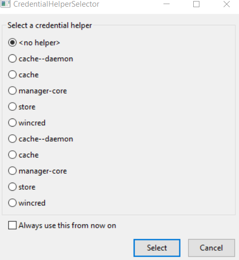

.. _Installation:
How to install the WarmingUp Design Toolkit
===========================================

This paragraph describes how to install the design toolkit
----------------------------------------------------------

Step 1 Download the WarmingUp Designtoolkit from ??

Step 2 Unpack the zip file in the folder you want to install the
WarmingUp Design Toolkit

|image0|

|image1|

Step 3 If you have not installed Docker or Matlab Runtime libraries run
install\_dependencies.bat. See here for the steps which you need to take
here.

Step 4 Run install.bat. This script will download the designtoolkit and
install the required packages. If it is finished, check if there were
errors, if not press any key to finish it.

|image2|

Step 4a if below window is shown, select no helper, put a check at
Always use this from now and press Ok

|image3|

Step 5. Go into the folder, cf-commons\\shared\\ and start
WiseDesignToolkit.cmd. This script will update the WarmingUp Design
toolkit when required and then start it.

.. |image1| image:: media/image2.png
   :width: 6.26806in
   :height: 2.22917in

.. |image3| image:: media/image4.png
   :width: 3.87534in
   :height: 4.22537in
