.. _market_price
I want to simulate my network with market-based control
=======================================================

Tested for version *22.4.2-g0abbaa1-main* of the ESDL MapEditor.

This tutorial focusses on using HeatMatcher to utilize market-based
control in a network. Be advised that this is an advanced option in the
WarmingUp toolkit and requires some extra skills on using ESDL and
configuring it correctly for HeatMatcher market-based control in the
toolkit.

**Short introduction on HeatMatcher**

When you simulate a network in the WarmingUp toolkit, you can specify
the order of the dispatch of the different heat supply options for the
CHESS network simulator. For some operational scenarios this does not
always match practice, as the dispatch of some supply options are
dependent on prices that fluctuate throughout the year. Market-based
control with HeatMatcher can help in these situations, as it allows you
to define the eagerness to supply based on external data such as price
information.

In HeatMatcher all assets become part of a virtual market, where they
can bid on energy: what price are they willing to pay or receive for a
certain amount of energy. The bidding strategy is implemented in agents
that represent each asset, hence the name of agent-based control. When
all agents have placed their bid, HeatMatcher determines where demand
matches supply and calculates the market clearing price. This price is
used in each agent to determine how much energy the assets have to
consume or produce in the next timestep. The function that calculates
the bid is dependent on the role in the market (e.g. producer, consumer,
storage), the type of asset and business strategy and is in this setup
provided by HeatMatcher. These bid functions can be extended for more
sophisticated bidding behaviour (out of the scope of this tutorial). In
the current HeatMatcher, it allows you to specify the marginal cost of
the bid. The marginal cost of an asset is the price at which producing
becomes profitable and consuming becomes not profitable. If used as a
static value, it provides similar behavior as setting the priority of
the asset’s dispatch, but HeatMatcher also supports marginal cost
profiles as input, for example marginal costs based on the electricity
market price, allowing for dynamic marginal costs in a simulation.

**Note:** In the beta release of the WarmingUp toolkit, all prices are
normalized. This means that the maximum market price is set a 1 and all
prices need to be defined between 0 and 1 (i.e. divided by the maximum
price in the market).

**Tutorial Outline**

This tutorial shows the steps to simulate a simple network using
market-based control.

As this is an advanced tutorial, it is assumed that the other tutorials
on using the `ESDL
MapEditor <https://esdl-mapeditor-documentation.readthedocs.io/en/latest/index.html>`__
and the DelftFEWS framework are already known.

This tutorial shows the steps to find the answer to the following
questions:

1) How to create an ESDL that describes the required input for
   market-based control?

2) How to simulate a market-based control scenario?

To achieve these results the following workflows and packages are used:

+------------+------------------------------------------------------------------------------------------------------------------------------------------------------+
| |image0|   | ESDL MapEditor is used to create a network and configure market-based control.                                                                       |
+============+======================================================================================================================================================+
| |image1|   | The network is loaded into the computational framework (CF), which allows us to configure the simulation, run the simulation and view the results.   |
+------------+------------------------------------------------------------------------------------------------------------------------------------------------------+

+---------------+-------------------------------------------------------------------------------------------------------------------------------------------------------------------------------------------------------------------------------------------------------------------------------------------------------------------------------------------------------------------------------------------------------------------------------------------------------------------------------------------------------------------------------------------------------------------------------------------------------------------------------------------------------------------------------------------------------------------------------------------------------------+
| **1**         | \ **How to create an ESDL that describes the required input for market-based control?**                                                                                                                                                                                                                                                                                                                                                                                                                                                                                                                                                                                                                                                                     |
+===============+=============================================================================================================================================================================================================================================================================================================================================================================================================================================================================================================================================================================================================================================================================================================================================================+
| 1.1           | Go to `ESDL MapEditor <http://localhost:8111/>`__, use credentials to login and load the desired network.                                                                                                                                                                                                                                                                                                                                                                                                                                                                                                                                                                                                                                                   |
+---------------+-------------------------------------------------------------------------------------------------------------------------------------------------------------------------------------------------------------------------------------------------------------------------------------------------------------------------------------------------------------------------------------------------------------------------------------------------------------------------------------------------------------------------------------------------------------------------------------------------------------------------------------------------------------------------------------------------------------------------------------------------------------+
| 1.2           | For each producer and consumer asset, configure the marginal costs.                                                                                                                                                                                                                                                                                                                                                                                                                                                                                                                                                                                                                                                                                         |
|               |                                                                                                                                                                                                                                                                                                                                                                                                                                                                                                                                                                                                                                                                                                                                                             |
|               | This can be done in two ways:                                                                                                                                                                                                                                                                                                                                                                                                                                                                                                                                                                                                                                                                                                                               |
|               |                                                                                                                                                                                                                                                                                                                                                                                                                                                                                                                                                                                                                                                                                                                                                             |
|               | 1. Specify static marginal costs by configuring the *marginal cost* property of an asset.                                                                                                                                                                                                                                                                                                                                                                                                                                                                                                                                                                                                                                                                   |
|               |                                                                                                                                                                                                                                                                                                                                                                                                                                                                                                                                                                                                                                                                                                                                                             |
|               |    [step 1.2.1]                                                                                                                                                                                                                                                                                                                                                                                                                                                                                                                                                                                                                                                                                                                                             |
|               |                                                                                                                                                                                                                                                                                                                                                                                                                                                                                                                                                                                                                                                                                                                                                             |
|               | 2. Specify dynamic marginal costs by configuring a marginal cost profile. This workflow is a little more complicated, as the MapEditor does support easy configuration of setting a cost profile. [step 1.2.2-1.2.x]                                                                                                                                                                                                                                                                                                                                                                                                                                                                                                                                        |
|               |                                                                                                                                                                                                                                                                                                                                                                                                                                                                                                                                                                                                                                                                                                                                                             |
|               | 3.                                                                                                                                                                                                                                                                                                                                                                                                                                                                                                                                                                                                                                                                                                                                                          |
+---------------+-------------------------------------------------------------------------------------------------------------------------------------------------------------------------------------------------------------------------------------------------------------------------------------------------------------------------------------------------------------------------------------------------------------------------------------------------------------------------------------------------------------------------------------------------------------------------------------------------------------------------------------------------------------------------------------------------------------------------------------------------------------+
| ***1.2.1***   | \ ***Specify static marginal costs***                                                                                                                                                                                                                                                                                                                                                                                                                                                                                                                                                                                                                                                                                                                       |
+---------------+-------------------------------------------------------------------------------------------------------------------------------------------------------------------------------------------------------------------------------------------------------------------------------------------------------------------------------------------------------------------------------------------------------------------------------------------------------------------------------------------------------------------------------------------------------------------------------------------------------------------------------------------------------------------------------------------------------------------------------------------------------------+
|               | Open the properties of the asset by clicking on it and expand the Cost Information widget. Click the “Change or add cost” button and specify the marginal cost field in the window that pops up.                                                                                                                                                                                                                                                                                                                                                                                                                                                                                                                                                            |
|               |                                                                                                                                                                                                                                                                                                                                                                                                                                                                                                                                                                                                                                                                                                                                                             |
|               | |image2|                                                                                                                                                                                                                                                                                                                                                                                                                                                                                                                                                                                                                                                                                                                                                    |
|               |                                                                                                                                                                                                                                                                                                                                                                                                                                                                                                                                                                                                                                                                                                                                                             |
|               | Use a value between 0 and 1 (due to normalisation as described in the introduction). Also select a unit (e.g. EUR/kWh, is not used in the simulation)                                                                                                                                                                                                                                                                                                                                                                                                                                                                                                                                                                                                       |
|               |                                                                                                                                                                                                                                                                                                                                                                                                                                                                                                                                                                                                                                                                                                                                                             |
|               | When closing the popup window, the sidebar looks similar to the screenshot below.                                                                                                                                                                                                                                                                                                                                                                                                                                                                                                                                                                                                                                                                           |
|               |                                                                                                                                                                                                                                                                                                                                                                                                                                                                                                                                                                                                                                                                                                                                                             |
|               | |image3|                                                                                                                                                                                                                                                                                                                                                                                                                                                                                                                                                                                                                                                                                                                                                    |
+---------------+-------------------------------------------------------------------------------------------------------------------------------------------------------------------------------------------------------------------------------------------------------------------------------------------------------------------------------------------------------------------------------------------------------------------------------------------------------------------------------------------------------------------------------------------------------------------------------------------------------------------------------------------------------------------------------------------------------------------------------------------------------------+
| ***1.2.2***   | ***Specify dynamic marginal costs (advanced)***                                                                                                                                                                                                                                                                                                                                                                                                                                                                                                                                                                                                                                                                                                             |
+---------------+-------------------------------------------------------------------------------------------------------------------------------------------------------------------------------------------------------------------------------------------------------------------------------------------------------------------------------------------------------------------------------------------------------------------------------------------------------------------------------------------------------------------------------------------------------------------------------------------------------------------------------------------------------------------------------------------------------------------------------------------------------------+
| 1.2.2.1       | This advanced scenario describes how you can add a profile instead of a single value to the marginal costs of an assets, as currently the MapEditor GUI does not allow to directly edit these marginal costs.                                                                                                                                                                                                                                                                                                                                                                                                                                                                                                                                               |
|               |                                                                                                                                                                                                                                                                                                                                                                                                                                                                                                                                                                                                                                                                                                                                                             |
|               | For HeatMatcher we need to add a Cost profile to the cost information of the asset, and specify the marginal costs there. As ESDL supports multiple profile types (e.g. manual specified, from a database, etc) for this tutorial we use an InfluxDBProfile as we assume that the profile data is present in the database by uploading an CSV file using the profile upload tool in the ESDL MapEditor (see View->Settings, Profiles plugin). Make sure that the profile contains hourly data (or better) and is in range of your simulation period (currently 01-01-2019 – 01-01-2020. Alternatively, you can use a TimeSeries profile where each value needs to be filled in manually if the simulation only concerns a short timespan (e.g. 24 hours).   |
|               |                                                                                                                                                                                                                                                                                                                                                                                                                                                                                                                                                                                                                                                                                                                                                             |
|               | Right-click on the assets and select ‘Edit’, to open up the ESDL Browser, which shows the semantic definition of the asset.                                                                                                                                                                                                                                                                                                                                                                                                                                                                                                                                                                                                                                 |
|               |                                                                                                                                                                                                                                                                                                                                                                                                                                                                                                                                                                                                                                                                                                                                                             |
|               | |image4|                                                                                                                                                                                                                                                                                                                                                                                                                                                                                                                                                                                                                                                                                                                                                    |
|               |                                                                                                                                                                                                                                                                                                                                                                                                                                                                                                                                                                                                                                                                                                                                                             |
|               | Scroll down to the CostInformation section of this asset (in the example a HeatPump) and select the InPort of the asset.                                                                                                                                                                                                                                                                                                                                                                                                                                                                                                                                                                                                                                    |
|               |                                                                                                                                                                                                                                                                                                                                                                                                                                                                                                                                                                                                                                                                                                                                                             |
|               | |image5|                                                                                                                                                                                                                                                                                                                                                                                                                                                                                                                                                                                                                                                                                                                                                    |
|               |                                                                                                                                                                                                                                                                                                                                                                                                                                                                                                                                                                                                                                                                                                                                                             |
|               | After clicking on the CostInformation the following dialog appears (if there is no CostInformation link to click on, press the (+) button in the last column of the Cost Information row if the link is not present.                                                                                                                                                                                                                                                                                                                                                                                                                                                                                                                                        |
|               |                                                                                                                                                                                                                                                                                                                                                                                                                                                                                                                                                                                                                                                                                                                                                             |
|               | |image6|                                                                                                                                                                                                                                                                                                                                                                                                                                                                                                                                                                                                                                                                                                                                                    |
|               |                                                                                                                                                                                                                                                                                                                                                                                                                                                                                                                                                                                                                                                                                                                                                             |
|               | Select InfluxDBProfile from the drop down list and press ‘Next’.                                                                                                                                                                                                                                                                                                                                                                                                                                                                                                                                                                                                                                                                                            |
|               |                                                                                                                                                                                                                                                                                                                                                                                                                                                                                                                                                                                                                                                                                                                                                             |
|               | Copy the information of the profile that you’ve previously uploaded using the Profile plugin in the Settings dialog (under View->Settings, Profile plugin).                                                                                                                                                                                                                                                                                                                                                                                                                                                                                                                                                                                                 |
|               |                                                                                                                                                                                                                                                                                                                                                                                                                                                                                                                                                                                                                                                                                                                                                             |
|               | |image7|                                                                                                                                                                                                                                                                                                                                                                                                                                                                                                                                                                                                                                                                                                                                                    |
|               |                                                                                                                                                                                                                                                                                                                                                                                                                                                                                                                                                                                                                                                                                                                                                             |
|               | Furthermore it is important to specify the “Profile Quantity and Unit” in the last row of the dialog.                                                                                                                                                                                                                                                                                                                                                                                                                                                                                                                                                                                                                                                       |
|               |                                                                                                                                                                                                                                                                                                                                                                                                                                                                                                                                                                                                                                                                                                                                                             |
|               | |image8|                                                                                                                                                                                                                                                                                                                                                                                                                                                                                                                                                                                                                                                                                                                                                    |
|               |                                                                                                                                                                                                                                                                                                                                                                                                                                                                                                                                                                                                                                                                                                                                                             |
|               | Make sure you specify ‘Cost’ as physical quantity.                                                                                                                                                                                                                                                                                                                                                                                                                                                                                                                                                                                                                                                                                                          |
|               |                                                                                                                                                                                                                                                                                                                                                                                                                                                                                                                                                                                                                                                                                                                                                             |
|               | |image9|                                                                                                                                                                                                                                                                                                                                                                                                                                                                                                                                                                                                                                                                                                                                                    |
+---------------+-------------------------------------------------------------------------------------------------------------------------------------------------------------------------------------------------------------------------------------------------------------------------------------------------------------------------------------------------------------------------------------------------------------------------------------------------------------------------------------------------------------------------------------------------------------------------------------------------------------------------------------------------------------------------------------------------------------------------------------------------------------+
| 1.2.2.2       | Save the network to the ESDL drive using File -> Save to ESDL Drive …                                                                                                                                                                                                                                                                                                                                                                                                                                                                                                                                                                                                                                                                                       |
+---------------+-------------------------------------------------------------------------------------------------------------------------------------------------------------------------------------------------------------------------------------------------------------------------------------------------------------------------------------------------------------------------------------------------------------------------------------------------------------------------------------------------------------------------------------------------------------------------------------------------------------------------------------------------------------------------------------------------------------------------------------------------------------+
|               |                                                                                                                                                                                                                                                                                                                                                                                                                                                                                                                                                                                                                                                                                                                                                             |
+---------------+-------------------------------------------------------------------------------------------------------------------------------------------------------------------------------------------------------------------------------------------------------------------------------------------------------------------------------------------------------------------------------------------------------------------------------------------------------------------------------------------------------------------------------------------------------------------------------------------------------------------------------------------------------------------------------------------------------------------------------------------------------------+
|               |                                                                                                                                                                                                                                                                                                                                                                                                                                                                                                                                                                                                                                                                                                                                                             |
+---------------+-------------------------------------------------------------------------------------------------------------------------------------------------------------------------------------------------------------------------------------------------------------------------------------------------------------------------------------------------------------------------------------------------------------------------------------------------------------------------------------------------------------------------------------------------------------------------------------------------------------------------------------------------------------------------------------------------------------------------------------------------------------+
| **2**         | **Simulate the network in the Computational Framework (CF)**                                                                                                                                                                                                                                                                                                                                                                                                                                                                                                                                                                                                                                                                                                |
+---------------+-------------------------------------------------------------------------------------------------------------------------------------------------------------------------------------------------------------------------------------------------------------------------------------------------------------------------------------------------------------------------------------------------------------------------------------------------------------------------------------------------------------------------------------------------------------------------------------------------------------------------------------------------------------------------------------------------------------------------------------------------------------+
|               | Open the toolkit and select Simulate and optimize. Import the network design from the ESDL Drive that was created in the previous scenario. Press the ‘Simulate and optimize’ button to load the network in CF (this might take a few seconds).                                                                                                                                                                                                                                                                                                                                                                                                                                                                                                             |
+---------------+-------------------------------------------------------------------------------------------------------------------------------------------------------------------------------------------------------------------------------------------------------------------------------------------------------------------------------------------------------------------------------------------------------------------------------------------------------------------------------------------------------------------------------------------------------------------------------------------------------------------------------------------------------------------------------------------------------------------------------------------------------------+
| 2.1           | **Import profiles**                                                                                                                                                                                                                                                                                                                                                                                                                                                                                                                                                                                                                                                                                                                                         |
+---------------+-------------------------------------------------------------------------------------------------------------------------------------------------------------------------------------------------------------------------------------------------------------------------------------------------------------------------------------------------------------------------------------------------------------------------------------------------------------------------------------------------------------------------------------------------------------------------------------------------------------------------------------------------------------------------------------------------------------------------------------------------------------+
|               | In the CF task window select ‘Import Profiles’ and press the play button (|image10|) to import them.                                                                                                                                                                                                                                                                                                                                                                                                                                                                                                                                                                                                                                                        |
+---------------+-------------------------------------------------------------------------------------------------------------------------------------------------------------------------------------------------------------------------------------------------------------------------------------------------------------------------------------------------------------------------------------------------------------------------------------------------------------------------------------------------------------------------------------------------------------------------------------------------------------------------------------------------------------------------------------------------------------------------------------------------------------+
| 2.2           | **Configure Market-based control**                                                                                                                                                                                                                                                                                                                                                                                                                                                                                                                                                                                                                                                                                                                          |
+---------------+-------------------------------------------------------------------------------------------------------------------------------------------------------------------------------------------------------------------------------------------------------------------------------------------------------------------------------------------------------------------------------------------------------------------------------------------------------------------------------------------------------------------------------------------------------------------------------------------------------------------------------------------------------------------------------------------------------------------------------------------------------------+
|               | In the task window, navigate to Simulate -> Advanced control and then Market-based control.                                                                                                                                                                                                                                                                                                                                                                                                                                                                                                                                                                                                                                                                 |
|               |                                                                                                                                                                                                                                                                                                                                                                                                                                                                                                                                                                                                                                                                                                                                                             |
|               | |image11|                                                                                                                                                                                                                                                                                                                                                                                                                                                                                                                                                                                                                                                                                                                                                   |
|               |                                                                                                                                                                                                                                                                                                                                                                                                                                                                                                                                                                                                                                                                                                                                                             |
|               | And subsequently select “Scenario composition” to configure the scenario for Martket-based control.                                                                                                                                                                                                                                                                                                                                                                                                                                                                                                                                                                                                                                                         |
|               |                                                                                                                                                                                                                                                                                                                                                                                                                                                                                                                                                                                                                                                                                                                                                             |
|               | This window allows you to create a new scenario and specify the timestep.                                                                                                                                                                                                                                                                                                                                                                                                                                                                                                                                                                                                                                                                                   |
|               |                                                                                                                                                                                                                                                                                                                                                                                                                                                                                                                                                                                                                                                                                                                                                             |
|               | |image12|                                                                                                                                                                                                                                                                                                                                                                                                                                                                                                                                                                                                                                                                                                                                                   |
|               |                                                                                                                                                                                                                                                                                                                                                                                                                                                                                                                                                                                                                                                                                                                                                             |
|               | This will an empty view                                                                                                                                                                                                                                                                                                                                                                                                                                                                                                                                                                                                                                                                                                                                     |
|               |                                                                                                                                                                                                                                                                                                                                                                                                                                                                                                                                                                                                                                                                                                                                                             |
|               | |image13|                                                                                                                                                                                                                                                                                                                                                                                                                                                                                                                                                                                                                                                                                                                                                   |
+---------------+-------------------------------------------------------------------------------------------------------------------------------------------------------------------------------------------------------------------------------------------------------------------------------------------------------------------------------------------------------------------------------------------------------------------------------------------------------------------------------------------------------------------------------------------------------------------------------------------------------------------------------------------------------------------------------------------------------------------------------------------------------------+
| 2.3           | **Configure timestep**                                                                                                                                                                                                                                                                                                                                                                                                                                                                                                                                                                                                                                                                                                                                      |
+---------------+-------------------------------------------------------------------------------------------------------------------------------------------------------------------------------------------------------------------------------------------------------------------------------------------------------------------------------------------------------------------------------------------------------------------------------------------------------------------------------------------------------------------------------------------------------------------------------------------------------------------------------------------------------------------------------------------------------------------------------------------------------------+
|               | The default timestep in CF is 1 week, but when using price profiles a smaller timestep is needed. Select ‘1 hour’ from the drop down list and give the scenario a name.                                                                                                                                                                                                                                                                                                                                                                                                                                                                                                                                                                                     |
|               |                                                                                                                                                                                                                                                                                                                                                                                                                                                                                                                                                                                                                                                                                                                                                             |
|               | |image14|                                                                                                                                                                                                                                                                                                                                                                                                                                                                                                                                                                                                                                                                                                                                                   |
|               |                                                                                                                                                                                                                                                                                                                                                                                                                                                                                                                                                                                                                                                                                                                                                             |
|               | Press ‘Apply’ to use this configuration of the simulation.                                                                                                                                                                                                                                                                                                                                                                                                                                                                                                                                                                                                                                                                                                  |
+---------------+-------------------------------------------------------------------------------------------------------------------------------------------------------------------------------------------------------------------------------------------------------------------------------------------------------------------------------------------------------------------------------------------------------------------------------------------------------------------------------------------------------------------------------------------------------------------------------------------------------------------------------------------------------------------------------------------------------------------------------------------------------------+
| **2.4**       | **Configure simulation time range**                                                                                                                                                                                                                                                                                                                                                                                                                                                                                                                                                                                                                                                                                                                         |
+---------------+-------------------------------------------------------------------------------------------------------------------------------------------------------------------------------------------------------------------------------------------------------------------------------------------------------------------------------------------------------------------------------------------------------------------------------------------------------------------------------------------------------------------------------------------------------------------------------------------------------------------------------------------------------------------------------------------------------------------------------------------------------------+
|               | By default CF simulates a full year. When stepping by a 1 hour timestep, this simulation will take considerable amount of time. Therefore select a time range below the Tasks window that fits your requirements.                                                                                                                                                                                                                                                                                                                                                                                                                                                                                                                                           |
+---------------+-------------------------------------------------------------------------------------------------------------------------------------------------------------------------------------------------------------------------------------------------------------------------------------------------------------------------------------------------------------------------------------------------------------------------------------------------------------------------------------------------------------------------------------------------------------------------------------------------------------------------------------------------------------------------------------------------------------------------------------------------------------+
| **2.5**       | **Simulate**                                                                                                                                                                                                                                                                                                                                                                                                                                                                                                                                                                                                                                                                                                                                                |
+---------------+-------------------------------------------------------------------------------------------------------------------------------------------------------------------------------------------------------------------------------------------------------------------------------------------------------------------------------------------------------------------------------------------------------------------------------------------------------------------------------------------------------------------------------------------------------------------------------------------------------------------------------------------------------------------------------------------------------------------------------------------------------------+
|               | Select the newly created scenario in the Tasks window and press the play button to simulate this scenario. In the Logging windows (select the Logging tab on the bottom right) you can see the progress of the running simulation (select ‘Running simulation’ at the top).                                                                                                                                                                                                                                                                                                                                                                                                                                                                                 |
|               |                                                                                                                                                                                                                                                                                                                                                                                                                                                                                                                                                                                                                                                                                                                                                             |
|               | |image15|                                                                                                                                                                                                                                                                                                                                                                                                                                                                                                                                                                                                                                                                                                                                                   |
+---------------+-------------------------------------------------------------------------------------------------------------------------------------------------------------------------------------------------------------------------------------------------------------------------------------------------------------------------------------------------------------------------------------------------------------------------------------------------------------------------------------------------------------------------------------------------------------------------------------------------------------------------------------------------------------------------------------------------------------------------------------------------------------+
| **2.6**       | **Explore results**                                                                                                                                                                                                                                                                                                                                                                                                                                                                                                                                                                                                                                                                                                                                         |
+---------------+-------------------------------------------------------------------------------------------------------------------------------------------------------------------------------------------------------------------------------------------------------------------------------------------------------------------------------------------------------------------------------------------------------------------------------------------------------------------------------------------------------------------------------------------------------------------------------------------------------------------------------------------------------------------------------------------------------------------------------------------------------------+
|               | Explore the results of the simulation in the graphs section of CF.                                                                                                                                                                                                                                                                                                                                                                                                                                                                                                                                                                                                                                                                                          |
+---------------+-------------------------------------------------------------------------------------------------------------------------------------------------------------------------------------------------------------------------------------------------------------------------------------------------------------------------------------------------------------------------------------------------------------------------------------------------------------------------------------------------------------------------------------------------------------------------------------------------------------------------------------------------------------------------------------------------------------------------------------------------------------+
|               |                                                                                                                                                                                                                                                                                                                                                                                                                                                                                                                                                                                                                                                                                                                                                             |
+---------------+-------------------------------------------------------------------------------------------------------------------------------------------------------------------------------------------------------------------------------------------------------------------------------------------------------------------------------------------------------------------------------------------------------------------------------------------------------------------------------------------------------------------------------------------------------------------------------------------------------------------------------------------------------------------------------------------------------------------------------------------------------------+
|               |                                                                                                                                                                                                                                                                                                                                                                                                                                                                                                                                                                                                                                                                                                                                                             |
+---------------+-------------------------------------------------------------------------------------------------------------------------------------------------------------------------------------------------------------------------------------------------------------------------------------------------------------------------------------------------------------------------------------------------------------------------------------------------------------------------------------------------------------------------------------------------------------------------------------------------------------------------------------------------------------------------------------------------------------------------------------------------------------+

.. |image0| image:: media/image1.png
   :width: 0.69444in
   :height: 0.65972in

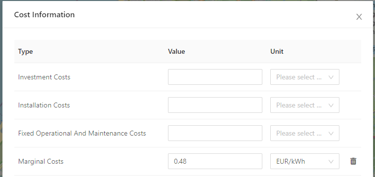
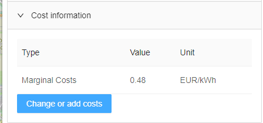
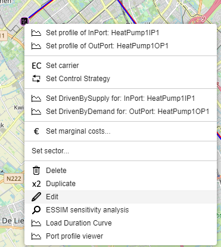
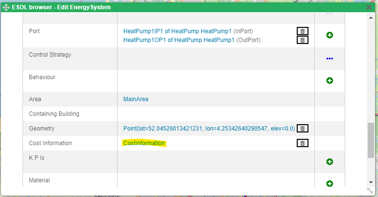
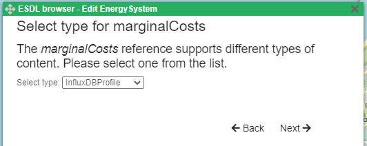
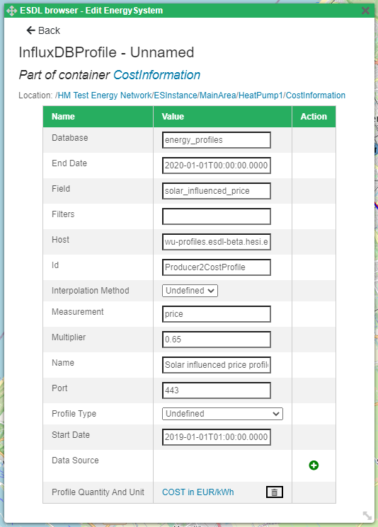
.. |image8| image:: media/image9.png
   :width: 5.65694in
   :height: 3.91875in
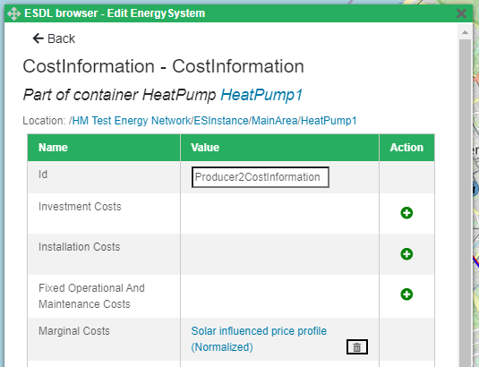

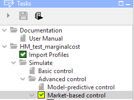

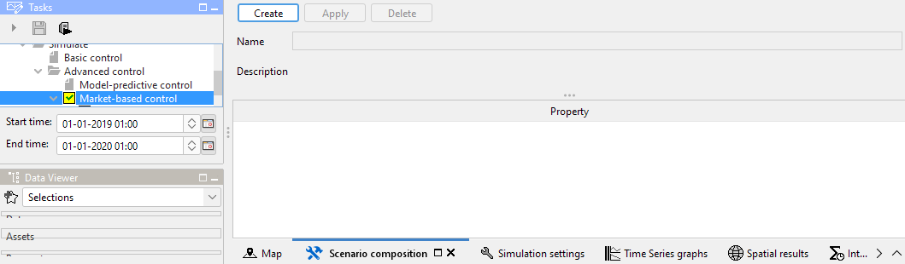
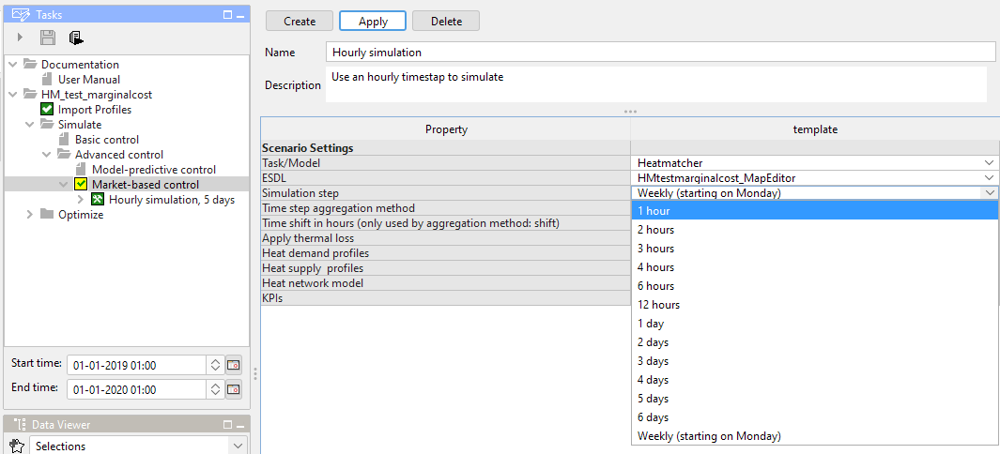
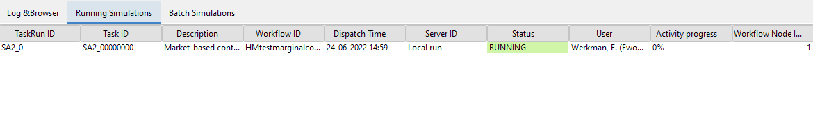
