.. _sup_temp_min:

I want to minimize the supply temperature
=========================================

This tutorial explains how to use the Design Toolkit to minimize the
temperatures of your designed network. For minimizing the supply
temperatures in your network the toolkit uses the Smart Control
Optimizer. This tutorial will further improve the network setup in the
“how to set up an simple network” tutorial.

For the optimization of temperatures, the model predictive controller is
used. More detailed information about model predictive control can be
found at this site in the MPC documentation. More information about ESDL
MapEditor follow this link: `*Welcome to the ESDL MapEditor
documentation — ESDL MapEditor documentation
(esdl-mapeditor-documentation.readthedocs.io)* <https://esdl-mapeditor-documentation.readthedocs.io/en/latest/index.html>`__ 

This tutorial, explaining how the Minimize supply temperature workflow
works, shows the steps to find the answer to the following questions: 

1. How to set up your ESDL model to optimize supply temperatures

2. How to set up your scenario settings for temperature optimization

3. How to explore the results of your simulations

To achieve these results the following workflows and packages are used: 

+-------------+------------------------------------------------------------------------------------------------------------------------------------------------------------------------------------------------------------------+
| |image0|    | ESDL Map Editor is used to create a network.                                                                                                                                                                     |
+=============+==================================================================================================================================================================================================================+
| |image1|    | The network is loaded into the computational framework (CF), which allows us to add operational bounds (e.g. desired network pressures and velocities), prioritize producers and select the optimization goal.   |
+-------------+------------------------------------------------------------------------------------------------------------------------------------------------------------------------------------------------------------------+
|             | Model Predictive Controller (MPC).                                                                                                                                                                               |
+-------------+------------------------------------------------------------------------------------------------------------------------------------------------------------------------------------------------------------------+
| |image2|    | KPI dashboard                                                                                                                                                                                                    |
+-------------+------------------------------------------------------------------------------------------------------------------------------------------------------------------------------------------------------------------+

+----------+------------------------------------------------------------------------------------------------------------------------------------------------------------------------------------------------------------------------------------------------------------------------------------------------------------------------------------------------+
| **1**    | **How to set up your ESDL model to optimize supply temperatures**                                                                                                                                                                                                                                                                              |
+==========+================================================================================================================================================================================================================================================================================================================================================+
| 1.1      | Make or open a network you want to use for optimizing temperatures, in this tutorial we build on the network created in the tutorial “how to set up a simple network”                                                                                                                                                                          |
|          |                                                                                                                                                                                                                                                                                                                                                |
|          | |image3|                                                                                                                                                                                                                                                                                                                                       |
+----------+------------------------------------------------------------------------------------------------------------------------------------------------------------------------------------------------------------------------------------------------------------------------------------------------------------------------------------------------+
| 1.2      | For the for optimizing temperatures workflow to work it’s important to use Heating Demands instead of Generic Consumers.                                                                                                                                                                                                                       |
|          |                                                                                                                                                                                                                                                                                                                                                |
|          | In the previously created model Generic Consumers are used, so this needs to change. Does your model already have Heating Demand you can ignore these steps.                                                                                                                                                                                   |
|          |                                                                                                                                                                                                                                                                                                                                                |
|          | Delete the Generic Consumer by right-clicking on them and selecting delete. Do this for all three Generic Consumers.                                                                                                                                                                                                                           |
+----------+------------------------------------------------------------------------------------------------------------------------------------------------------------------------------------------------------------------------------------------------------------------------------------------------------------------------------------------------+
| 1.3      | Select “Heating Demand” in the toolbar in the lower left corner by clicking |image4|                                                                                                                                                                                                                                                           |
|          |                                                                                                                                                                                                                                                                                                                                                |
|          | Place three HeatDemands at the locations where the Generic Consumers where.                                                                                                                                                                                                                                                                    |
|          |                                                                                                                                                                                                                                                                                                                                                |
|          | Press “Cancel” at the left site of the screen |image5| tot stop placing Heating Demands                                                                                                                                                                                                                                                        |
+----------+------------------------------------------------------------------------------------------------------------------------------------------------------------------------------------------------------------------------------------------------------------------------------------------------------------------------------------------------+
| 1.4      | Connect the Heating Demands to the grid by drawing connection between the In and OutPort and the supply and return pipes.                                                                                                                                                                                                                      |
|          |                                                                                                                                                                                                                                                                                                                                                |
|          | Tip: start at the grid side to avoid the change of connecting the wrong port.                                                                                                                                                                                                                                                                  |
|          |                                                                                                                                                                                                                                                                                                                                                |
|          | The Heating Demand should look like this:                                                                                                                                                                                                                                                                                                      |
|          |                                                                                                                                                                                                                                                                                                                                                |
|          | |image6|                                                                                                                                                                                                                                                                                                                                       |
|          |                                                                                                                                                                                                                                                                                                                                                |
|          | Repeat this step for all Heating Demands                                                                                                                                                                                                                                                                                                       |
+----------+------------------------------------------------------------------------------------------------------------------------------------------------------------------------------------------------------------------------------------------------------------------------------------------------------------------------------------------------+
| 1.5      | Make sure there are demand profiles attached to the Heating Demand.                                                                                                                                                                                                                                                                            |
|          |                                                                                                                                                                                                                                                                                                                                                |
|          | Do this by right clicking the Heating Demand and selecting “Set profile of InPort: In”                                                                                                                                                                                                                                                         |
|          |                                                                                                                                                                                                                                                                                                                                                |
|          | |image7|                                                                                                                                                                                                                                                                                                                                       |
+----------+------------------------------------------------------------------------------------------------------------------------------------------------------------------------------------------------------------------------------------------------------------------------------------------------------------------------------------------------+
| 1.6      | Click on a Heating Demand to open the attributes tab; the tab will open at the right site of the screen. Click on advanced attributes to unfold the advanced attributes. You should see the following screen:                                                                                                                                  |
|          |                                                                                                                                                                                                                                                                                                                                                |
|          | |image8|                                                                                                                                                                                                                                                                                                                                       |
|          |                                                                                                                                                                                                                                                                                                                                                |
|          | Fill in the power field and the Min temperature field.                                                                                                                                                                                                                                                                                         |
+----------+------------------------------------------------------------------------------------------------------------------------------------------------------------------------------------------------------------------------------------------------------------------------------------------------------------------------------------------------+
| 1.7      | When your model contains a geothermal source also fill in the mass flow rate at the advanced attributes.                                                                                                                                                                                                                                       |
+----------+------------------------------------------------------------------------------------------------------------------------------------------------------------------------------------------------------------------------------------------------------------------------------------------------------------------------------------------------+
| 1.8      | Your model is now ready for simulation and optimization. Save your model start the project manager and go to simulation tools to upload your project to CF.                                                                                                                                                                                    |
+----------+------------------------------------------------------------------------------------------------------------------------------------------------------------------------------------------------------------------------------------------------------------------------------------------------------------------------------------------------+
| **2 **   | **How to set up your scenario settings for temperature optimization **                                                                                                                                                                                                                                                                         |
+----------+------------------------------------------------------------------------------------------------------------------------------------------------------------------------------------------------------------------------------------------------------------------------------------------------------------------------------------------------+
| 2.1      | Open your project in CF creating a new project in the project manager and starting the simulation tools. CF will now start                                                                                                                                                                                                                     |
+----------+------------------------------------------------------------------------------------------------------------------------------------------------------------------------------------------------------------------------------------------------------------------------------------------------------------------------------------------------+
| 2.2      | First you need to upload your heating demand. Select import “Import Profiles” and press the “Run an save simulation” button.                                                                                                                                                                                                                   |
|          |                                                                                                                                                                                                                                                                                                                                                |
|          | |image9| à |image10|                                                                                                                                                                                                                                                                                                                           |
+----------+------------------------------------------------------------------------------------------------------------------------------------------------------------------------------------------------------------------------------------------------------------------------------------------------------------------------------------------------+
| 2.3      | Wait until “Forecast completed” pop-up appears |image11| ; your Import Profiles workflow is now completed                                                                                                                                                                                                                                      |
+----------+------------------------------------------------------------------------------------------------------------------------------------------------------------------------------------------------------------------------------------------------------------------------------------------------------------------------------------------------+
| 2.4      | To see your profile and adjust it press the “Heat Demand (refresh and modify)” button . |image12|                                                                                                                                                                                                                                              |
+----------+------------------------------------------------------------------------------------------------------------------------------------------------------------------------------------------------------------------------------------------------------------------------------------------------------------------------------------------------+
| 2.5      | The “modifier properties: Heat Demand” screen will now open. Here you can modify your heating demand manually. In this tutorial we will go further into this.                                                                                                                                                                                  |
|          |                                                                                                                                                                                                                                                                                                                                                |
|          | |image13|                                                                                                                                                                                                                                                                                                                                      |
+----------+------------------------------------------------------------------------------------------------------------------------------------------------------------------------------------------------------------------------------------------------------------------------------------------------------------------------------------------------+
| 2.7      | Now you can set op your optimization setting. Select “Run Smart Control Optimizer” in the task manual. To open the “modifier properties: Smart Control goals and constraints” screen.                                                                                                                                                          |
|          |                                                                                                                                                                                                                                                                                                                                                |
|          | |image14|                                                                                                                                                                                                                                                                                                                                      |
+----------+------------------------------------------------------------------------------------------------------------------------------------------------------------------------------------------------------------------------------------------------------------------------------------------------------------------------------------------------+
| 2.8      | Now you should see te following screen:                                                                                                                                                                                                                                                                                                        |
|          |                                                                                                                                                                                                                                                                                                                                                |
|          | |image15|                                                                                                                                                                                                                                                                                                                                      |
+----------+------------------------------------------------------------------------------------------------------------------------------------------------------------------------------------------------------------------------------------------------------------------------------------------------------------------------------------------------+
| 2.9      | In the Goals tab you can select your Smart Control Goal. Double click the goal field to unfold the menu.                                                                                                                                                                                                                                       |
|          |                                                                                                                                                                                                                                                                                                                                                |
|          | |image16|                                                                                                                                                                                                                                                                                                                                      |
|          |                                                                                                                                                                                                                                                                                                                                                |
|          | Here you can choose between two optimization goals: “Minimize Supply Temperature” and “Minimize Cost”. Select “Minimize Supply Temperature” .                                                                                                                                                                                                  |
+----------+------------------------------------------------------------------------------------------------------------------------------------------------------------------------------------------------------------------------------------------------------------------------------------------------------------------------------------------------+
| 2.10     | Go to the next tab by clicking on “Limits (constraints)”                                                                                                                                                                                                                                                                                       |
|          |                                                                                                                                                                                                                                                                                                                                                |
|          | |image17|                                                                                                                                                                                                                                                                                                                                      |
|          |                                                                                                                                                                                                                                                                                                                                                |
|          | Here you can select the constraints of your optimization. If you want to select or deselect constraint, double click the checkbox to place or remove a check.                                                                                                                                                                                  |
+----------+------------------------------------------------------------------------------------------------------------------------------------------------------------------------------------------------------------------------------------------------------------------------------------------------------------------------------------------------+
| 2.11     | Go to the next tab by clicking “Producers”                                                                                                                                                                                                                                                                                                     |
|          |                                                                                                                                                                                                                                                                                                                                                |
|          | |image18|                                                                                                                                                                                                                                                                                                                                      |
|          |                                                                                                                                                                                                                                                                                                                                                |
|          | Here you can adjust the minimum and maximum Outgoing Temperatures and the Variable operational costs of your heat sources.                                                                                                                                                                                                                     |
+----------+------------------------------------------------------------------------------------------------------------------------------------------------------------------------------------------------------------------------------------------------------------------------------------------------------------------------------------------------+
| 2.12     | Go to the next tab by clicking “Consumers”                                                                                                                                                                                                                                                                                                     |
|          |                                                                                                                                                                                                                                                                                                                                                |
|          | |image19|                                                                                                                                                                                                                                                                                                                                      |
|          |                                                                                                                                                                                                                                                                                                                                                |
|          | Here you can modify the minimum supply and return temperature of the consumers.                                                                                                                                                                                                                                                                |
+----------+------------------------------------------------------------------------------------------------------------------------------------------------------------------------------------------------------------------------------------------------------------------------------------------------------------------------------------------------+
| 2.13     | When you have set your optimization goals and constraints you need to save your new settings.                                                                                                                                                                                                                                                  |
|          |                                                                                                                                                                                                                                                                                                                                                |
|          | Do this by clicking the apply button on the right site of the screen                                                                                                                                                                                                                                                                           |
|          |                                                                                                                                                                                                                                                                                                                                                |
|          | |image20|                                                                                                                                                                                                                                                                                                                                      |
|          |                                                                                                                                                                                                                                                                                                                                                |
|          | In the “Node: Run Smart Control Optimizer” Screen above a new line will appear with your saved settings.                                                                                                                                                                                                                                       |
|          |                                                                                                                                                                                                                                                                                                                                                |
|          | |image21|                                                                                                                                                                                                                                                                                                                                      |
+----------+------------------------------------------------------------------------------------------------------------------------------------------------------------------------------------------------------------------------------------------------------------------------------------------------------------------------------------------------+
| 2.14     | Now you need to set your scenario. Go to the scenario composition menu by clicking on “Scenario composition” at the bottom of the screen.                                                                                                                                                                                                      |
|          |                                                                                                                                                                                                                                                                                                                                                |
|          | |image22|                                                                                                                                                                                                                                                                                                                                      |
+----------+------------------------------------------------------------------------------------------------------------------------------------------------------------------------------------------------------------------------------------------------------------------------------------------------------------------------------------------------+
| 2.15     | Now the following screen will appear                                                                                                                                                                                                                                                                                                           |
|          |                                                                                                                                                                                                                                                                                                                                                |
|          | |image23|                                                                                                                                                                                                                                                                                                                                      |
|          |                                                                                                                                                                                                                                                                                                                                                |
|          | Press “create” to set a new scenario                                                                                                                                                                                                                                                                                                           |
+----------+------------------------------------------------------------------------------------------------------------------------------------------------------------------------------------------------------------------------------------------------------------------------------------------------------------------------------------------------+
| 2.16     | The following screen will appear:                                                                                                                                                                                                                                                                                                              |
|          |                                                                                                                                                                                                                                                                                                                                                |
|          | |image24|                                                                                                                                                                                                                                                                                                                                      |
|          |                                                                                                                                                                                                                                                                                                                                                |
|          | 1. Give your scenario a name; you can also add a description if you want this is not necessary.                                                                                                                                                                                                                                                |
|          |                                                                                                                                                                                                                                                                                                                                                |
|          | 2. Go to the third line to set the time steps of your simulation double clicking on the time step will unfold the menu, select 1 hour                                                                                                                                                                                                          |
|          |                                                                                                                                                                                                                                                                                                                                                |
|          | 3. The next line “Time step aggregation method” gives you the option to change the aggregation method. Double click the menu and select “Select peak within time step”                                                                                                                                                                         |
|          |                                                                                                                                                                                                                                                                                                                                                |
|          | 4. Go to the line “Heat Demand”, here you can select the heat demand or any saved changes in your demand profile. Select your profile by double clicking the box                                                                                                                                                                               |
|          |                                                                                                                                                                                                                                                                                                                                                |
|          | 5. Select your previously saved smart control goals and constraints in the last line by double clicking and selecting your choice.                                                                                                                                                                                                             |
+----------+------------------------------------------------------------------------------------------------------------------------------------------------------------------------------------------------------------------------------------------------------------------------------------------------------------------------------------------------+
| 2.17     | Press Apply to safe your scenario settings                                                                                                                                                                                                                                                                                                     |
|          |                                                                                                                                                                                                                                                                                                                                                |
|          | |image25|                                                                                                                                                                                                                                                                                                                                      |
+----------+------------------------------------------------------------------------------------------------------------------------------------------------------------------------------------------------------------------------------------------------------------------------------------------------------------------------------------------------+
| 2.18     | Your scenario will now appear in the task menu as shown as bellow.                                                                                                                                                                                                                                                                             |
|          |                                                                                                                                                                                                                                                                                                                                                |
|          | |image26|                                                                                                                                                                                                                                                                                                                                      |
|          |                                                                                                                                                                                                                                                                                                                                                |
|          | Fill in the desired start and end time of your simulation at the bottom of the task menu                                                                                                                                                                                                                                                       |
|          |                                                                                                                                                                                                                                                                                                                                                |
|          | Press the “Run and save simulation” button to start the simulation.                                                                                                                                                                                                                                                                            |
+----------+------------------------------------------------------------------------------------------------------------------------------------------------------------------------------------------------------------------------------------------------------------------------------------------------------------------------------------------------+
| **3**    | **How to explore the results of your simulation**                                                                                                                                                                                                                                                                                              |
+----------+------------------------------------------------------------------------------------------------------------------------------------------------------------------------------------------------------------------------------------------------------------------------------------------------------------------------------------------------+
| 3.1      | To view your results, go to the data viewer by clicking on “6: Data Viewer” on the left of the screen. The screen shown as below will appear. Here you can select the results per workflow. Select smartcontrol from the data sources menu. Here you can also focus your selection on a specific part of the network, for example Producers.   |
|          |                                                                                                                                                                                                                                                                                                                                                |
|          | |image27|                                                                                                                                                                                                                                                                                                                                      |
+----------+------------------------------------------------------------------------------------------------------------------------------------------------------------------------------------------------------------------------------------------------------------------------------------------------------------------------------------------------+
| 3.2      | Below the Data sources menu there is the Assets menu. Here you can select a specific asset, our multiple assets be Ctrl- clicking them. Select the asset of which you want to see the results.                                                                                                                                                 |
|          |                                                                                                                                                                                                                                                                                                                                                |
|          | |image28|                                                                                                                                                                                                                                                                                                                                      |
+----------+------------------------------------------------------------------------------------------------------------------------------------------------------------------------------------------------------------------------------------------------------------------------------------------------------------------------------------------------+
| 3.3      | Below the Assets menu there is the Parameters menu. Here you can select the parameter you want to show in a graph. By Ctrl-Clicking you can select multiple parameters. For the temperature optimization workflow, the temperature is interesting, select this one.                                                                            |
|          |                                                                                                                                                                                                                                                                                                                                                |
|          | |image29|                                                                                                                                                                                                                                                                                                                                      |
+----------+------------------------------------------------------------------------------------------------------------------------------------------------------------------------------------------------------------------------------------------------------------------------------------------------------------------------------------------------+
| 3.4      | Make sure you have selected the Time Series graphs in lower part of the screen.                                                                                                                                                                                                                                                                |
|          |                                                                                                                                                                                                                                                                                                                                                |
|          | |image30|                                                                                                                                                                                                                                                                                                                                      |
+----------+------------------------------------------------------------------------------------------------------------------------------------------------------------------------------------------------------------------------------------------------------------------------------------------------------------------------------------------------+
| 3.5      | Now you can have a look at the results of the simulation in the graph                                                                                                                                                                                                                                                                          |
|          |                                                                                                                                                                                                                                                                                                                                                |
|          | |image31|                                                                                                                                                                                                                                                                                                                                      |
+----------+------------------------------------------------------------------------------------------------------------------------------------------------------------------------------------------------------------------------------------------------------------------------------------------------------------------------------------------------+
| 3.6      | Try different assets and parameters to explore the results further.                                                                                                                                                                                                                                                                            |
+----------+------------------------------------------------------------------------------------------------------------------------------------------------------------------------------------------------------------------------------------------------------------------------------------------------------------------------------------------------+

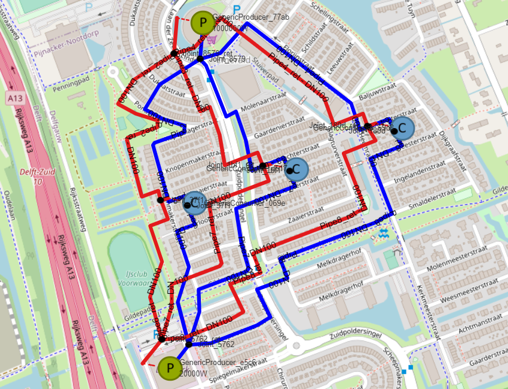

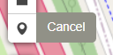
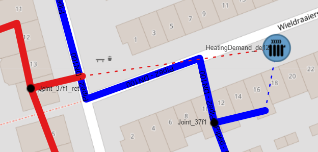
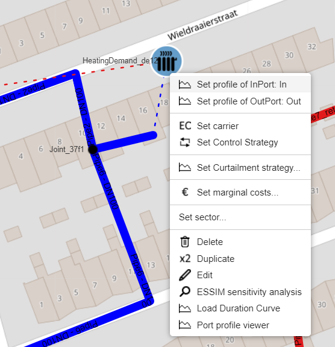
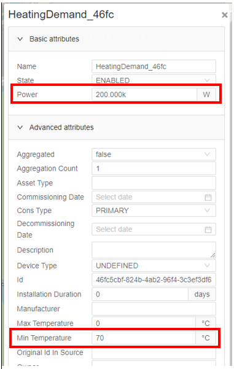
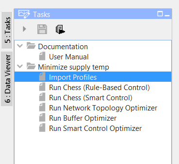
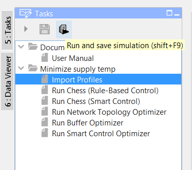
.. |image11| image:: media/image12.png
   :width: 1.77600in
   :height: 0.65083in
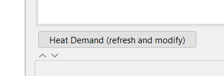
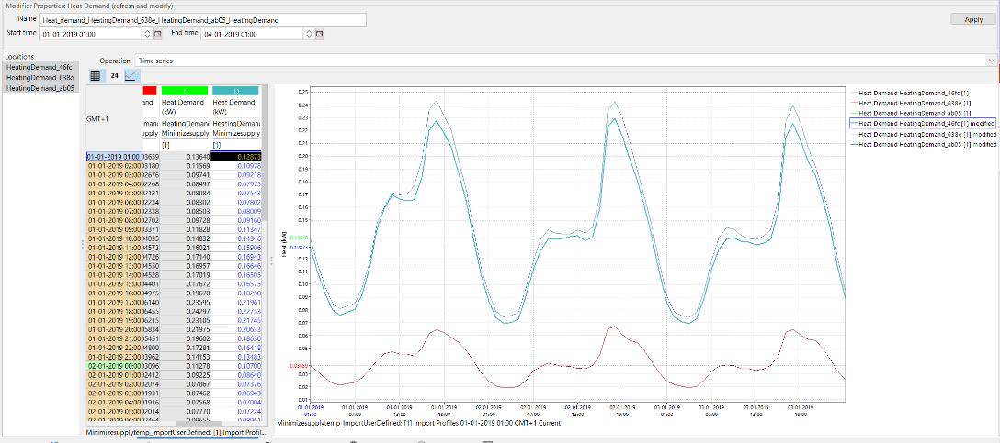
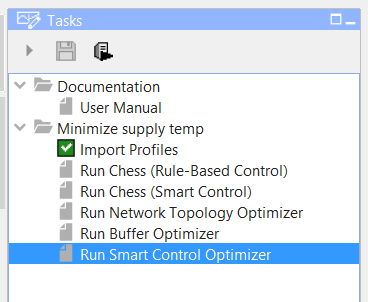
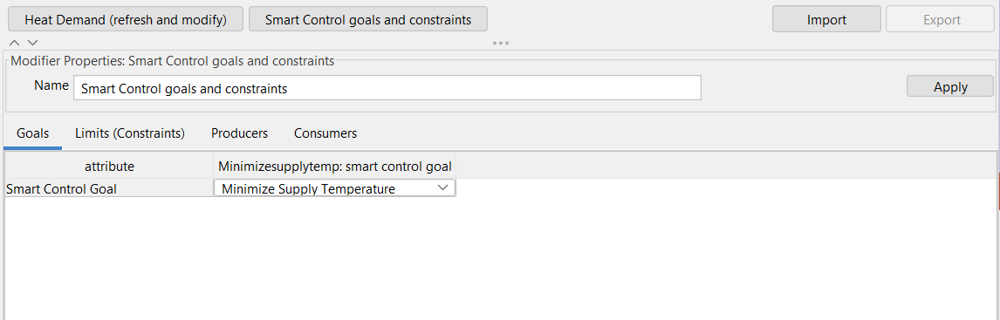
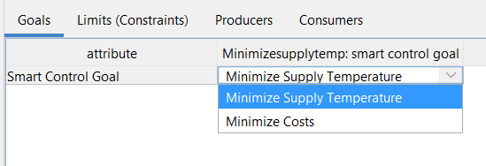
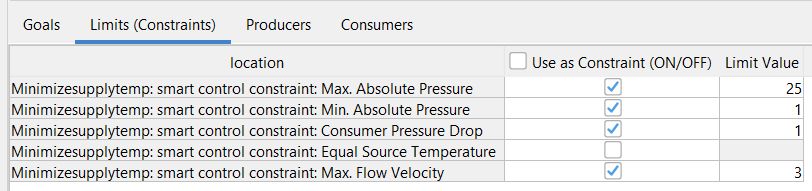
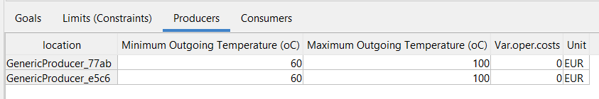
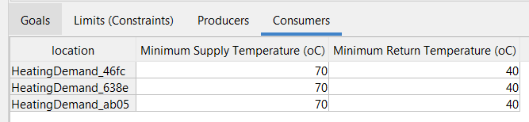
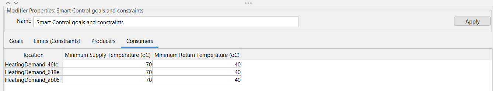
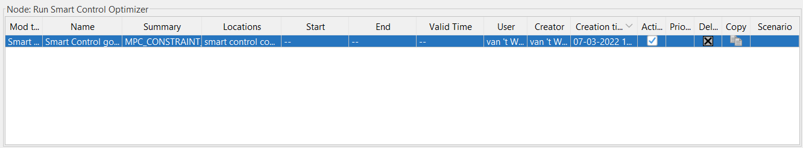
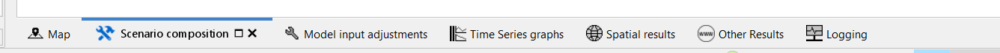
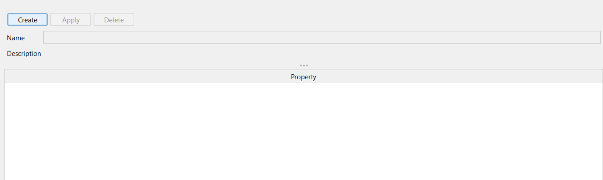
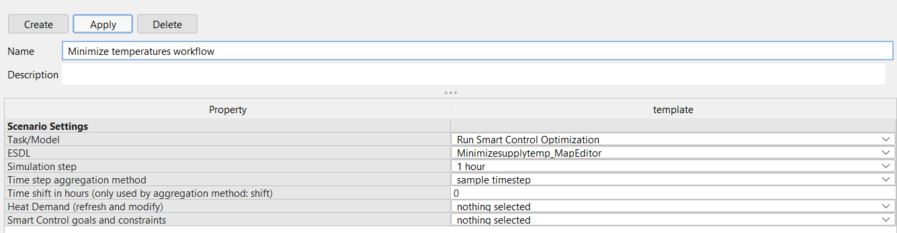
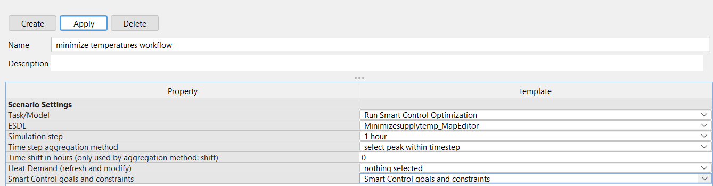
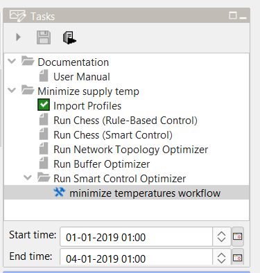
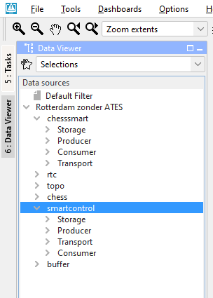
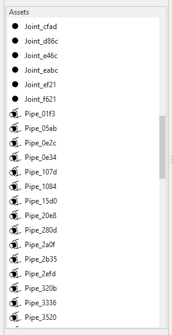
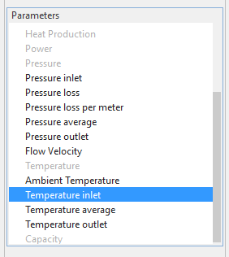
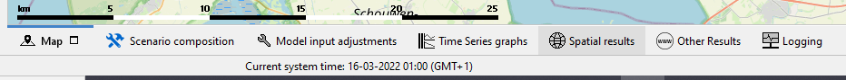
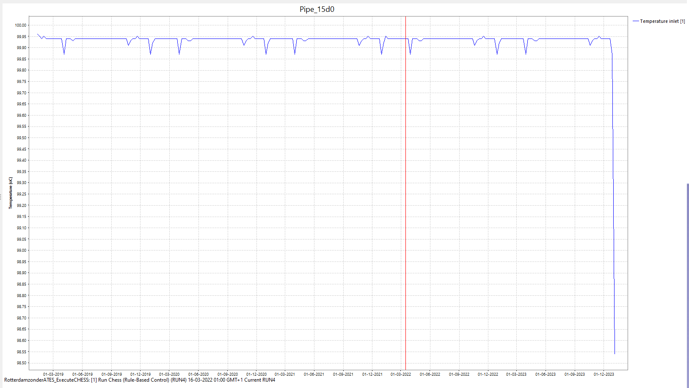
