.. _ates:

I want to use HT-ATES in my simulation
======================================

Tested for version *22.7.0-g778faf5-main* of the ESDL MapEditor and
version *0.4.6* of Computational Framework (CF)

This tutorial focus on how to use High Temperature Aquifer Thermal
Energy Storage (HT-ATES) in the simulation. HT-ATES is simulated using
TNO in-house tool called ROSIM and Doubletcalc3D. For more information
regarding this model please visit this
`link <https://warmingup-designtoolkitdocumentation.readthedocs-hosted.com/en/latest/software/CHESS/index.html#chess-ates-module-rosim>`__

This tutorial shows the steps to find the answer to the following
questions:

1) How to add HT-ATES in the MapEditor?

2) How to use HT-ATES and heatpump in the MapEditor?

3) How to set properties and run simulation in CF?

To achieve these results the following workflows and packages are used:

+------------+-----------------------------------------------------------------------------------------------------------------------------------------------------------------------------------------+
| |image0|   | ESDL MapEditor is used to create a network.                                                                                                                                             |
+------------+-----------------------------------------------------------------------------------------------------------------------------------------------------------------------------------------+
| |image1|   | The network is loaded into the Computational Framework (CF), which allows to alter heat demand, simulate and optimize heat networks, define (sub) scenario's and related *modifiers*.   |
+------------+-----------------------------------------------------------------------------------------------------------------------------------------------------------------------------------------+
| |image2|   | In the CF environment, CHESS is used to simulate the network.                                                                                                                           |
+------------+-----------------------------------------------------------------------------------------------------------------------------------------------------------------------------------------+

+---------+----------------------------------------------------------------------------------------------------------------------------------------------------------+
| **1**   | \ **How to add HT-ATES in the MapEditor?**                                                                                                               |
+=========+==========================================================================================================================================================+
| 1.1     | Go to the MapEditor and use credentials to login.                                                                                                        |
|         |                                                                                                                                                          |
|         | |image3|                                                                                                                                                 |
+---------+----------------------------------------------------------------------------------------------------------------------------------------------------------+
| 1.2     | Create a simple network consist of 2 producers (1 for base load and 1 for peak load) and 1 demand.                                                       |
|         |                                                                                                                                                          |
|         | |image4|                                                                                                                                                 |
+---------+----------------------------------------------------------------------------------------------------------------------------------------------------------+
| 1.3     | Add HT-ATES asset in to the MapEditor by selecting from Asset Dropdown List. |image5|                                                                    |
+---------+----------------------------------------------------------------------------------------------------------------------------------------------------------+
| 1.4     | Connect supply pipe to the InPort of ATES and return pipe to the OutPort of ATES (Similar to connecting a Heat Demand). |image6|                         |
+---------+----------------------------------------------------------------------------------------------------------------------------------------------------------+
| 1.5     | Fill ATES properties:                                                                                                                                    |
|         |                                                                                                                                                          |
|         | -  Max Charge Rate                                                                                                                                       |
|         |                                                                                                                                                          |
|         | -  Max Discharge Rate                                                                                                                                    |
|         |                                                                                                                                                          |
|         | -  Aquifer Anisotropy                                                                                                                                    |
|         |                                                                                                                                                          |
|         | -  Aquifer Mid Temperature                                                                                                                               |
|         |                                                                                                                                                          |
|         | -  Aquifer Net To Gross                                                                                                                                  |
|         |                                                                                                                                                          |
|         | -  Aquifer Permeability                                                                                                                                  |
|         |                                                                                                                                                          |
|         | -  Aquifer Porosity                                                                                                                                      |
|         |                                                                                                                                                          |
|         | -  Aquifer Thickness                                                                                                                                     |
|         |                                                                                                                                                          |
|         | -  Aquifer Top Depth                                                                                                                                     |
|         |                                                                                                                                                          |
|         | -  Well Casing Size                                                                                                                                      |
|         |                                                                                                                                                          |
|         | -  Well Distance                                                                                                                                         |
|         |                                                                                                                                                          |
|         | |image7|                                                                                                                                                 |
+---------+----------------------------------------------------------------------------------------------------------------------------------------------------------+
| 1.6     | If you don’t know, you can select HT-ATES from Energy Data Repository (EDR). There are 3 default HT-ATES based on the performance (Low, Medium, High).   |
|         |                                                                                                                                                          |
|         | |image8|                                                                                                                                                 |
+---------+----------------------------------------------------------------------------------------------------------------------------------------------------------+

+---------+--------------------------------------------------------------------------------------------------------------------------------------------------------------------------------------------------------------------------------------------------------------------------------------------------------------------------------------------------------------------------------------------------------------------------------------------------------------------------------+
| **2**   | **How to use HT-ATES and heatpump in the MapEditor?**                                                                                                                                                                                                                                                                                                                                                                                                                          |
+=========+================================================================================================================================================================================================================================================================================================================================================================================================================================================================================+
| 2.1     | ATES hot well temperature will drop during production period. It is not desirable when you are connecting it directly to the primary grid. Thus, you can add a heat pump when the temperature drops below the grid temperature.                                                                                                                                                                                                                                                |
|         |                                                                                                                                                                                                                                                                                                                                                                                                                                                                                |
|         | |image9|                                                                                                                                                                                                                                                                                                                                                                                                                                                                       |
+---------+--------------------------------------------------------------------------------------------------------------------------------------------------------------------------------------------------------------------------------------------------------------------------------------------------------------------------------------------------------------------------------------------------------------------------------------------------------------------------------+
| 2.2     | Split the supply pipe into 3 segments (1 of them with a Joint, and 1 of them just Split, not connected):                                                                                                                                                                                                                                                                                                                                                                       |
|         |                                                                                                                                                                                                                                                                                                                                                                                                                                                                                |
|         | 1. Right click, select Split and add Joint                                                                                                                                                                                                                                                                                                                                                                                                                                     |
|         |                                                                                                                                                                                                                                                                                                                                                                                                                                                                                |
|         | 2. Right click, select Split                                                                                                                                                                                                                                                                                                                                                                                                                                                   |
|         |                                                                                                                                                                                                                                                                                                                                                                                                                                                                                |
|         | |image10|                                                                                                                                                                                                                                                                                                                                                                                                                                                                      |
+---------+--------------------------------------------------------------------------------------------------------------------------------------------------------------------------------------------------------------------------------------------------------------------------------------------------------------------------------------------------------------------------------------------------------------------------------------------------------------------------------+
| 2.3     | Right click and select Reverse for pipes with yellow box. Make sure the supply pipe connected to ATES is still having direction going to the ATES.                                                                                                                                                                                                                                                                                                                             |
|         |                                                                                                                                                                                                                                                                                                                                                                                                                                                                                |
|         | |image11|                                                                                                                                                                                                                                                                                                                                                                                                                                                                      |
+---------+--------------------------------------------------------------------------------------------------------------------------------------------------------------------------------------------------------------------------------------------------------------------------------------------------------------------------------------------------------------------------------------------------------------------------------------------------------------------------------+
| 2.4     | Add Heat Pump and remove (PrimIn Port and PrimOut Port)                                                                                                                                                                                                                                                                                                                                                                                                                        |
|         |                                                                                                                                                                                                                                                                                                                                                                                                                                                                                |
|         | |image12|                                                                                                                                                                                                                                                                                                                                                                                                                                                                      |
+---------+--------------------------------------------------------------------------------------------------------------------------------------------------------------------------------------------------------------------------------------------------------------------------------------------------------------------------------------------------------------------------------------------------------------------------------------------------------------------------------+
| 2.5     | Connect the SecIn and SecOut port of the heat pump to the pipes.                                                                                                                                                                                                                                                                                                                                                                                                               |
|         |                                                                                                                                                                                                                                                                                                                                                                                                                                                                                |
|         | |image13|                                                                                                                                                                                                                                                                                                                                                                                                                                                                      |
+---------+--------------------------------------------------------------------------------------------------------------------------------------------------------------------------------------------------------------------------------------------------------------------------------------------------------------------------------------------------------------------------------------------------------------------------------------------------------------------------------+
| 2.6     | *Note:* With this 2 ports heat pump, we are upgrading heat from ATES to meet the grid’s temperature from Secondary side. At the moment, the 4 ports heat pump is not supported for ATES because ATES flow is bidirectional for charging and discharging. The 4 ports heat pump is only for 1 direction flow like a producer (e.g. geothermal). Thus, during discharging, we can’t have lower temperature than your return pipe’s temperature for injection to the cold well.   |
+---------+--------------------------------------------------------------------------------------------------------------------------------------------------------------------------------------------------------------------------------------------------------------------------------------------------------------------------------------------------------------------------------------------------------------------------------------------------------------------------------+
| 2.7     | Fill the heat pump’s properties:                                                                                                                                                                                                                                                                                                                                                                                                                                               |
|         |                                                                                                                                                                                                                                                                                                                                                                                                                                                                                |
|         | -  Efficiency                                                                                                                                                                                                                                                                                                                                                                                                                                                                  |
|         |                                                                                                                                                                                                                                                                                                                                                                                                                                                                                |
|         | -  Initial COP                                                                                                                                                                                                                                                                                                                                                                                                                                                                 |
|         |                                                                                                                                                                                                                                                                                                                                                                                                                                                                                |
|         | -  Power (it is not used at the moment for limiting the operational of a heat pump). Power is a calculation output.                                                                                                                                                                                                                                                                                                                                                            |
|         |                                                                                                                                                                                                                                                                                                                                                                                                                                                                                |
|         | |image14|                                                                                                                                                                                                                                                                                                                                                                                                                                                                      |
+---------+----------------------------------------------------------------------------------------------------------------------------------------------------------+

+---------+--------------------------------------------------------------------------------------------------------------------------------------------------------------------------------------------------------------------------------------------------------------------------------------------------------------------------------------------------------------------------------------------------------------------------------------------------------------------------------+
| **3**   | **How to set properties and run simulation in CF?**                                                                                                                                                                                                                                                                                                                                                                                                                            |
+---------+--------------------------------------------------------------------------------------------------------------------------------------------------------------------------------------------------------------------------------------------------------------------------------------------------------------------------------------------------------------------------------------------------------------------------------------------------------------------------------+
| 3.1     | Go to the Simulate and optimize and create a new project. Open CF.                                                                                                                                                                                                                                                                                                                                                                                                             |
|         |                                                                                                                                                                                                                                                                                                                                                                                                                                                                                |
|         | |image15|                                                                                                                                                                                                                                                                                                                                                                                                                                                                      |
+---------+--------------------------------------------------------------------------------------------------------------------------------------------------------------------------------------------------------------------------------------------------------------------------------------------------------------------------------------------------------------------------------------------------------------------------------------------------------------------------------+
| 3.2     | Import and set Demand Profiles                                                                                                                                                                                                                                                                                                                                                                                                                                                 |
|         |                                                                                                                                                                                                                                                                                                                                                                                                                                                                                |
|         | |image16|                                                                                                                                                                                                                                                                                                                                                                                                                                                                      |
+---------+--------------------------------------------------------------------------------------------------------------------------------------------------------------------------------------------------------------------------------------------------------------------------------------------------------------------------------------------------------------------------------------------------------------------------------------------------------------------------------+
| 3.3     | Set simulation settings:                                                                                                                                                                                                                                                                                                                                                                                                                                                       |
|         |                                                                                                                                                                                                                                                                                                                                                                                                                                                                                |
|         | -  Geothermal 11 MW as base load and priority 1                                                                                                                                                                                                                                                                                                                                                                                                                                |
|         |                                                                                                                                                                                                                                                                                                                                                                                                                                                                                |
|         | |image17|                                                                                                                                                                                                                                                                                                                                                                                                                                                                      |
|         |                                                                                                                                                                                                                                                                                                                                                                                                                                                                                |
|         | -  ATES with priority 2 and cut off temperature 70 (minimum demand’s temperature)                                                                                                                                                                                                                                                                                                                                                                                              |
|         |                                                                                                                                                                                                                                                                                                                                                                                                                                                                                |
|         | |image18|                                                                                                                                                                                                                                                                                                                                                                                                                                                                      |
|         |                                                                                                                                                                                                                                                                                                                                                                                                                                                                                |
|         | -  Boiler with priority 3 as a backup and uncheck “Use resource to fill buffer”                                                                                                                                                                                                                                                                                                                                                                                                |
|         |                                                                                                                                                                                                                                                                                                                                                                                                                                                                                |
|         | |image19|                                                                                                                                                                                                                                                                                                                                                                                                                                                                      |
+---------+--------------------------------------------------------------------------------------------------------------------------------------------------------------------------------------------------------------------------------------------------------------------------------------------------------------------------------------------------------------------------------------------------------------------------------------------------------------------------------+
| 3.4     | Run simulation for 3.5 years with weekly timesteps and peak demand.                                                                                                                                                                                                                                                                                                                                                                                                            |
|         | |image20|                                                                                                                                                                                                                                                                                                                                                                                                                                                                      |
+---------+--------------------------------------------------------------------------------------------------------------------------------------------------------------------------------------------------------------------------------------------------------------------------------------------------------------------------------------------------------------------------------------------------------------------------------------------------------------------------------+
| 3.5     | Check the results when simulation is finish.                                                                                                                                                                                                                                                                                                                                                                                                                                   |
|         |                                                                                                                                                                                                                                                                                                                                                                                                                                                                                |
|         | |image21|                                                                                                                                                                                                                                                                                                                                                                                                                                                                      |
|         |                                                                                                                                                                                                                                                                                                                                                                                                                                                                                |
|         | |image22|                                                                                                                                                                                                                                                                                                                                                                                                                                                                      |
|         |                                                                                                                                                                                                                                                                                                                                                                                                                                                                                |
|         | As we can see from figure above that ATES is used to cover the peak load and stops supplying the heat when temperature drops below 70 C. Then, the boiler is taking over the peak load.                                                                                                                                                                                                                                                                                        |
+---------+--------------------------------------------------------------------------------------------------------------------------------------------------------------------------------------------------------------------------------------------------------------------------------------------------------------------------------------------------------------------------------------------------------------------------------------------------------------------------------+
| 3.6     | Now, we open the project for ATES with a heat pump. We redo all the settings, but now we reduce the cut off temperature to 40 C. So the ATES will produce longer.                                                                                                                                                                                                                                                                                                              |
|         |                                                                                                                                                                                                                                                                                                                                                                                                                                                                                |
|         | |image23|                                                                                                                                                                                                                                                                                                                                                                                                                                                                      |
+---------+--------------------------------------------------------------------------------------------------------------------------------------------------------------------------------------------------------------------------------------------------------------------------------------------------------------------------------------------------------------------------------------------------------------------------------------------------------------------------------+
| 3.7     | Set the heat pump properties such a way it represents the configuration of 4 ports heat pump:                                                                                                                                                                                                                                                                                                                                                                                  |
|         |                                                                                                                                                                                                                                                                                                                                                                                                                                                                                |
|         | -  Setpoint secondary supply temperature is the grid’s supply temperature (85 C)                                                                                                                                                                                                                                                                                                                                                                                               |
|         |                                                                                                                                                                                                                                                                                                                                                                                                                                                                                |
|         | -  And the primary supply temperature is the grid’s return temperature (35 C)                                                                                                                                                                                                                                                                                                                                                                                                  |
|         |                                                                                                                                                                                                                                                                                                                                                                                                                                                                                |
|         | |image24|                                                                                                                                                                                                                                                                                                                                                                                                                                                                      |
+---------+--------------------------------------------------------------------------------------------------------------------------------------------------------------------------------------------------------------------------------------------------------------------------------------------------------------------------------------------------------------------------------------------------------------------------------------------------------------------------------+
| 3.8     | Run simulation for 3.5 years with weekly timesteps and peak demand.                                                                                                                                                                                                                                                                                                                                                                                                            |
|         |                                                                                                                                                                                                                                                                                                                                                                                                                                                                                |
|         | |image25|                                                                                                                                                                                                                                                                                                                                                                                                                                                                      |
+---------+--------------------------------------------------------------------------------------------------------------------------------------------------------------------------------------------------------------------------------------------------------------------------------------------------------------------------------------------------------------------------------------------------------------------------------------------------------------------------------+
| 3.9     | Check the results when simulation is finish.                                                                                                                                                                                                                                                                                                                                                                                                                                   |
|         |                                                                                                                                                                                                                                                                                                                                                                                                                                                                                |
|         | |image26|                                                                                                                                                                                                                                                                                                                                                                                                                                                                      |
|         |                                                                                                                                                                                                                                                                                                                                                                                                                                                                                |
|         | |image27|                                                                                                                                                                                                                                                                                                                                                                                                                                                                      |
|         |                                                                                                                                                                                                                                                                                                                                                                                                                                                                                |
|         | |image28|                                                                                                                                                                                                                                                                                                                                                                                                                                                                      |
|         |                                                                                                                                                                                                                                                                                                                                                                                                                                                                                |
|         | Since the cut off temperature of the ATES can be lower to 40 C, it has a longer operational time during discharge period. So the use of the boiler is decreasing over the year. The inlet temperature at Demand remains at grid’s supply temperature of 85 C                                                                                                                                                                                                                   |
+---------+--------------------------------------------------------------------------------------------------------------------------------------------------------------------------------------------------------------------------------------------------------------------------------------------------------------------------------------------------------------------------------------------------------------------------------------------------------------------------------+

.. |image0| image:: media/image1.png
   :width: 0.87361in
   :height: 0.90694in

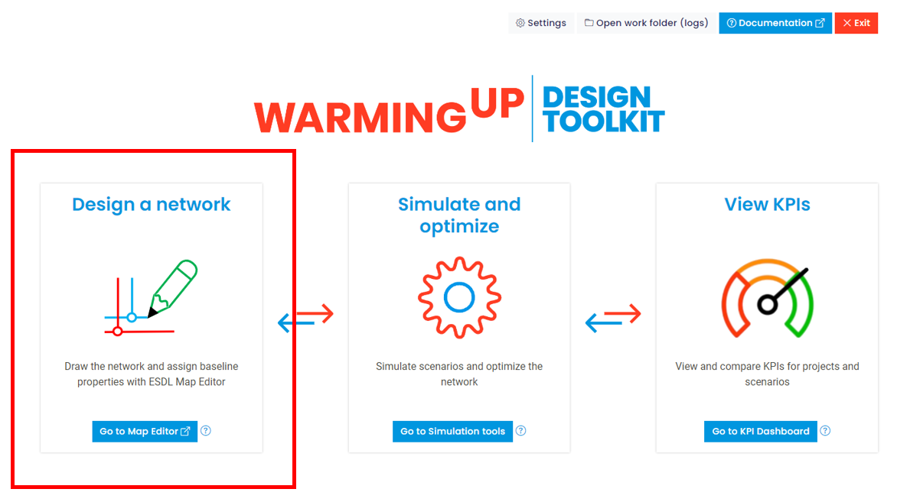
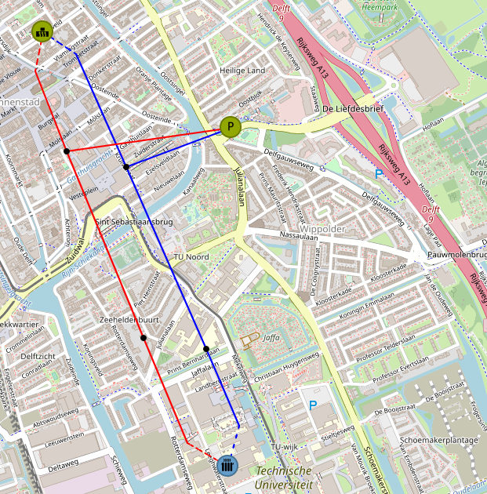
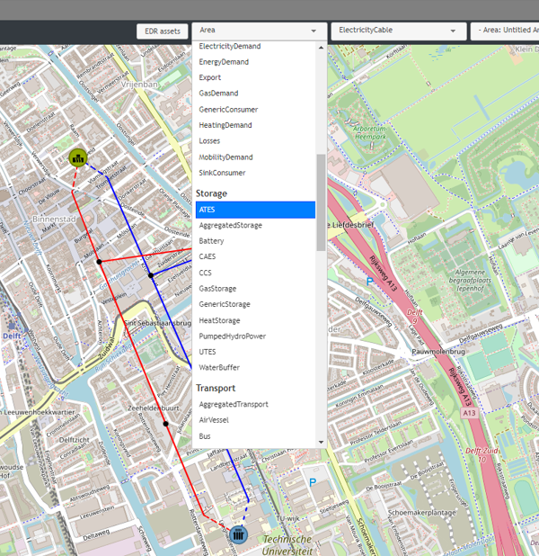
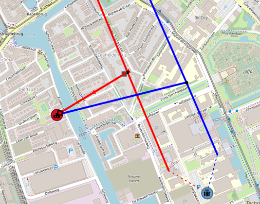
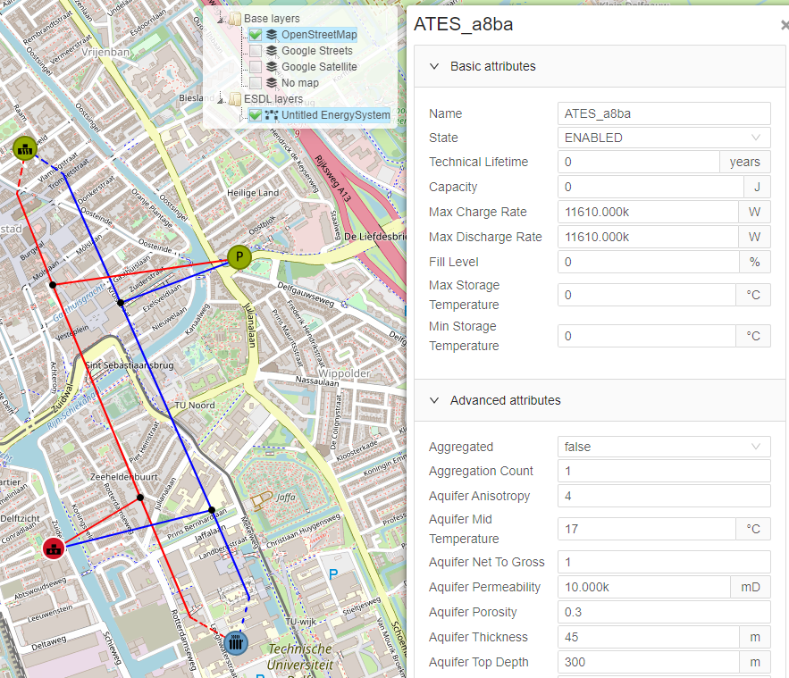
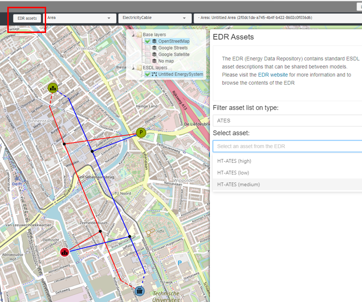

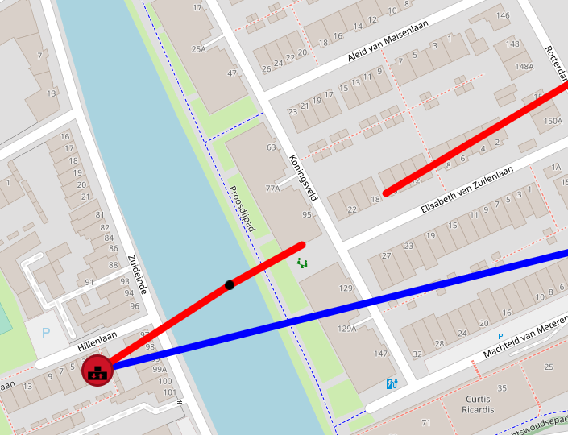
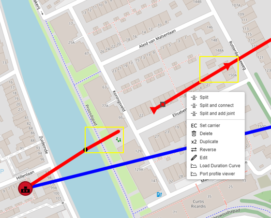
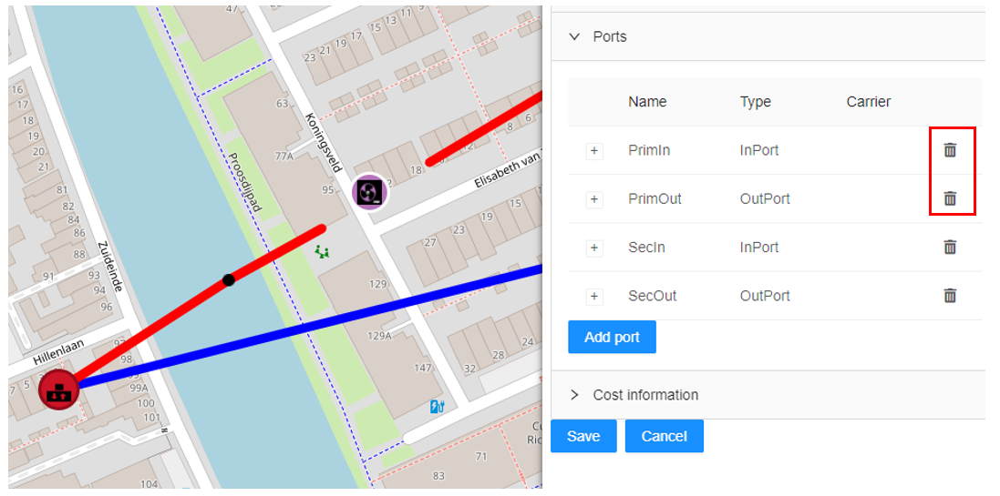
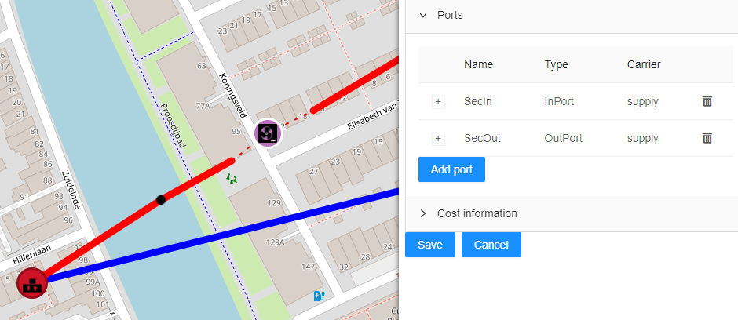
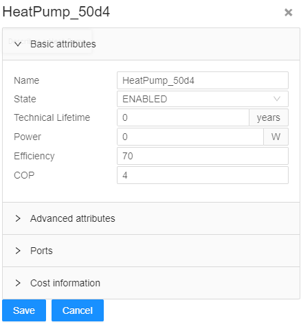
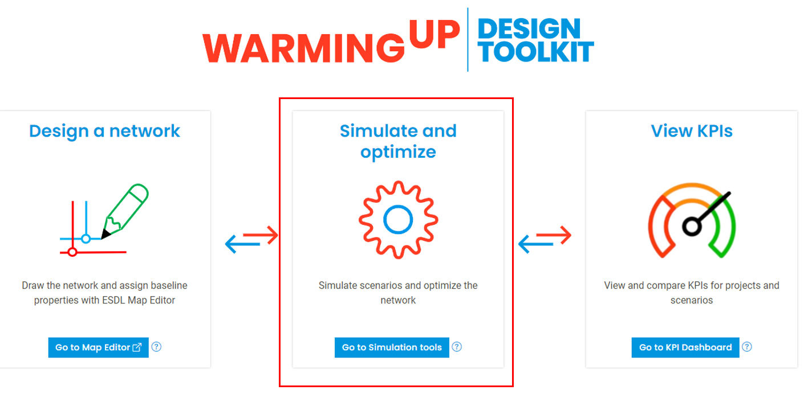
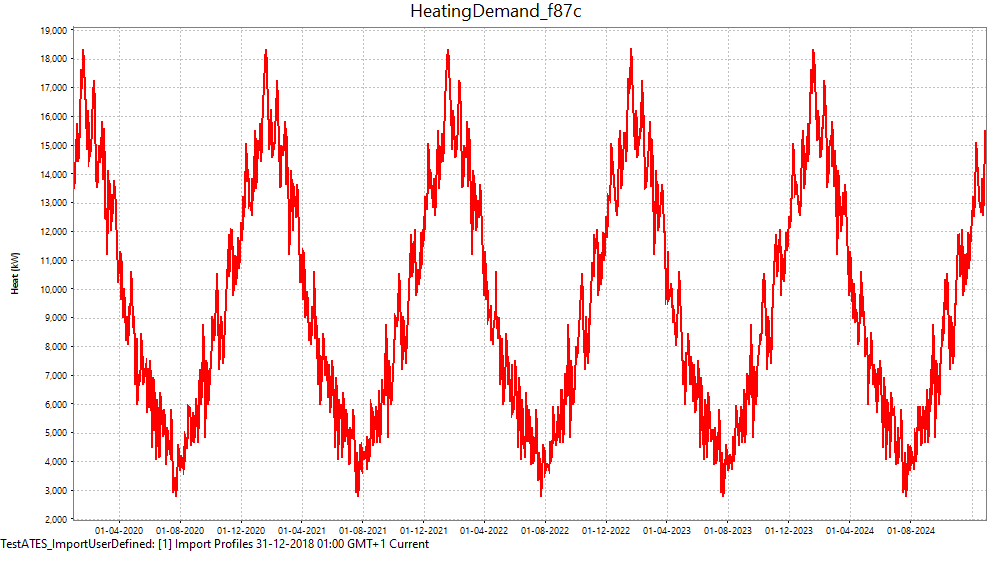
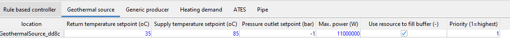
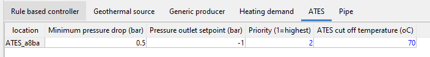
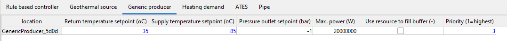
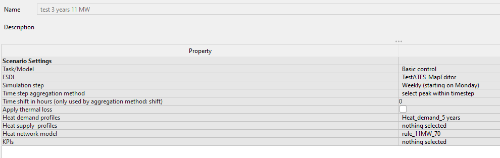
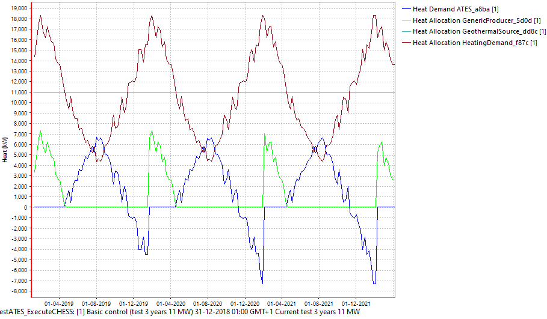
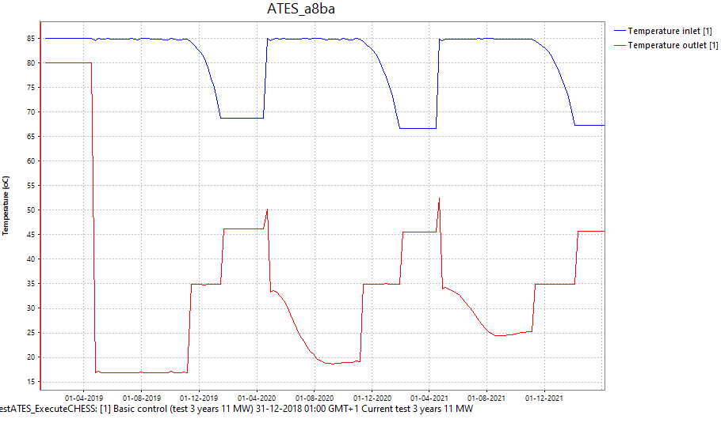
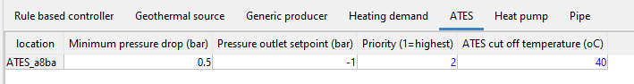
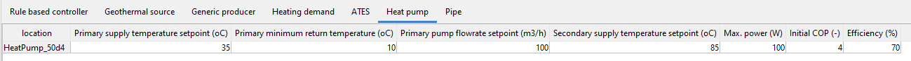
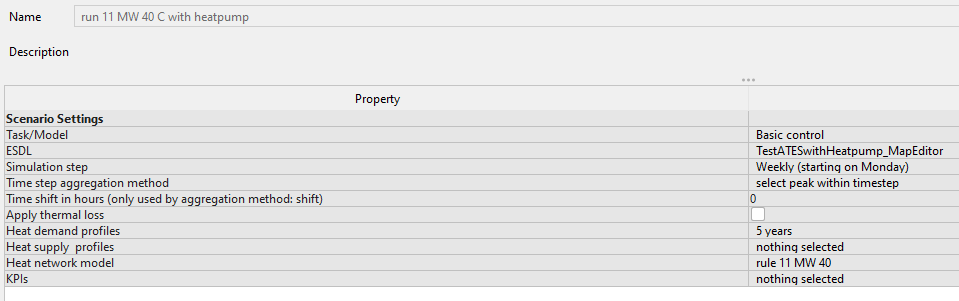
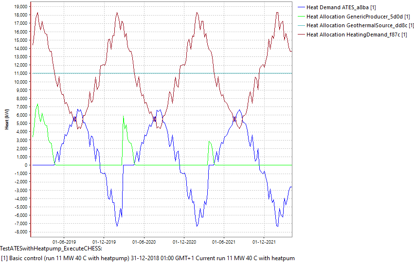
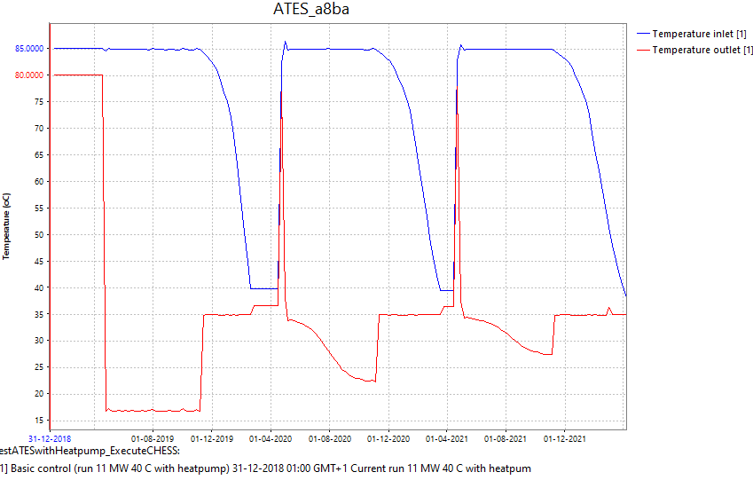
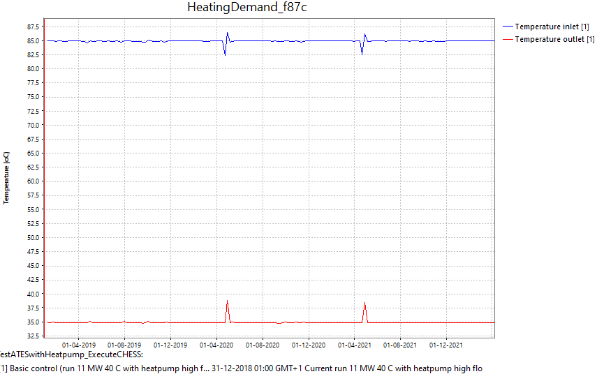
